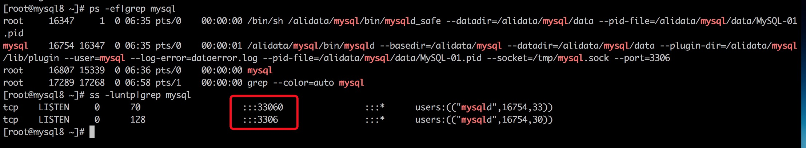

# MySQL 8.0 新增管理连接专用的TCP/IP端口

> 2019-06-10 

```shell
[root@mysql8 ~]# ps -ef|grep mysql
root     16347     1  0 06:35 pts/0    00:00:00 /bin/sh /alidata/mysql/bin/mysqld_safe --datadir=/alidata/mysql/data --pid-file=/alidata/mysql/data/MySQL-01.pid
mysql    16754 16347  0 06:35 pts/0    00:00:01 /alidata/mysql/bin/mysqld --basedir=/alidata/mysql --datadir=/alidata/mysql/data --plugin-dir=/alidata/mysql/lib/plugin --user=mysql --log-error=dataerror.log --pid-file=/alidata/mysql/data/MySQL-01.pid --socket=/tmp/mysql.sock --port=3306
root     16807 15339  0 06:36 pts/0    00:00:00 mysql
root     17289 17268  0 06:58 pts/1    00:00:00 grep --color=auto mysql
[root@mysql8 ~]# ss -luntp|grep mysql
tcp    LISTEN     0      70                    :::33060                :::*      users:(("mysqld",16754,33))
tcp    LISTEN     0      128                   :::3306                 :::*      users:(("mysqld",16754,30))
```

按照后启动服务，查看mysqld监听的端口可以发现比之前多了`33060`。



好处：当出现连接数暴增导致无法连接数据库时，可以通过`管理连接专用的TCP/IP端口33060` 访问数据库。

