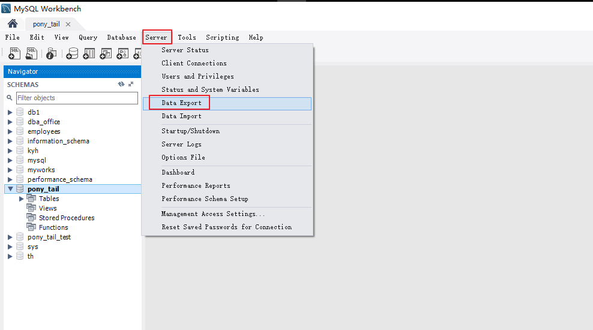
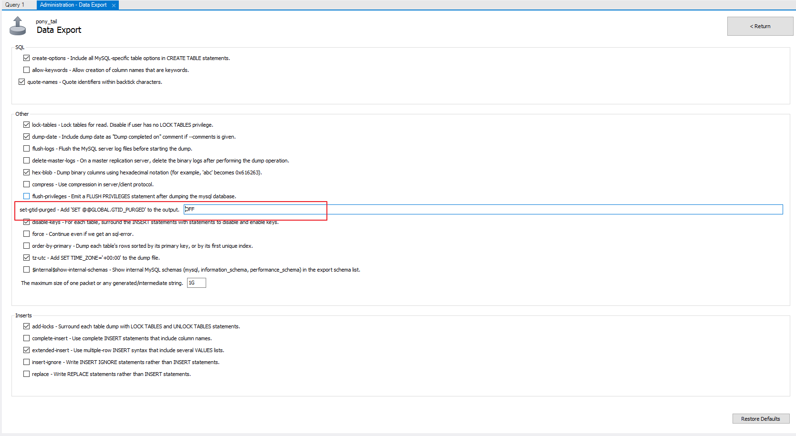
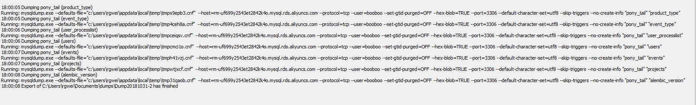
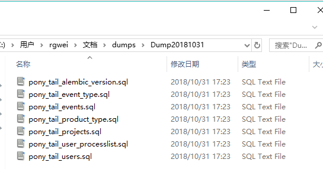

# MySQL Workbench逻辑备份操作手册

[TOC]

## 说在前面

逻辑备份适用于数据量较小的场景，例如10G以下，如果数据较大建议使用物理备份工具；或者数据迁移或同步工具。

本文的备份方法可以在恢复的时候并发进行导入，加快导入速率。

## 前提

> 软件安装

MySQL Workbench 是一款专门为用户提供了用于创建、修改、执行和优化SQL的可视化工具，开发人员可以很轻松的管理数数据。该工具并且提供开发者一整套可视化用于创建、编辑和管理SQL 查询和管理数据库连接。在可视化SQL编辑工作模式下，用户创建表，删除表，修改表信息等只需要使用简单的可编辑列表中完成。

用户通常认为MySQL Workbench 是一个MySQL 数据库ER模型设计的工具，可以说是专门为MySQL数据库提供的数据库设计工具，用户使用MySQL Workbench可以很容易的设计、编辑数据库ER模型。这一功能可以说是MySQL Workbench的一大亮点。

> 软件获取

<https://dev.mysql.com/downloads/workbench/>

## 备份步骤

### 第一步 点击Server-->Data Export 

### 第二步 选择需要备份的库并选择Export to Dump Project Folder

在Export Options中一定要选择Export to Dump Project Folder，只有该模式下，才能进行单表备份，只有每个表一个文件，将来导入时才能并发。

### 第三步 设置 --set-gtid-purged=OFF

### 第四步 完成数据备份

### 第五步 查看备份文件

