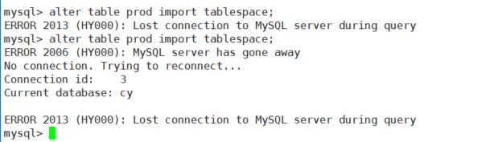

# MySQL_通过frm和ibd强制恢复结构和数据

> 2018-05-16 BoobooWei

[TOC]

## 写在前面

Crash恢复的正确方式是：**备份文件（逻辑或物理）+ binlog**进行恢复；然而并不是所有的运维人员都知道怎么进行正确的备份，甚至连逻辑备份和物理备份的区别是什么都不知道？更不知道备份过程中需要考虑数据的一致性与服务可用性的问题？或者连备份工具都不会使用，所以当你问：有备份吗？回答：没有或者无效

在本次案例中，某客户只对单个`cy`库所属的目录进行了文件层面的备份，MySQL使用5.7.17版本，使用innodb存储引擎，开启了独立表空间。也就是说当前的救命稻草是：每个表的`.frm`和`.ibd`文件。

## 强制还原步骤

| 步骤 | 描述                                                         | 备注                                                         |
| ---- | ------------------------------------------------------------ | ------------------------------------------------------------ |
| 1    | **创建同版本的MySQL服务实例一枚**                            |                                                              |
| 2    | **获取表的列数**                                             | 如果有ddl备份直接导入，可惜都是没有的，哭。。。              |
| 2.1  | 创建同名表，结构无所谓                                       | 数据库的世界也需要身份证，先造个人拿上身份证，至于人长得啥样几条胳膊都无所谓，名字最重要 |
| 2.2  | 停服务；使用备份的frm文件覆盖当前的frm                       | 偷梁换柱                                                     |
| 2.3  | 配置文件添加强制恢复innodb的参数；启动服务                   | 蒙蔽她的双眼                                                 |
| 2.4  | 查看表结构                                                   | 数据库会拿着身份证和面前的人（frm文件）做对比                |
| 2.5  | 查看错误日志中关于该表的报错                                 | 数据库发现身份证上的人只有1条胳膊，而被检查的人有10条胳膊，明显对不上啊 |
| 2.6  | 成功获取表的真实列数；删除这些表                             | 通过警告可以知道应该造一个有10条胳膊的人                     |
| 3    | **获取表的结构**                                             |                                                              |
| 3.1  | 创建同名表，列数一致，列名无所谓                             | 这一次造人的时候，造一个有10条胳膊的，每条胳膊的名字无所谓，关键是身份证上面的人名和10条胳膊 |
| 3.2  | 停服务；使用备份的frm文件覆盖当前的frm                       | 偷梁换柱                                                     |
| 3.3  | 配置文件添加强制恢复innodb的参数；启动服务                   | 蒙蔽她的双眼                                                 |
| 3.4  | 查看表结构                                                   | 数据库会拿着新的身份证和面前的人（frm文件）做对比            |
| 3.5  | 成功获取表结构                                               | 数据库发现身份证上信息和被检查的人信息一致，名字，胳膊的数量，对上了就认可啦！（数据库只检查表名和列的个数） |
| 4    | **强制恢复表数据**                                           |                                                              |
| 4.1  | 丢弃当前表的数据                                             | 把这个人的五脏六腑都挖出来                                   |
| 4.2  | 将备份的ibd放到对应路径                                      | 将之前备份的吃了肉的五脏六腑放进去                           |
| 4.3  | 导入新的数据，如果数据库加载成功则可以看到数据；否则加载失败。 | 跟大脑汇报一下新的五脏六腑已经就位可以开始使用了；如果使用得没问题就成功；如果器官已经损坏那么手术失败。 |


## 详细过程

### 数据量

| 明细     | 大小 | 备注 |
| -------- | ---- | ---- |
| 物理文件 | 174M |      |
| 数据库   | 1个  | cy   |
| 表       | 57张 |      |

### 恢复结果

> 在客户服务器上面结果如下：

| 明细   | 成功 | 失败 | 恢复率 |
| ------ | ---- | ---- | ------ |
| 表结构 | 58   | 0    | 100%   |
| 表数据 | 56   | 2    | 96%    |


> 在我的服务器上面结果如下：

| 明细   | 成功 | 失败 | 恢复率 |
| ------ | ---- | ---- | ------ |
| 表结构 | 58   | 0    | 100%   |
| 表数据 | 58   | 0    | 100%   |

```shell
[root@toberoot mysql]# /alidata/mysql/bin/mysqld --initialize-insecure --datadir=/alidata/mysql/data/  --user=mysql
[root@toberoot mysql]# service mysqld start
Starting MySQL.                                            [  OK  ]
[root@toberoot mysql]# mysql -V
mysql  Ver 14.14 Distrib 5.7.17, for linux-glibc2.5 (x86_64) using  EditLine wrapper

[root@toberoot mysql]# cd ~/home/cy02/
[root@toberoot cy02]# ll
total 178140
-rw-r--r-- 1 mysql mysql     9022 Aug 14  2017 base_dict.frm
-rw-r--r-- 1 mysql mysql    98304 Mar 14 15:00 base_dict.ibd
-rw-r--r-- 1 mysql mysql     8822 Mar  2 11:14 biz_advise.frm
-rw-r--r-- 1 mysql mysql    98304 May 14 14:39 biz_advise.ibd
-rw-r--r-- 1 mysql mysql     8850 Mar  2 11:14 biz_bank.frm
-rw-r--r-- 1 mysql mysql    98304 Mar  2 11:14 biz_bank.ibd
-rw-r--r-- 1 mysql mysql     9580 Mar  2 11:14 biz.frm
-rw-r--r-- 1 mysql mysql     9286 Mar  2 11:14 biz_gift.frm
-rw-r--r-- 1 mysql mysql    98304 Apr 24 14:08 biz_gift.ibd
-rw-r--r-- 1 mysql mysql     8890 Mar  2 11:14 biz_gprs_bind.frm
-rw-r--r-- 1 mysql mysql     8745 Mar  2 11:14 biz_gprs_bind_his.frm
-rw-r--r-- 1 mysql mysql   180224 May 15 09:40 biz_gprs_bind_his.ibd
-rw-r--r-- 1 mysql mysql   180224 May 15 09:42 biz_gprs_bind.ibd
-rw-r--r-- 1 mysql mysql    98304 May 15 14:33 biz.ibd
-rw-r--r-- 1 mysql mysql     8845 Aug 14  2017 biz_msg_template.frm
-rw-r--r-- 1 mysql mysql    98304 Aug 14  2017 biz_msg_template.ibd
-rw-r--r-- 1 mysql mysql     8881 Aug 14  2017 biz_take_bank.frm
-rw-r--r-- 1 mysql mysql    98304 May 13 19:26 biz_take_bank.ibd
-rw-r--r-- 1 mysql mysql     9411 Nov 24 13:22 biz_take.frm
-rw-r--r-- 1 mysql mysql   196608 May 15 15:22 biz_take.ibd
-rw-r--r-- 1 mysql mysql     8862 Aug 14  2017 biz_take_wwlt.frm
-rw-r--r-- 1 mysql mysql    98304 May 15 15:22 biz_take_wwlt.ibd
-rw-r--r-- 1 mysql mysql     8854 Aug 14  2017 biz_take_wx.frm
-rw-r--r-- 1 mysql mysql    98304 May 15 11:52 biz_take_wx.ibd
-rw-r--r-- 1 mysql mysql     8925 Aug 14  2017 biz_vip.frm
-rw-r--r-- 1 mysql mysql    98304 Mar 16 09:31 biz_vip.ibd
-rw-r--r-- 1 mysql mysql     8852 Aug 14  2017 biz_wlt.frm
-rw-r--r-- 1 mysql mysql    98304 May 15 18:30 biz_wlt.ibd
-rw-r--r-- 1 mysql mysql     8926 Aug 14  2017 biz_wx_focus.frm
-rw-r--r-- 1 mysql mysql    98304 May 10 16:24 biz_wx_focus.ibd
-rw-r--r-- 1 mysql mysql     9339 Nov 24 13:25 biz_wx.frm
-rw-r--r-- 1 mysql mysql    98304 May 10 16:24 biz_wx.ibd
-rw-r--r-- 1 mysql mysql     8874 Aug 14  2017 biz_wx_walt.frm
-rw-r--r-- 1 mysql mysql    98304 Aug 14  2017 biz_wx_walt.ibd
-rw-r--r-- 1 mysql mysql     8776 Aug 14  2017 cfg_area.frm
-rw-r--r-- 1 mysql mysql   311296 Aug 14  2017 cfg_area.ibd
-rw-r--r-- 1 mysql mysql     8721 Aug 14  2017 cfg_id_gen.frm
-rw-r--r-- 1 mysql mysql    98304 May 15 18:41 cfg_id_gen.ibd
-rw-r--r-- 1 mysql mysql       61 Aug 14  2017 db.opt
-rw-r--r-- 1 mysql mysql     9053 Aug 14  2017 gprs_model.frm
-rw-r--r-- 1 mysql mysql   212992 May 15 18:47 gprs_model.ibd
-r--r--r-- 1 mysql mysql 79691776 May 16 14:04 ibdata1
-rw-r--r-- 1 mysql mysql     8801 Dec 19 15:00 mbr_coin_chged.frm
-rw-r--r-- 1 mysql mysql  2097152 May 15 17:27 mbr_coin_chged.ibd
-rw-r--r-- 1 mysql mysql     8766 Dec 19 14:53 mbr_coin.frm
-rw-r--r-- 1 mysql mysql    98304 May 15 19:12 mbr_coin.ibd
-rw-r--r-- 1 mysql mysql     9155 May 14 11:55 mbr.frm
-rw-r--r-- 1 mysql mysql   212992 May 15 20:58 mbr.ibd
-rw-r--r-- 1 mysql mysql     8876 Aug 14  2017 mbr_oauth.frm
-rw-r--r-- 1 mysql mysql   475136 May 15 19:37 mbr_oauth.ibd
-rw-r--r-- 1 mysql mysql     9011 Aug 14  2017 mbr_pay.frm
-rw-r--r-- 1 mysql mysql    98304 Aug 14  2017 mbr_pay.ibd
-rw-r--r-- 1 mysql mysql     8740 Aug 14  2017 mbr_prizen.frm
-rw-r--r-- 1 mysql mysql    98304 Aug 14  2017 mbr_prizen.ibd
-rw-r--r-- 1 mysql mysql     9147 Dec 19 14:56 mbr_recharge.frm
-rw-r--r-- 1 mysql mysql   294912 May 15 19:11 mbr_recharge.ibd
-rw-r--r-- 1 mysql mysql     8801 Aug 14  2017 mbr_wallet_chged.frm
-rw-r--r-- 1 mysql mysql  9437184 May 15 17:27 mbr_wallet_chged.ibd
-rw-r--r-- 1 mysql mysql     8845 Aug 14  2017 mbr_wallet.frm
-rw-r--r-- 1 mysql mysql   262144 May 15 19:12 mbr_wallet.ibd
-rw-r--r-- 1 mysql mysql    10100 Dec 19 15:47 ord.frm
-rw-r--r-- 1 mysql mysql 31457280 May 15 18:41 ord.ibd
-rw-r--r-- 1 mysql mysql     8940 Aug 14  2017 ord_item.frm
-rw-r--r-- 1 mysql mysql    98304 Aug 14  2017 ord_item.ibd
-rw-r--r-- 1 mysql mysql     8917 Aug 14  2017 ord_pay_ali.frm
-rw-r--r-- 1 mysql mysql    98304 Aug 14  2017 ord_pay_ali.ibd
-rw-r--r-- 1 mysql mysql     8924 Dec 19 15:55 ord_pay_coin.frm
-rw-r--r-- 1 mysql mysql   475136 May 15 17:27 ord_pay_coin.ibd
-rw-r--r-- 1 mysql mysql     8926 Aug 14  2017 ord_pay_return.frm
-rw-r--r-- 1 mysql mysql    98304 Aug 14  2017 ord_pay_return.ibd
-rw-r--r-- 1 mysql mysql     8966 Dec 20 16:50 ord_pay_wlt.frm
-rw-r--r-- 1 mysql mysql  9437184 May 15 17:27 ord_pay_wlt.ibd
-rw-r--r-- 1 mysql mysql     9036 Aug 14  2017 ord_pay_wx.frm
-rw-r--r-- 1 mysql mysql 32505856 May 15 18:41 ord_pay_wx.ibd
-rw-r--r-- 1 mysql mysql     9098 Aug 14  2017 prod_base_args.frm
-rw-r--r-- 1 mysql mysql    98304 Aug 14  2017 prod_base_args.ibd
-rw-r--r-- 1 mysql mysql     8790 Aug 14  2017 prod_bug_rpt.frm
-rw-r--r-- 1 mysql mysql    98304 Aug 14  2017 prod_bug_rpt.ibd
-rw-r--r-- 1 mysql mysql     8887 Aug 14  2017 prod_cmd.frm
-rw-r--r-- 1 mysql mysql    98304 Aug 14  2017 prod_cmd.ibd
-rw-r--r-- 1 mysql mysql     8984 Aug 14  2017 prod_cmd_invoke.frm
-rw-r--r-- 1 mysql mysql    98304 Aug 14  2017 prod_cmd_invoke.ibd
-rw-r--r-- 1 mysql mysql     9058 Aug 14  2017 prod_coin_rpt.frm
-rw-r--r-- 1 mysql mysql  9437184 May 15 14:24 prod_coin_rpt.ibd
-rw-r--r-- 1 mysql mysql     8798 Aug 14  2017 prod_coin_rpt_log.frm
-rw-r--r-- 1 mysql mysql    98304 May 15 14:24 prod_coin_rpt_log.ibd
-rw-r--r-- 1 mysql mysql     9834 Dec 13 14:12 prod.frm
-rw-r--r-- 1 mysql mysql     8835 Aug 14  2017 prod_gprs_bind.frm
-rw-r--r-- 1 mysql mysql     8793 Aug 14  2017 prod_gprs_bind_his.frm
-rw-r--r-- 1 mysql mysql   196608 May 15 09:42 prod_gprs_bind_his.ibd
-rw-r--r-- 1 mysql mysql    98304 Aug 14  2017 prod_gprs_bind.ibd
-rw-r--r-- 1 mysql mysql   425984 May 15 09:42 prod.ibd
-rw-r--r-- 1 mysql mysql     8851 Aug 14  2017 prod_instl_imgs.frm
-rw-r--r-- 1 mysql mysql    98304 Aug 14  2017 prod_instl_imgs.ibd
-rw-r--r-- 1 mysql mysql     9388 Dec 13 14:13 prod_instl_pos.frm
-rw-r--r-- 1 mysql mysql   147456 May 15 16:25 prod_instl_pos.ibd
-rw-r--r-- 1 mysql mysql     9384 Dec 13 14:14 prod_instl_pos_model.frm
-rw-r--r-- 1 mysql mysql   131072 May 15 16:24 prod_instl_pos_model.ibd
-rw-r--r-- 1 mysql mysql     8892 Aug 14  2017 prod_mod_attr.frm
-rw-r--r-- 1 mysql mysql    98304 Aug 14  2017 prod_mod_attr.ibd
-rw-r--r-- 1 mysql mysql     8873 Aug 14  2017 prod_mod_attr_val.frm
-rw-r--r-- 1 mysql mysql    98304 Aug 14  2017 prod_mod_attr_val.ibd
-rw-r--r-- 1 mysql mysql     9642 Dec 13 14:11 prod_model.frm
-rw-r--r-- 1 mysql mysql    98304 May 11 11:58 prod_model.ibd
-rw-r--r-- 1 mysql mysql     8815 Aug 14  2017 prod_mod_sku.frm
-rw-r--r-- 1 mysql mysql    98304 Aug 14  2017 prod_mod_sku.ibd
-rw-r--r-- 1 mysql mysql     9050 Aug 14  2017 prod_onl_log.frm
-rw-r--r-- 1 mysql mysql   163840 May 15 18:42 prod_onl_log.ibd
-rw-r--r-- 1 mysql mysql     9143 Aug 14  2017 prod_sp_args.frm
-rw-r--r-- 1 mysql mysql    98304 Aug 14  2017 prod_sp_args.ibd
-rw-r--r-- 1 mysql mysql     8876 Aug 14  2017 prod_sp_arg_vals.frm
-rw-r--r-- 1 mysql mysql    98304 Aug 14  2017 prod_sp_arg_vals.ibd
-rw-r--r-- 1 mysql mysql     9190 Dec 13 14:14 sys_acct.frm
-rw-r--r-- 1 mysql mysql    98304 May 14 11:16 sys_acct.ibd
-rw-r--r-- 1 mysql mysql     8776 Aug 14  2017 sys_acct_res.frm
-rw-r--r-- 1 mysql mysql   229376 May 11 11:52 sys_acct_res.ibd
-rw-r--r-- 1 mysql mysql     9106 Aug 14  2017 sys_res.frm
-rw-r--r-- 1 mysql mysql    98304 Aug 14  2017 sys_res.ibd
#获取待恢复表名
[root@toberoot cy02]# ll *.frm |awk '{print $9}'|awk -F '.' '{print $1}' > /alidata/cy_table.txt

# python脚本自动生成建表语句
[root@toberoot alidata]# cat py_createtable01.py 
#-*- coding : utf8 -*-

def create_table_test(table_file,sql_file):
    a_file = open(sql_file,'w')
    b_file = open(table_file)
    b_list = b_file.readlines()
    for table in b_list:
        string = "create table {} (id int);".format(table)
        a_file.write(string)
    a_file.close() 
   

if __name__ == '__main__':
    create_table_test('/alidata/cy_table.txt'，'/alidata/cy_sql1.sql')

[root@toberoot alidata]# python /alidata/py_createtable01.py 
[root@toberoot alidata]# head /alidata/cy_sql1.sql 
create table base_dict
 (id int);create table biz_advise
 (id int);create table biz_bank
 (id int);create table biz
 (id int);create table biz_gift
 (id int);create table biz_gprs_bind
 (id int);create table biz_gprs_bind_his
 (id int);create table biz_msg_template
 (id int);create table biz_take_bank
 (id int);create table biz_take
省略。。。

# 导入测试表结构
[root@toberoot alidata]# mysql -e "show databases"
+--------------------+
| Database           |
+--------------------+
| information_schema |
| mysql              |
| performance_schema |
| sys                |
+--------------------+
[root@toberoot alidata]# mysql -e "create database cy;"
[root@toberoot alidata]# mysql cy < /alidata/cy_sql1.sql 
[root@toberoot alidata]# mysql -e "desc cy.sys_res"
+-------+---------+------+-----+---------+-------+
| Field | Type    | Null | Key | Default | Extra |
+-------+---------+------+-----+---------+-------+
| id    | int(11) | YES  |     | NULL    |       |
+-------+---------+------+-----+---------+-------+

# 开始获取表结构中列的信息

[root@toberoot alidata]# service mysqld stop
Shutting down MySQL..                                      [  OK  ]
[root@toberoot alidata]# yes|cp ~/home/cy02/*.frm /alidata/mysql/data/cy/
cp: overwrite ‘/alidata/mysql/data/cy/base_dict.frm’? cp: overwrite ‘/alidata/mysql/data/cy/biz_advise.frm’? cp: overwrite ‘/alidata/mysql/data/cy/biz_bank.frm’? cp: overwrite ‘/alidata/mysql/data/cy/biz.frm’? cp: overwrite ‘/alidata/mysql/data/cy/biz_gift.frm’? cp: overwrite ‘/alidata/mysql/data/cy/biz_gprs_bind.frm’? cp: overwrite ‘/alidata/mysql/data/cy/biz_gprs_bind_his.frm’? cp: overwrite ‘/alidata/mysql/data/cy/biz_msg_template.frm’? cp: overwrite ‘/alidata/mysql/data/cy/biz_take_bank.frm’? cp: overwrite ‘/alidata/mysql/data/cy/biz_take.frm’? cp: overwrite ‘/alidata/mysql/data/cy/biz_take_wwlt.frm’? cp: overwrite ‘/alidata/mysql/data/cy/biz_take_wx.frm’? cp: overwrite ‘/alidata/mysql/data/cy/biz_vip.frm’? cp: overwrite ‘/alidata/mysql/data/cy/biz_wlt.frm’? cp: overwrite ‘/alidata/mysql/data/cy/biz_wx_focus.frm’? cp: overwrite ‘/alidata/mysql/data/cy/biz_wx.frm’? cp: overwrite ‘/alidata/mysql/data/cy/biz_wx_walt.frm’? cp: overwrite ‘/alidata/mysql/data/cy/cfg_area.frm’? cp: overwrite ‘/alidata/mysql/data/cy/cfg_id_gen.frm’? cp: overwrite ‘/alidata/mysql/data/cy/gprs_model.frm’? cp: overwrite ‘/alidata/mysql/data/cy/mbr_coin_chged.frm’? cp: overwrite ‘/alidata/mysql/data/cy/mbr_coin.frm’? cp: overwrite ‘/alidata/mysql/data/cy/mbr.frm’? cp: overwrite ‘/alidata/mysql/data/cy/mbr_oauth.frm’? cp: overwrite ‘/alidata/mysql/data/cy/mbr_pay.frm’? cp: overwrite ‘/alidata/mysql/data/cy/mbr_prizen.frm’? cp: overwrite ‘/alidata/mysql/data/cy/mbr_recharge.frm’? cp: overwrite ‘/alidata/mysql/data/cy/mbr_wallet_chged.frm’? cp: overwrite ‘/alidata/mysql/data/cy/mbr_wallet.frm’? cp: overwrite ‘/alidata/mysql/data/cy/ord.frm’? cp: overwrite ‘/alidata/mysql/data/cy/ord_item.frm’? cp: overwrite ‘/alidata/mysql/data/cy/ord_pay_ali.frm’? cp: overwrite ‘/alidata/mysql/data/cy/ord_pay_coin.frm’? cp: overwrite ‘/alidata/mysql/data/cy/ord_pay_return.frm’? cp: overwrite ‘/alidata/mysql/data/cy/ord_pay_wlt.frm’? cp: overwrite ‘/alidata/mysql/data/cy/ord_pay_wx.frm’? cp: overwrite ‘/alidata/mysql/data/cy/prod_base_args.frm’? cp: overwrite ‘/alidata/mysql/data/cy/prod_bug_rpt.frm’? cp: overwrite ‘/alidata/mysql/data/cy/prod_cmd.frm’? cp: overwrite ‘/alidata/mysql/data/cy/prod_cmd_invoke.frm’? cp: overwrite ‘/alidata/mysql/data/cy/prod_coin_rpt.frm’? cp: overwrite ‘/alidata/mysql/data/cy/prod_coin_rpt_log.frm’? cp: overwrite ‘/alidata/mysql/data/cy/prod.frm’? cp: overwrite ‘/alidata/mysql/data/cy/prod_gprs_bind.frm’? cp: overwrite ‘/alidata/mysql/data/cy/prod_gprs_bind_his.frm’? cp: overwrite ‘/alidata/mysql/data/cy/prod_instl_imgs.frm’? cp: overwrite ‘/alidata/mysql/data/cy/prod_instl_pos.frm’? cp: overwrite ‘/alidata/mysql/data/cy/prod_instl_pos_model.frm’? cp: overwrite ‘/alidata/mysql/data/cy/prod_mod_attr.frm’? cp: overwrite ‘/alidata/mysql/data/cy/prod_mod_attr_val.frm’? cp: overwrite ‘/alidata/mysql/data/cy/prod_model.frm’? cp: overwrite ‘/alidata/mysql/data/cy/prod_mod_sku.frm’? cp: overwrite ‘/alidata/mysql/data/cy/prod_onl_log.frm’? cp: overwrite ‘/alidata/mysql/data/cy/prod_sp_args.frm’? cp: overwrite ‘/alidata/mysql/data/cy/prod_sp_arg_vals.frm’? cp: overwrite ‘/alidata/mysql/data/cy/sys_acct.frm’? cp: overwrite ‘/alidata/mysql/data/cy/sys_acct_res.frm’? cp: overwrite ‘/alidata/mysql/data/cy/sys_res.frm’? [root@toberoot alidata]# 

[root@toberoot alidata]# cat py_createtable01.py 
#-*- coding : utf8 -*-

def create_table_test(table_file,sql_file):
    a_file = open(sql_file,'w')
    b_file = open(table_file)
    b_list = b_file.readlines()
    for table in b_list:
        string = "create table {} (id int);".format(table)
        a_file.write(string)
    a_file.close() 
   
def desc_table_test(table_file,sql_file):
    a_file = open(sql_file,'w')
    b_file = open(table_file)
    b_list = b_file.readlines()
    for table in b_list:
        string = "desc {};".format(table)
        a_file.write(string)
    a_file.close()

if __name__ == '__main__':
    #create_table_test('/alidata/cy_table.txt','/alidata/cy_sql1.sql')
    desc_table_test('/alidata/cy_table.txt','/alidata/cy_sql2.sql')

[root@toberoot alidata]# python py_createtable01.py
[root@toberoot alidata]# head cy_sql2.sql 
desc base_dict
;desc biz_advise
;desc biz_bank
;desc biz
;desc biz_gift
;desc biz_gprs_bind
;desc biz_gprs_bind_his
;desc biz_msg_template
;desc biz_take_bank
;desc biz_take

# 截取包含列名的报错
[root@toberoot alidata]# grep contains  mysql/dataerror.log > cy_error1.log
# 报错格式如下：
2018-05-17T07:58:32.926555Z 3 [Warning] InnoDB: Table cy/base_dict contains 1 user defined columns in InnoDB, but 11 columns in MySQL. Please check INFORMATION_SCHEMA.INNODB_SYS_COLUMNS and http://dev.mysql.com/doc/refman/5.7/en/innodb-troubleshooting.html for how to resolve the issue.
2018-05-17T07:59:03.555492Z 4 [Warning] InnoDB: Table cy/biz_advise contains 1 user defined columns in InnoDB, but 7 columns in MySQL. Please check INFORMATION_SCHEMA.INNODB_SYS_COLUMNS and http://dev.mysql.com/doc/refman/5.7/en/innodb-troubleshooting.html for how to resolve the issue.
2018-05-17T07:59:03.556045Z 4 [Warning] InnoDB: Table cy/biz_bank contains 1 user defined columns in InnoDB, but 7 columns in MySQL. Please check INFORMATION_SCHEMA.INNODB_SYS_COLUMNS and http://dev.mysql.com/doc/refman/5.7/en/innodb-troubleshooting.html for how to resolve the issue.

# 将表名和列数存放至文件中
[root@toberoot alidata]# awk '{print $6,$15}' cy_error1.log | awk -F '/' '{print $2}' > cy_table_col.txt

# 根据以上表名和列数生成新的测试表
def create_table_col(table_col_file,sql_file):
    a_file = open(sql_file,'w')
    b_file = open(table_col_file)
    b_list = b_file.readlines()
    # b_list = ['t1 10','t2 20']
    str_list = []
    for table_col_str in b_list:
        table_col_list = table_col_str.split()
	table = table_col_list[0]
	col = int(table_col_list[1])
        string = "create table {} (".format(table)
        str_list.append(string)
	for i in range(1,col+1):
            if i!=col:
                string = 'id{} int,'.format(i)
	    else:
                string = 'id{} int);'.format(i)
            str_list.append(string)
    for line in str_list:
        a_file.write(line)
    a_file.close()

create_table_col('/alidata/cy_table_col.txt','/alidata/cy_sql3.sql')

# 删除这些测试表
[root@toberoot alidata]# vim py_createtable01.py 
[root@toberoot alidata]# python py_createtable01.py 
[root@toberoot alidata]# ll
total 60
-rw-r--r--  1 root  root  16729 May 17 16:00 cy_error1.log
-rw-r--r--  1 root  root   2033 May 17 15:12 cy_sql1.sql
-rw-r--r--  1 root  root   1047 May 17 15:56 cy_sql2.sql
-rw-r--r--  1 root  root   6353 May 17 16:15 cy_sql3.sql
-rw-r--r--  1 root  root   1395 May 17 16:17 cy_sql4.sql
-rw-r--r--  1 root  root    837 May 17 16:03 cy_table_col.txt
-rw-r--r--  1 root  root    699 May 17 15:56 cy_table.txt
drwxr-xr-x  3 root  root   4096 May 17 12:12 install
drwxr-xr-x 11 mysql mysql  4096 May 17 15:44 mysql
-rw-r--r--  1 root  root   1798 May 17 16:17 py_createtable01.py
#python代码如下：
def drop_table_test(table_file,sql_file):
    a_file = open(sql_file,'w')
    b_file = open(table_file)
    b_list = b_file.readlines()
    for table in b_list:
        string = "drop table {};".format(table)
        a_file.write(string)
    a_file.close()

drop_table_test('/alidata/cy_table.txt','/alidata/cy_sql4.sql')
    
[root@toberoot alidata]# head /alidata/cy_sql4.sql 
drop table base_dict
;drop table biz_advise
;drop table biz_bank
;drop table biz
;drop table biz_gift
;drop table biz_gprs_bind
;drop table biz_gprs_bind_his
;drop table biz_msg_template
;drop table biz_take_bank
;drop table biz_take

#删除数据库的时候直接卡死了，原因未知。也没有报错。
#清数据启动服务

ln: failed to create symbolic link ‘/usr/local/mysql/bin/mysqld’: File exists
Starting MySQL.                                            [  OK  ]
[root@toberoot ~]# mysql -e 'create database cy'

# 开始尝试获取表的结构
[root@toberoot alidata]# mysql cy < cy_sql3.sql
[root@toberoot alidata]# service mysqld stop
Shutting down MySQL..                                      [  OK  ]
[root@toberoot alidata]# cp ~/home/cy02/*.frm /alidata/mysql/data/cy/ -p
cp: overwrite ‘/alidata/mysql/data/cy/base_dict.frm’? ^C
[root@toberoot alidata]# yes | cp ~/home/cy02/*.frm /alidata/mysql/data/cy/ -p
[root@toberoot alidata]# ll /alidata/mysql/data/cy/sys_res*
-rw-r--r-- 1 mysql mysql  9106 Aug 14  2017 /alidata/mysql/data/cy/sys_res.frm
-rw-r----- 1 mysql mysql 98304 May 17 16:44 /alidata/mysql/data/cy/sys_res.ibd
# 配置文件
[mysqld]
innodb_force_recovery=6
[root@toberoot alidata]# vim /etc/my.cnf
[root@toberoot alidata]# service mysqld start
Starting MySQL.                                            [  OK  ]
# 表结构成功获取
[root@toberoot alidata]# mysql cy -e 'desc sys_res'
+--------+--------------+------+-----+---------+-------+
| Field  | Type         | Null | Key | Default | Extra |
+--------+--------------+------+-----+---------+-------+
| ID     | varchar(64)  | NO   | PRI | NULL    |       |
| NAME   | varchar(32)  | NO   |     | NULL    |       |
| CODE   | varchar(128) | NO   |     | NULL    |       |
| URI    | varchar(128) | NO   |     | NULL    |       |
| LOGO   | varchar(64)  | YES  |     | NULL    |       |
| TYPE   | int(11)      | NO   |     | NULL    |       |
| PCODE  | varchar(64)  | YES  |     | NULL    |       |
| SORT   | int(11)      | YES  |     | 0       |       |
| STATE  | int(11)      | NO   |     | NULL    |       |
| ADMIN  | int(11)      | YES  |     | 0       |       |
| REMARK | varchar(64)  | YES  |     | NULL    |       |
| CRTIME | datetime     | NO   |     | NULL    |       |
| UPTIME | datetime     | NO   |     | NULL    |       |
+--------+--------------+------+-----+---------+-------+
root@MySQL-01 16:49:  [(none)]> select table_name,table_schema from information_schema.tables where table_schema='cy';
+----------------------+--------------+
| table_name           | table_schema |
+----------------------+--------------+
| base_dict            | cy           |
| biz                  | cy           |
| biz_advise           | cy           |
| biz_bank             | cy           |
| biz_gift             | cy           |
| biz_gprs_bind        | cy           |
| biz_gprs_bind_his    | cy           |
| biz_msg_template     | cy           |
| biz_take             | cy           |
| biz_take_bank        | cy           |
| biz_take_wwlt        | cy           |
| biz_take_wx          | cy           |
| biz_vip              | cy           |
| biz_wlt              | cy           |
| biz_wx               | cy           |
| biz_wx_focus         | cy           |
| biz_wx_walt          | cy           |
| cfg_area             | cy           |
| cfg_id_gen           | cy           |
| gprs_model           | cy           |
| mbr                  | cy           |
| mbr_coin             | cy           |
| mbr_coin_chged       | cy           |
| mbr_oauth            | cy           |
| mbr_pay              | cy           |
| mbr_prizen           | cy           |
| mbr_recharge         | cy           |
| mbr_wallet           | cy           |
| mbr_wallet_chged     | cy           |
| ord                  | cy           |
| ord_item             | cy           |
| ord_pay_ali          | cy           |
| ord_pay_coin         | cy           |
| ord_pay_return       | cy           |
| ord_pay_wlt          | cy           |
| ord_pay_wx           | cy           |
| prod                 | cy           |
| prod_base_args       | cy           |
| prod_bug_rpt         | cy           |
| prod_cmd             | cy           |
| prod_cmd_invoke      | cy           |
| prod_coin_rpt        | cy           |
| prod_coin_rpt_log    | cy           |
| prod_gprs_bind       | cy           |
| prod_gprs_bind_his   | cy           |
| prod_instl_imgs      | cy           |
| prod_instl_pos       | cy           |
| prod_instl_pos_model | cy           |
| prod_mod_attr        | cy           |
| prod_mod_attr_val    | cy           |
| prod_mod_sku         | cy           |
| prod_model           | cy           |
| prod_onl_log         | cy           |
| prod_sp_arg_vals     | cy           |
| prod_sp_args         | cy           |
| sys_acct             | cy           |
| sys_acct_res         | cy           |
| sys_res              | cy           |
+----------------------+--------------+
58 rows in set (0.00 sec)
# 58张表dump备份出来
[root@toberoot alidata]# mysqldump -B cy -d > /alidata/new_yc_ddl.sql
[root@toberoot alidata]# tail -n 30 /alidata/new_yc_ddl.sql 
/*!40101 SET @saved_cs_client     = @@character_set_client */;
/*!40101 SET character_set_client = utf8 */;
CREATE TABLE `sys_res` (
  `ID` varchar(64) NOT NULL COMMENT 'ID',
  `NAME` varchar(32) NOT NULL COMMENT '菜单名称',
  `CODE` varchar(128) NOT NULL COMMENT '菜单编码',
  `URI` varchar(128) NOT NULL COMMENT 'URI',
  `LOGO` varchar(64) DEFAULT NULL COMMENT '图标',
  `TYPE` int(11) NOT NULL COMMENT '@菜单类型（1菜单；2按钮）',
  `PCODE` varchar(64) DEFAULT NULL COMMENT '父菜单',
  `SORT` int(11) DEFAULT '0' COMMENT '排序',
  `STATE` int(11) NOT NULL COMMENT '@@状态（0 无效；1 正常）',
  `ADMIN` int(11) DEFAULT '0' COMMENT '是否管理员菜单（默认0否）',
  `REMARK` varchar(64) DEFAULT NULL COMMENT '备注',
  `CRTIME` datetime NOT NULL COMMENT 'CRTIME',
  `UPTIME` datetime NOT NULL COMMENT 'UPTIME',
  PRIMARY KEY (`ID`)
) ENGINE=InnoDB DEFAULT CHARSET=utf8 COMMENT='权限_系统资源';
/*!40101 SET character_set_client = @saved_cs_client */;
/*!40103 SET TIME_ZONE=@OLD_TIME_ZONE */;

/*!40101 SET SQL_MODE=@OLD_SQL_MODE */;
/*!40014 SET FOREIGN_KEY_CHECKS=@OLD_FOREIGN_KEY_CHECKS */;
/*!40014 SET UNIQUE_CHECKS=@OLD_UNIQUE_CHECKS */;
/*!40101 SET CHARACTER_SET_CLIENT=@OLD_CHARACTER_SET_CLIENT */;
/*!40101 SET CHARACTER_SET_RESULTS=@OLD_CHARACTER_SET_RESULTS */;
/*!40101 SET COLLATION_CONNECTION=@OLD_COLLATION_CONNECTION */;
/*!40111 SET SQL_NOTES=@OLD_SQL_NOTES */;

-- Dump completed on 2018-05-17 16:52:28


# discard和import命令
def discard_table_test(table_file,sql_file):
    a_file = open(sql_file,'w')
    b_file = open(table_file)
    b_list = b_file.readlines()
    for table in b_list:
        string = "alter table {} discard tablespace;".format(table)
        a_file.write(string)
    a_file.close() 


def import_table_test(table_file,sql_file):
    a_file = open(sql_file,'w')
    b_file = open(table_file)
    b_list = b_file.readlines()
    for table in b_list:
        string = "alter table {} import tablespace;".format(table)
        a_file.write(string)
    a_file.close() 

    
discard_table_test('/alidata/cy_table.txt','/alidata/cy_sql5.sql')
import_table_test('/alidata/cy_table.txt','/alidata/cy_sql6.sql')
   
# 生成sql
[root@toberoot alidata]# python py_createtable01.py 
[root@toberoot alidata]# ll
total 124
-rw-r--r--  1 root  root  16729 May 17 16:00 cy_error1.log
-rw-r--r--  1 root  root   2033 May 17 15:12 cy_sql1.sql
-rw-r--r--  1 root  root   1047 May 17 15:56 cy_sql2.sql
-rw-r--r--  1 root  root   6353 May 17 16:15 cy_sql3.sql
-rw-r--r--  1 root  root   1395 May 17 16:17 cy_sql4.sql
-rw-r--r--  1 root  root   2033 May 17 16:55 cy_sql5.sql
-rw-r--r--  1 root  root   2033 May 17 16:55 cy_sql6.sql
-rw-r--r--  1 root  root    837 May 17 16:03 cy_table_col.txt
-rw-r--r--  1 root  root    699 May 17 15:56 cy_table.txt
drwxr-xr-x  3 root  root   4096 May 17 16:41 install
drwxr-xr-x 11 mysql mysql  4096 May 17 16:47 mysql
-rw-r--r--  1 root  root  57068 May 17 16:52 new_yc_ddl.sql
-rw-r--r--  1 root  root   2489 May 17 16:55 py_createtable01.py

[root@toberoot alidata]# head /alidata/cy_sql5.sql 
alter table base_dict
 discard tablespace;alter table biz_advise
 discard tablespace;alter table biz_bank
 discard tablespace;alter table biz
 discard tablespace;alter table biz_gift
 discard tablespace;alter table biz_gprs_bind
 discard tablespace;alter table biz_gprs_bind_his
 discard tablespace;alter table biz_msg_template
 discard tablespace;alter table biz_take_bank
 discard tablespace;alter table biz_take
[root@toberoot alidata]# head /alidata/cy_sql6.sql 
alter table base_dict
 import tablespace;alter table biz_advise
 import tablespace;alter table biz_bank
 import tablespace;alter table biz
 import tablespace;alter table biz_gift
 import tablespace;alter table biz_gprs_bind
 import tablespace;alter table biz_gprs_bind_his
 import tablespace;alter table biz_msg_template
 import tablespace;alter table biz_take_bank
 import tablespace;alter table biz_take


[root@toberoot alidata]# mysql cy < cy_sql5.sql
ERROR 1036 (HY000) at line 1: Table 'base_dict' is read only
[root@toberoot alidata]# vim /etc/my.cnf
[root@toberoot alidata]# service mysqld restart
Shutting down MySQL..                                      [  OK  ]
Starting MySQL.                                            [  OK  ]
[root@toberoot alidata]# vim /etc/my.cnf
[root@toberoot alidata]# mysql cy < cy_sql5.sql

[root@toberoot alidata]# cp /root/home/cy02/*.ibd /alidata/mysql/data/cy/ -rp


[root@toberoot alidata]# mysql cy < cy_sql6.sql
ERROR 2013 (HY000) at line 1: Lost connection to MySQL server during query
[root@toberoot alidata]# vim /etc/my.cnf
[root@toberoot alidata]# service mysqld restart
Shutting down MySQL..                                      [  OK  ]
Starting MySQL.                                            [  OK  ]


[root@toberoot alidata]# mysql cy < cy_sql6.sql
ERROR 1036 (HY000) at line 1: Table 'base_dict' is read only
[root@toberoot alidata]# service mysqld stop
Shutting down MySQL..                                      [  OK  ]
[root@toberoot alidata]# rm -rf /alidata/mysql/data/*

[root@toberoot alidata]# service mysqld start
Starting MySQL.                                            [  OK  ]
[root@toberoot alidata]# mysql < new_yc_ddl.sql 
[root@toberoot alidata]# mysql -e 'use cy;select * from sys_res'

开启强制恢复参数
[root@toberoot alidata]# vim /etc/my.cnf
[root@toberoot alidata]# mysql cy < cy_sql
cy_sql1.sql  cy_sql2.sql  cy_sql3.sql  cy_sql4.sql  cy_sql5.sql  cy_sql6.sql  
[root@toberoot alidata]# mysql cy < cy_sql5.sql 
[root@toberoot alidata]# cp /root/home/cy02/*.ibd /alidata/mysql/data/cy/ -rp
[root@toberoot alidata]# mysql cy < cy_sql6.sql

# 全备份数据
[root@toberoot alidata]# mysqldump -B cy > new_cy_all.sql

# 查看备份的数据量
-rw-r--r--  1 root  root   26M May 17 17:13 new_cy_all.sql
```

## 报错汇总

### ERROR 1036 （HY00）

```shell
[root@toberoot alidata]# mysql cy < cy_sql5.sql
ERROR 1036 (HY000) at line 1: Table 'base_dict' is read only
```

解决方法：

1. 检查是否配置文件中存在innodb_force_recovery参数
2. 如果存在去除或注释掉，重启服务即可
3. 还不行就清空数据库导入结构后再继续

###  ERROR 2013 (HY000)

```shell
[root@toberoot alidata]# mysql cy < cy_sql6.sql
ERROR 2013 (HY000) at line 1: Lost connection to MySQL server during query
```

解决方法：

1. sql脚本中执行import tablespace的操作需要开启recovery的参数

2. 重启服务 

   在客户服务上，执行以上操作还是报错无法连接，尝试多次都不行。



## 总结

这次case的教训就是，备份！一定要有周期性的有效备份！

欺骗MySQL进程蒙混过关只能是没办法的办法，而且不能保证成功率。

```shell
# -*- coding : utf8 -*-
# py_createtable01.py
# auth： booboowei


class mysql_tools():
    def __init__(self, in_file):
        self.b_list = open(in_file).readlines()

       
    def create_table_test(self, sql_file):
        a_file = open(sql_file, 'w')
        for table in self.b_list:
            string = "create table {} (id int);".format(table)
            a_file.write(string)
        a_file.close()
    
    
    def desc_table_test(self, sql_file):
        a_file = open(sql_file, 'w')
        for table in self.b_list:
            string = "desc {};".format(table)
            a_file.write(string)
        a_file.close()
    
    
    def create_table_col(self, sql_file):
        a_file = open(sql_file, 'w')
        str_list = []
        for table_col_str in self.b_list:
            table_col_list = table_col_str.split()
            table = table_col_list[0]
            col = int(table_col_list[1])
            string = "create table {} (".format(table)
            str_list.append(string)
            for i in range(1, col + 1):
                if i != col:
                    string = 'id{} int,'.format(i)
                else:
                    string = 'id{} int);'.format(i)
                str_list.append(string)
        for line in str_list:
            a_file.write(line)
        a_file.close()
    
    
    def drop_table_test(self,  sql_file):
        a_file = open(sql_file, 'w')
        for table in self.b_list:
            string = "drop table {};".format(table)
            a_file.write(string)
        a_file.close()
    
    
    def discard_table_test(self, sql_file):
        a_file = open(sql_file, 'w')
        for table in self.b_list:
            string = "alter table {} discard tablespace;".format(table)
            a_file.write(string)
        a_file.close()
    
    
    def import_table_test(self, sql_file):
        a_file = open(sql_file, 'w')
        for table in self.b_list:
            string = "alter table {} import tablespace;".format(table)
            a_file.write(string)
        a_file.close()


if __name__ == '__main__':
    mysql_tools('/alidata/cy_table.txt').create_table_test('/alidata/cy_sql1.sql')
    mysql_tools('/alidata/cy_table.txt').desc_table_test('/alidata/cy_sql2.sql')
    # 根据以上表名和列数生成新的测试表
    mysql_tools('/alidata/cy_table_col.txt').create_table_col('/alidata/cy_sql3.sql')
    mysql_tools('/alidata/cy_table.txt').drop_table_test('/alidata/cy_sql4.sql')
    mysql_tools('/alidata/cy_table.txt').discard_table_test('/alidata/cy_sql5.sql')
    mysql_tools('/alidata/cy_table.txt').import_table_test('/alidata/cy_sql6.sql')
```

