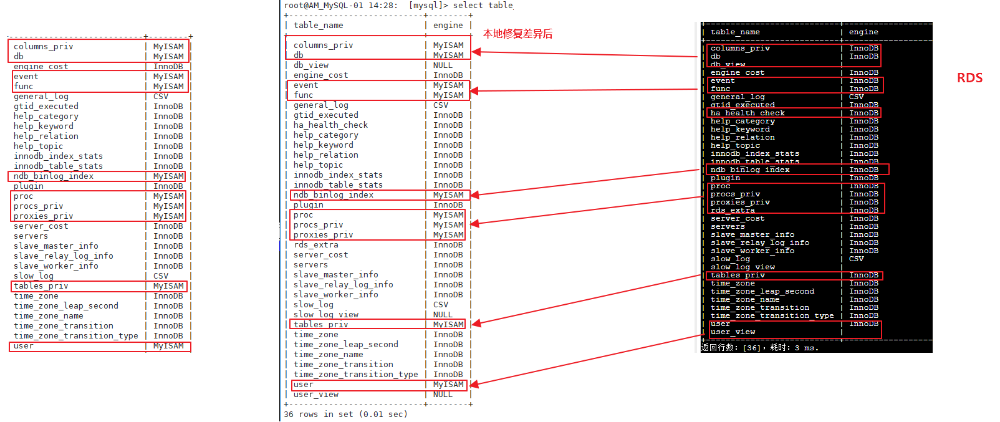

# 突破阿里限制实现RDS For MySQL 5.7到自建MySQL的实时同步

> 2018-08-14 大宝


[TOC]

> **摘要**
>
> 阿里云官网表示目前不支持RDS For MySQL 5.7 到自建MySQL的主从搭建，本篇文档尝试突破阿里云限制。经过多次验证发现，PerconaServer与RDS的兼容性最高， 破解方法为：使用Percona Server，在物理备份还原后，手动修改系统库引擎，已达到数据实时同步，且能够正常于从库进行权限配置。

## 背景

### 写在前面

目前很多客户在阿里云上使用的MySQL数据库版本多数为**RDS For MySQL 5.7**，尽管RDS本身拥有很高的数据库可用性和服务可用性，但都是基于阿里云本身，客户希望在保证阿里云上数据库高可用的同时，在本地也有一份保障，因此云上RDS到IDC的数据库实时同步成为一个重要的需求场景。

目前阿里云只提供DTS工具来实现云上到IDC机房数据实时同步的场景，一个最小规格的同步链路其费用为27840元/年，接近3万元。

**为何只能通过DTS同步工具来实现从RDS到自建数据库的同步关系呢？**

我们看看阿里官方的解释：

[阿里官方DTS实现RDS到自建的同步](https://help.aliyun.com/document_detail/26621.html?spm=a2c4g.11186623.6.584.aKUIz1)

>  RDS 目前已经不支持 MYISAM 引擎了，所有的数据库，包括系统库默认都是使用InnoDB存储引擎。所以如果是通过自建的replication 同步就会有不兼容的问题，例如从库无法管理用户，甚至无法正常启动等无法预知的问题。
> 如果需求是从RDS到自建数据库的同步关系，建议您使用DTS 做业务数据的同步。

### DTS工具的痛点

* 使用DTS做云上到自建数据库业务数据的同步时，只能选择**DTS迁移工具**，而该工具在使用时必须保证没有DDL操作，否则就会停止同步，相信没有哪个业务能够长期保证不执行DDL操作，因此DTS迁移工具不能一直使用。只能是周期性地去同步RDS和自建MySQL的数据，属于非实时同步，且每次都是全量同步，同步耗时是需要根据数据量的情况来评估的（1T的数据预计在10小时）。
* DTS同步工具，虽然可以支持同步过程中执行DDL操作，但是目前只支持从RDS到RDS For MySQL，且同步过程中不支持触发器。
* 如果能够利用MySQL自带的Replication技术去实现数据同步，一来可以完全实现实时同步，而来还能够节省支出。

## 探索解决方法

> 阿里云RDS For MySQL 5.7 的版本号并不是唯一的，有5.7.17、5.7.20 等，大版本号确定为5.7，小版本号不确定。


自建MySQL选择以下本版进行尝试：

* MySQL 5.7.20
* Percona Server 5.7.20

### 初步探索

RDS For MySQL 5.7 到自建MySQL 5.7.20/Percona Server5.7.20 搭建主从同步架构:

- 配置从库不同步RDS主库的系统表

```
# skip rep
replicate_wild_ignore_table=mysql.%
replicate_wild_ignore_table=sys.%
replicate_wild_ignore_table=information_schema.%
```

- **非系统库数据同步正常**
- 从库无法执行grant命令，即无法添加授权信息
- 从库无法对系统表mysql.user表执行insert操作
- 从库无法对系统表mysql.user表执行updat操作

报错如下：

```shell
ERROR 1064 (42000): Unknown trigger has an error in its body: 'Unknown system variable 'maintain_user_list''
```

### 问题根源

通过初步对比系统库`mysql`，可以发现一些端倪：

* 和MySQL官方的社区版相比，Percona的版本与RDS兼容性更高
* RDS与Percona版本在系统库引擎的差异如下图所示：

```sql
select table_name,engine from information_schema.tables where table_schema='mysql';
```


## 破解方法

经过多次验证发现，RDS使用的应该是Percona的数据库服务器，并进行了二次开发，破解的方法为**物理备份还原后，手动修改系统库**。

### 破解环境概览

| 数据库环境          | 说明                  |
| ------------------- | --------------------- |
| 阿里云RDS           | 5.7.20                |
| 自建MySQL服务器系统 | CentOS 7.4            |
| 自建MYSQL数据库版本 | Percona Server 5.7.20 |

### 具体操作步骤

#### 1 自建MySQL安装

```shell
wget "https://raw.githubusercontent.com/BoobooWei/DBA_Mysql/master/scripts/auto_intall/install_perconaxerver5.7.20_centos7.sh"
bash install_perconaxerver5.7.20_centos7.sh
/alidata/mysql/support-files/mysql.server start
mysql -e "select @@version;"
```

如果返回`5.7.20-log`则说明已成功安装并启动了数据库服务。

软件架构如下：

| 自建数据库软件架构      | 说明                           |
| ----------------------- | ------------------------------ |
| 安装目录                | /alidata/mysql                 |
| 数据目录                | /alidata/mysql/data            |
| 守护进程                | /alidata/mysql/bin/mysqld      |
| 监听端口                | 3306                           |
| 配置文件                | /etc/my.cnf                    |
| RDS备份文件下载解压目录 | /alidata/mysql/xtrabackup_data |

#### 2 全备份文件下载并解压

登陆到阿里云RDS控制台，选择最近的全备份进行下载，全备份时间不能超过binlog设置的过期时间。

```shell
curl -o "hins4764419_data_20180913072637.tar.gz" "http://rdsbak-shanghai-v2.oss-cn-shanghai-internal.aliyuncs.com/asldkjalsdkjflasdjf"
```

下载pxc工具以及阿里云专用解压工具

```shell
wget https://raw.githubusercontent.com/BoobooWei/DBA_Mysql/master/scripts/auto_intall/install_rds_pxc_centos7.sh
bash install_rds_pxc_centos7.sh
```
开始解压全备份数据

```shell
# 全备份恢复
bash rds_backup_extract.sh -f hins4764419_data_20180913072637.tar.gz -C /alidata/mysql/xtrabackup_data
# applay-log
innobackupex --apply-log /alidata/mysql/xtrabackup_data
chown mysql. -R /alidata/mysql/xtrabackup_data
```
如果数据量很大，这一步会非常耗时。

#### 3 将全备份数据恢复

停止数据库服务

```shell
/alidata/mysql/support-files/mysql.server stop
```

将初始化的数据库数据目录重命名为data_back
```shell
mv /alidata/mysql/data/ /alidata/mysql/data_back
```

将pxc恢复的全备份文件目录重命名为data

```shell
mv /alidata/mysql/xtrabackup_data /alidata/mysql/data
```

启动本地数据库

```shell
/alidata/mysql/support-files/mysql.server start
```
#### 4 手动修改系统库

备份RDS的元数据（与本地有差别的表）

```shell
mysqldump -u$rds_user -p$rds_pwd -h$rds_url -P $rds_port mysql columns_priv db event func ndb_binlog_index proc procs_priv proxies_priv tables_priv user  --set-gtid-purged=OFF --opt --default-character-set=utf8  --single-transaction --hex-blob --skip-triggers --max_allowed_packet=824288000 -d  > mysql.sys.meta.sql
```

备份rds差异表的数据

```shell
mysqldump -u$rds_user -p$rds_pwd -h$rds_url -P $rds_port mysql columns_priv db event func ndb_binlog_index proc procs_priv proxies_priv tables_priv user  --set-gtid-purged=OFF --opt --default-character-set=utf8  --single-transaction --hex-blob --skip-triggers --max_allowed_packet=824288000 -t > mysql.sys.data.sql 
```

删除本地恢复的差别表
```shell
cat > local_drop.sql << ENDF
drop table columns_priv ;
drop table db;
drop table event;
drop table func;
drop table ndb_binlog_index;
drop table proc;
drop table procs_priv;
drop table proxies_priv;
drop table tables_priv;
drop table user;
ENDF
mysql < local_drop.sql 
```

删除本地数据文件
```shell
cd $datadir
rm -rf columns_priv\.*
rm -rf db\.*
rm -rf event\.*
rm -rf func\.*
rm -rf ndb_binlog_index\.*
rm -rf proc\.*
rm -rf procs_priv\.*
rm -rf proxies_priv\.*
rm -rf tables_priv\.* 
rm -rf user\.* 
```

导入元数据（即表结构）
```shell
sed -i 's/ENGINE=InnoDB/ENGINE=myisam/' mysql.sys.meta.sql
mysql mysql < mysql.sys.meta.sql
```

导入数据
```shell
mysql mysql < mysql.sys.data.sql
```

添加权限
```shell
cat > local_grant.sql << ENDF
grant all on *.* to 'booboo'@'%' identified by 'Uploo00king';
update mysql.user set authentication_string=password('Uploo00king') where user='aliyun_root';
ENDF

mysql < local_grant.sql
```

重新启动服务
```shell
/alidata/mysql/support-files/mysql.server restart
```

#### 5 配置主从

停止本地数据库的replication线程，并清空相关配置

```shell
stop slave;
reset slave all;
reset master;
```

修改GTID参数
```shell
SET GLOBAL gtid_purged='$gtid';
```

配置主库同步信息
```shell
change master to master_host='$url',master_user='$user',master_password='$pwd',master_auto_position=1;
```

启动replication
```shell
start slave;
```

查看主从明细
```shell
show slave status\G;
```

## 总结

下面这幅图中最左侧为PerconaServer的系统表清空，中间这副是将RDS系统表修改后的结果，最右边是RDS的系统表情况。




通过手动修改自建MySQL系统库mysql中的表引擎，我们达到了RDS到自建MySQL实时同步的目的，且经过生产环境验证，该方法完全可以突破阿里限制实现云上和IDC机房的数据实时同步。