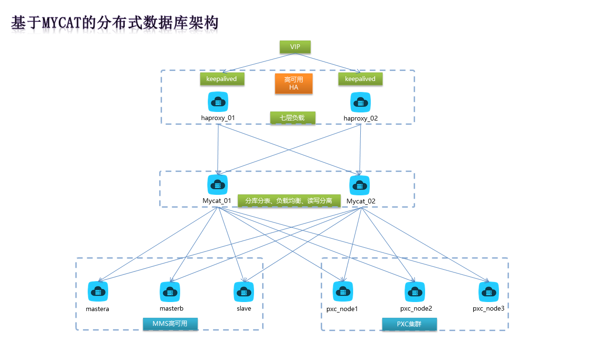
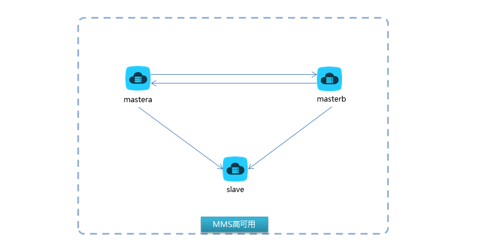

# 实施基于MyCAT的分布式数据库架构PXC + MMS + MyCAT + HAproxy + Keepalived

> 2018-02-09 驻云DBA组
>
> 该文档注重搭建的实战，若需要学习每一个组件的原理可以参考最后的链接


[TOC]

##1 架构图



* keepalived实现haproxy的高可用
* haproxy实现mycat的负载均衡和高可用   *2台haproxy建议生产中和mycat服务分开 ，实验环境中由于虚拟机数量的限制，所以haproxy和mycat放在同一台上*
* mycat实现了数据库的读写分离、负载均衡、分库分表、自动故障转移
* pxc集群实现了mysql高可用
* mms双主多源复制实现mysql高可用

整套架构最终实现数据库的分布式架构，单表数据量在两个数据节点都不够存放时，可以再添加一个mysql集群节点，mycat中做相应配置即可实现水平扩展。


## 2 服务和节点规划

一共准备了6台虚拟机操作系统 RHEL 7.2（CentOS 7.2），有条件的化，建议准备10台虚拟机。

| server            | port             | hostname     | ip          |
| :---------------- | :--------------- | :----------- | :---------- |
| PXC node1         | 3306             | mastera0     | 172.25.0.11 |
| PXC node2         | 3306             | masterb0     | 172.25.0.12 |
| PXC node3         | 3306             | slavea0      | 172.25.0.13 |
| MMS mastera       | 3306             | slaveb0      | 172.25.0.14 |
| MMS masterb       | 3306             | dbproxy0     | 172.25.0.15 |
| MMS slave         | 3306             | workstation0 | 172.25.0.10 |
| mycat_node1       | 8066             | dbproxy0     | 172.25.0.15 |
| mycat_node2       | 8066             | workstation0 | 172.25.0.10 |
| haproxy_01        | 7066             | dbproxy0     | 172.25.0.15 |
| haproxy_02        | 7066             | workstation0 | 172.25.0.10 |
| keepalived_master | vip:172.25.0.100 | dbproxy0     | 172.25.0.15 |
| keepalived_backup | vip:172.25.0.100 | workstation0 | 172.25.0.10 |


## 3 软件准备

* keepalived 使用系统自带yum源中的rpm包

* haproxy 使用系统自带yum源中的rpm包

* mycat 需要到mycat官网下载Mycat-server-1.5.1-RELEASE-20160328130228-linux.tar.gz 以及 oracle官网下载jdk-7u79-linux-x64.rpm 以及mysql官网下载mysql-connector-java-5.1.45.tar.gz

* pxc和mms都使用percona公司的Percona-XtraDB-Cluster，在percona官网下载

* innobackupex数据库物理备份工具在percona公司官网下载Percona-XtraBackup-2.3.4-re80c779-el7-x86_64-bundle.tar

  下载后的包如下所示

```shell
# mycat
jdk-7u79-linux-x64.rpm
Mycat-server-1.5.1-RELEASE-20160328130228-linux.tar.gz
Mycat_V1.6.0.pdf
mysql-connector-java-5.1.45.tar.gz
# innobackupex
libev-4.15-6.el7.x86_64.rpm
percona-xtrabackup-24-2.4.8-1.el7.x86_64.rpm
# pxc
Percona-XtraDB-Cluster-57-5.7.16-27.19.1.el7.x86_64.rpm
Percona-XtraDB-Cluster-57-debuginfo-5.7.16-27.19.1.el7.x86_64.rpm
Percona-XtraDB-Cluster-client-57-5.7.16-27.19.1.el7.x86_64.rpm
Percona-XtraDB-Cluster-devel-57-5.7.16-27.19.1.el7.x86_64.rpm
Percona-XtraDB-Cluster-full-57-5.7.16-27.19.1.el7.x86_64.rpm
Percona-XtraDB-Cluster-garbd-57-5.7.16-27.19.1.el7.x86_64.rpm
Percona-XtraDB-Cluster-server-57-5.7.16-27.19.1.el7.x86_64.rpm
Percona-XtraDB-Cluster-shared-57-5.7.16-27.19.1.el7.x86_64.rpm
Percona-XtraDB-Cluster-shared-compat-57-5.7.16-27.19.1.el7.x86_64.rpm
Percona-XtraDB-Cluster-test-57-5.7.16-27.19.1.el7.x86_64.rpm
galera-25.3.9-1.rhel7.el7.centos.x86_64.rpm
jemalloc-3.6.0-1.el7.x86_64.rpm
jemalloc-devel-3.6.0-1.el7.x86_64.rpm
# 下面是自己通过createrepo命令生成的yum配置文件，若有疑问可以查一下【手动制作yum源】
pxc.repo
repodata
```

## 4 PXC集群的搭建

percona xtradb cluster集群是基于引擎层的同步复制，所以数据一致性更高。

### 4.1 安装软件

auto_install_pxc.sh 脚本如下所示，需要在每一台pxc节点上安装。

```shell
#!/bin/bash
systemctl stop firewalld
systemctl disable firewalld
sed -i 's/SELINUX=enforcing/SELINUX=disabled/' /etc/selinux/config
setenforce 0
yum install -y wget net-tools vim
# 此处是我自己搭建了一个局域网站实现pxc的局域网内的在线yum源
wget http://172.25.254.254/content/Git/DB100_mysql/sides/soft/cluster/pxc-cluster-el7/pxc.repo -P /etc/yum.repos.d/
yum clean all && yum makecache
for i in `rpm -qa|grep mariadb`;do rpm -e --nodeps $i;done
yum install -y percona-xtrabackup-24 Percona-XtraDB-Cluster-57  galera* jemalloc*
```

bash auto_install_pxc.sh

通过跳板机，远程操作多台机器，循环完成安装

```
for i in seq 10 15;do ssh-copy-id root@172.25.0.$i;done
for i in seq 10 15;do scp auto_install_pxc.sh root@172.25.0.$i:~;done    
for i in seq 10 15;do ssh root@172.25.0.$i "bash auto_install_pxc.sh";done
```

### 4.2 pxc_node1

#### 4.2.1 配置文件

```
# vim /etc/my.cnf
grep -v '^#\|^$' /etc/my.cnf
[client]
socket=/var/lib/mysql/mysql.sock
[mysqld]
server-id=1 # server-id集群中每个节点保证唯一
datadir=/var/lib/mysql
socket=/var/lib/mysql/mysql.sock
log-error=/var/log/mysqld.log
pid-file=/var/run/mysqld/mysqld.pid
log-bin
log_slave_updates
expire_logs_days=7
symbolic-links=0
wsrep_provider=/usr/lib64/galera3/libgalera_smm.so
wsrep_cluster_address=gcomm://  # 集群初始节点因此此处使用默认值即可
binlog_format=ROW
default_storage_engine=InnoDB
wsrep_slave_threads= 8
wsrep_log_conflicts
innodb_autoinc_lock_mode=2
wsrep_cluster_name=pxc-cluster # 集群的名称，集群中所有节点保持一致
wsrep_node_name=pxc-cluster-node-1 # 集群节点的名称，自定义即可
pxc_strict_mode=ENFORCING 
wsrep_sst_method=rsync # 集群间同步数据的方式
```

#### 4.4.2 启动服务

```shell
systemctl start mysql
```

#### 4.2.3 修改初始密码

```shell
password=`grep password /var/log/mysqld.log|awk '{print $11}'`
mysqladmin -uroot -p$password password '(Uploo00king)'
```

##### 4.2.3.1 密码修改失败处理

有时初始密码中若包含？& 很有可能不能修改成功，此时按照如下步骤即可

```shell
# 修改配置文件，跳过认证授权
vim my.cf
[mysqld]
skip-grant-tables
# 重新启动服务
systemctl restart mysql
# 登陆数据库服务器后修改密码
mysql > update mysql.user set authentication_string=password('(Uploo00king)');
# 修改配置文件去除参数
vim my.cf
[mysqld]
#skip-grant-tables

# 重启服务
systemctl restart mysql
```

#### 4.2.4 查看集群状态

```shel
mysql -uroot -p'(Uploo00king)' -e "show status like 'wsrep_cluster%'"
mysql: [Warning] Using a password on the command line interface can be insecure.
+--------------------------+--------------------------------------+
| Variable_name            | Value                                |
+--------------------------+--------------------------------------+
| wsrep_cluster_conf_id    | 1                                    |
| wsrep_cluster_size       | 1                                    |
| wsrep_cluster_state_uuid | 838b888e-0c95-11e8-9eaf-62dad1baf837 |
| wsrep_cluster_status     | Primary                              |
+--------------------------+--------------------------------------+
```


### 4.3 pxc_node2

#### 4.3.1 配置文件

```shell
vim /etc/my.cnf
grep -v '^#\|^$' /etc/my.cnf
[client]
socket=/var/lib/mysql/mysql.sock
[mysqld]
server-id=2
datadir=/var/lib/mysql
socket=/var/lib/mysql/mysql.sock
log-error=/var/log/mysqld.log
pid-file=/var/run/mysqld/mysqld.pid
log-bin
log_slave_updates
expire_logs_days=7
symbolic-links=0
wsrep_provider=/usr/lib64/galera3/libgalera_smm.so
wsrep_cluster_address="gcomm://172.25.0.11"
binlog_format=ROW
default_storage_engine=InnoDB
wsrep_slave_threads= 8
wsrep_log_conflicts
innodb_autoinc_lock_mode=2
wsrep_cluster_name=pxc-cluster
wsrep_node_name=pxc-cluster-node-2
pxc_strict_mode=ENFORCING
wsrep_sst_method=rsync
```
#### 4.3.2 启动服务

```shell
systemctl start mysql
```

#### 4.3.3 修改初始密码

```shell
password=`grep password /var/log/mysqld.log|awk '{print $11}'`
mysqladmin -uroot -p$password password '(Uploo00king)'
```

#### 4.3.4 查看集群状态

```shel
mysql -uroot -p'(Uploo00king)' -e "show status like 'wsrep_cluster%'"
mysql: [Warning] Using a password on the command line interface can be insecure.
+--------------------------+--------------------------------------+
| Variable_name            | Value                                |
+--------------------------+--------------------------------------+
| wsrep_cluster_conf_id    | 2                                    |
| wsrep_cluster_size       | 2                                    |
| wsrep_cluster_state_uuid | 838b888e-0c95-11e8-9eaf-62dad1baf837 |
| wsrep_cluster_status     | Primary                              |
+--------------------------+--------------------------------------+
```
### 4.4 pxc_node3

#### 4.4.1 配置文件

```shell
vim /etc/my.cnf
grep -v '^#\|^$' /etc/my.cnf
[client]
socket=/var/lib/mysql/mysql.sock
[mysqld]
server-id=3
datadir=/var/lib/mysql
socket=/var/lib/mysql/mysql.sock
log-error=/var/log/mysqld.log
pid-file=/var/run/mysqld/mysqld.pid
log-bin
log_slave_updates
expire_logs_days=7
symbolic-links=0
wsrep_provider=/usr/lib64/galera3/libgalera_smm.so
wsrep_cluster_address="gcomm://172.25.0.11,172.25.0.12"
binlog_format=ROW
default_storage_engine=InnoDB
wsrep_slave_threads= 8
wsrep_log_conflicts
innodb_autoinc_lock_mode=2
wsrep_cluster_name=pxc-cluster
wsrep_node_name=pxc-cluster-node-3
pxc_strict_mode=ENFORCING
wsrep_sst_method=rsync
```

#### 4.4.2 启动服务

```shell
systemctl start mysql
```

#### 4.4.3 修改初始密码

```shell
password=`grep password /var/log/mysqld.log|awk '{print $11}'`
mysqladmin -uroot -p$password password '(Uploo00king)'
```

#### 4.4.4 查看集群状态

```shel
mysql -uroot -p'(Uploo00king)' -e "show status like 'wsrep_cluster%'"
mysql: [Warning] Using a password on the command line interface can be insecure.
+--------------------------+--------------------------------------+
| Variable_name            | Value                                |
+--------------------------+--------------------------------------+
| wsrep_cluster_conf_id    | 3                                    |
| wsrep_cluster_size       | 3                                    |
| wsrep_cluster_state_uuid | 838b888e-0c95-11e8-9eaf-62dad1baf837 |
| wsrep_cluster_status     | Primary                              |
+--------------------------+--------------------------------------+
```

#### 4.4.5 集群宕机后重启 

例如做实验的时候做到一半，就关机了，第二天再次启动虚拟机却发现集群无法启动了，执行一下步骤

```shell
systemctl stop mysql
rm -rf /var/lib/mysql/grastate.dat
systemctl start mysql
```

grastate.dat文件中记录着集群的状态信息，例如集群唯一标识，重新启动集群节点前删除该文件即可。

### 4.5 验证结果

1. 从任意节点写入测试数据，所有节点都可以同步到
2. 节点宕机后重新加入集群，可以自动同步增量数据

&emsp;

&emsp;


## 5 MMS高可用搭建

MMS是通过mysql的replication技术实现了异步复制，双主+多源复制的高可用。

此处使用的还是pxc的mysql5.7版本




### 5.1 mms_mastera

#### 5.1.1 配置文件

```shell
vim /etc/my.cnf
grep -v '^#\|^$' /etc/my.cnf
[client]
socket=/var/lib/mysql/mysql.sock
[mysqld]
server-id=1 # 确保mms架构中id的唯一性
datadir=/var/lib/mysql
socket=/var/lib/mysql/mysql.sock
log-error=/var/log/mysqld.log
pid-file=/var/run/mysqld/mysqld.pid
log-bin
log_slave_updates
expire_logs_days=7
symbolic-links=0
wsrep_provider=/usr/lib64/galera3/libgalera_smm.so
wsrep_cluster_address=gcomm://
binlog_format=ROW
default_storage_engine=InnoDB
wsrep_slave_threads= 8
wsrep_log_conflicts
innodb_autoinc_lock_mode=2
wsrep_cluster_name=mms-mastera # 由于此处使用集群版，就让每个主从节点都是一个独立的集群，每个节点取不同的名字即可
wsrep_node_name=pxc-cluster-node-1
pxc_strict_mode=ENFORCING
wsrep_sst_method=rsync
```

#### 5.1.2 启动服务

```shell
systemctl start mysql
```

#### 5.1.3 修改初始密码

```shell
password=`grep password /var/log/mysqld.log|awk '{print $11}'`
mysqladmin -uroot -p$password password '(Uploo00king)' 
```

#### 5.1.4 添加授权

```shell
mysql -uroot -p'(Uploo00king)' -e "grant all on *.* to slave@'%' identified by '(Uploo00king)';flush privileges"
```

#### 5.1.5 查看binlog位置

```shell
mysql -uroot -p'(Uploo00king)' -e " show master status\G;"
*************************** 1. row ***************************
             File: slaveb0-bin.000002
         Position: 847
     Binlog_Do_DB: 
 Binlog_Ignore_DB: 
Executed_Gtid_Set:
```


### 5.2 mms_masterb

#### 5.2.1 配置文件

```shell
vim /etc/my.cnf
grep -v '^#\|^$' /etc/my.cnf
[client]
socket=/var/lib/mysql/mysql.sock
[mysqld]
server-id=2 # 确保mms架构中id的唯一性
datadir=/var/lib/mysql
socket=/var/lib/mysql/mysql.sock
log-error=/var/log/mysqld.log
pid-file=/var/run/mysqld/mysqld.pid
log-bin
log_slave_updates
expire_logs_days=7
symbolic-links=0
wsrep_provider=/usr/lib64/galera3/libgalera_smm.so
wsrep_cluster_address=gcomm://
binlog_format=ROW
default_storage_engine=InnoDB
wsrep_slave_threads= 8
wsrep_log_conflicts
innodb_autoinc_lock_mode=2
wsrep_cluster_name=mms-masterb # 由于此处使用集群版，就让每个主从节点都是一个独立的集群，每个节点取不同的名字即可
wsrep_node_name=pxc-cluster-node-1
pxc_strict_mode=ENFORCING
wsrep_sst_method=rsync
```

#### 5.2.2 启动服务

```shell
systemctl start mysql
```

#### 5.2.3 修改初始密码

```shell
password=`grep password /var/log/mysqld.log|awk '{print $11}'`
mysqladmin -uroot -p$password password '(Uploo00king)'
```

#### 5.2.4 添加授权

```shell
mysql -uroot -p'(Uploo00king)' -e "grant all on *.* to slave@'%' identified by '(Uploo00king)';flush privileges"
```

#### 5.2.5 宣告主库

```shell
mysql> change master to master_host='172.25.0.14',master_user='slave',master_password='(Uploo00king)',master_log_file='slaveb0-bin.000002',master_log_pos=847;
```

#### 5.2.6 启动从服务

```shell
mysql> start slave;
```

#### 5.2.7 查看从服务状态

```shell
mysql> show slave status\G;
*************************** 1. row ***************************
               Slave_IO_State: Waiting for master to send event
                  Master_Host: 172.25.0.14
                  Master_User: slave
                  Master_Port: 3306
                Connect_Retry: 60
              Master_Log_File: slaveb0-bin.000002
          Read_Master_Log_Pos: 847
               Relay_Log_File: dbproxy0-relay-bin.000002
                Relay_Log_Pos: 322
        Relay_Master_Log_File: slaveb0-bin.000002
             Slave_IO_Running: Yes
            Slave_SQL_Running: Yes
              Replicate_Do_DB: 
          Replicate_Ignore_DB: 
           Replicate_Do_Table: 
       Replicate_Ignore_Table: 
      Replicate_Wild_Do_Table: 
  Replicate_Wild_Ignore_Table: 
                   Last_Errno: 0
                   Last_Error: 
                 Skip_Counter: 0
          Exec_Master_Log_Pos: 847
              Relay_Log_Space: 532
              Until_Condition: None
               Until_Log_File: 
                Until_Log_Pos: 0
           Master_SSL_Allowed: No
           Master_SSL_CA_File: 
           Master_SSL_CA_Path: 
              Master_SSL_Cert: 
            Master_SSL_Cipher: 
               Master_SSL_Key: 
        Seconds_Behind_Master: 0
Master_SSL_Verify_Server_Cert: No
                Last_IO_Errno: 0
                Last_IO_Error: 
               Last_SQL_Errno: 0
               Last_SQL_Error: 
  Replicate_Ignore_Server_Ids: 
             Master_Server_Id: 1
                  Master_UUID: fa24bb7f-0c99-11e8-a8fa-52540000000e
             Master_Info_File: /var/lib/mysql/master.info
                    SQL_Delay: 0
          SQL_Remaining_Delay: NULL
      Slave_SQL_Running_State: Slave has read all relay log; waiting for more updates
           Master_Retry_Count: 86400
                  Master_Bind: 
      Last_IO_Error_Timestamp: 
     Last_SQL_Error_Timestamp: 
               Master_SSL_Crl: 
           Master_SSL_Crlpath: 
           Retrieved_Gtid_Set: 
            Executed_Gtid_Set: 
                Auto_Position: 0
         Replicate_Rewrite_DB: 
                 Channel_Name: 
           Master_TLS_Version:
```

#### 5.2.8 查看binlog位置

```shell
mysql -uroot -p'(Uploo00king)' -e " show master status\G;"
*************************** 1. row ***************************
             File: dbproxy0-bin.000002
         Position: 847
     Binlog_Do_DB: 
 Binlog_Ignore_DB: 
Executed_Gtid_Set:
```


### 5.3 mms_slave

这台mysql实例将配置两个主库，叫做多源复制，该技术从mysql5.7版本才有，需要在从库上添加两个参数

```shell
master-info-repository=table	# 开启多源复制需要将主库信息以表格的方式存放
relay-log-info-repository=table # 开启多源复制需要将中继日志信息以表格方式存放
```

#### 5.3.1 配置文件

```shell
vim /etc/my.cnf
grep -v '^#\|^$' /etc/my.cnf
[client]
socket=/var/lib/mysql/mysql.sock
[mysqld]
server-id=3
master-info-repository=table	# 开启多源复制需要将主库信息以表格的方式存放
relay-log-info-repository=table # 开启多源复制需要将中继日志信息以表格方式存放
datadir=/var/lib/mysql
socket=/var/lib/mysql/mysql.sock
log-error=/var/log/mysqld.log
pid-file=/var/run/mysqld/mysqld.pid
log-bin
log_slave_updates
expire_logs_days=7
symbolic-links=0
wsrep_provider=/usr/lib64/galera3/libgalera_smm.so
wsrep_cluster_address=gcomm://
binlog_format=ROW
default_storage_engine=InnoDB
wsrep_slave_threads= 8
wsrep_log_conflicts
innodb_autoinc_lock_mode=2
wsrep_cluster_name=mms-slave
wsrep_node_name=pxc-cluster-node-1
pxc_strict_mode=ENFORCING
wsrep_sst_method=rsync
```

#### 5.3.2 启动服务

```shell
systemctl start mysql
```

#### 5.3.3 修改初始密码

```shell
password=`grep password /var/log/mysqld.log|awk '{print $11}'`
mysqladmin -uroot -p$password password '(Uploo00king)'
```

#### 5.3.4 宣告主库

先配置mastera为主，稍后会再配置masterb

```shell
mysql> change master to master_host='172.25.0.14',master_user='slave',master_password='(Uploo00king)',master_log_file='slaveb0-bin.000002',master_log_pos=847 for channel "channela";
```

### 5.4 mms_mastera

配置mms_masterb为mms_mastera的主

#### 5.4.1 宣告主库

```shell
mysql > change master to master_host='172.25.0.15',master_user='slave',master_password='(Uploo00king)',master_log_file='dbproxy0-bin.000002',master_log_pos=847;
```

#### 5.4.2 启动从服务

```shell
mysql> start slave;
```

#### 5.4.3 查看从服务状态

```shell
mysql> show slave status\G;
*************************** 1. row ***************************
               Slave_IO_State: Waiting for master to send event
                  Master_Host: 172.25.0.15
                  Master_User: slave
                  Master_Port: 3306
                Connect_Retry: 60
              Master_Log_File: dbproxy0-bin.000002
          Read_Master_Log_Pos: 847
               Relay_Log_File: slaveb0-relay-bin.000002
                Relay_Log_Pos: 323
        Relay_Master_Log_File: dbproxy0-bin.000002
             Slave_IO_Running: Yes
            Slave_SQL_Running: Yes
              Replicate_Do_DB: 
          Replicate_Ignore_DB: 
           Replicate_Do_Table: 
       Replicate_Ignore_Table: 
      Replicate_Wild_Do_Table: 
  Replicate_Wild_Ignore_Table: 
                   Last_Errno: 0
                   Last_Error: 
                 Skip_Counter: 0
          Exec_Master_Log_Pos: 847
              Relay_Log_Space: 532
              Until_Condition: None
               Until_Log_File: 
                Until_Log_Pos: 0
           Master_SSL_Allowed: No
           Master_SSL_CA_File: 
           Master_SSL_CA_Path: 
              Master_SSL_Cert: 
            Master_SSL_Cipher: 
               Master_SSL_Key: 
        Seconds_Behind_Master: 0
Master_SSL_Verify_Server_Cert: No
                Last_IO_Errno: 0
                Last_IO_Error: 
               Last_SQL_Errno: 0
               Last_SQL_Error: 
  Replicate_Ignore_Server_Ids: 
             Master_Server_Id: 2
                  Master_UUID: 669832f0-0c9b-11e8-b46e-52540000000f
             Master_Info_File: /var/lib/mysql/master.info
                    SQL_Delay: 0
          SQL_Remaining_Delay: NULL
      Slave_SQL_Running_State: Slave has read all relay log; waiting for more updates
           Master_Retry_Count: 86400
                  Master_Bind: 
      Last_IO_Error_Timestamp: 
     Last_SQL_Error_Timestamp: 
               Master_SSL_Crl: 
           Master_SSL_Crlpath: 
           Retrieved_Gtid_Set: 
            Executed_Gtid_Set: 
                Auto_Position: 0
         Replicate_Rewrite_DB: 
                 Channel_Name: 
           Master_TLS_Version: 
1 row in set (0.00 sec)
```

### 5.5 mms_slave

配置mms_masterb成为mms_slave的第二个主

####5.5.1 宣告主库

```shell
mysql > change master to master_host='172.25.0.15',master_user='slave',master_password='(Uploo00king)',master_log_file='dbproxy0-bin.000002',master_log_pos=847 for channel "channelb";
```

 #### 5.5.2 启动从服务

```shell
mysql> start slave;
```

#### 5.5.3 查看从服务状态

```shell
mysql> show slave status\G;
*************************** 1. row ***************************
               Slave_IO_State: Waiting for master to send event
                  Master_Host: 172.25.0.14
                  Master_User: slave
                  Master_Port: 3306
                Connect_Retry: 60
              Master_Log_File: slaveb0-bin.000002
          Read_Master_Log_Pos: 847
               Relay_Log_File: workstation0-relay-bin-channela.000002
                Relay_Log_Pos: 322
        Relay_Master_Log_File: slaveb0-bin.000002
             Slave_IO_Running: Yes
            Slave_SQL_Running: Yes
              Replicate_Do_DB: 
          Replicate_Ignore_DB: 
           Replicate_Do_Table: 
       Replicate_Ignore_Table: 
      Replicate_Wild_Do_Table: 
  Replicate_Wild_Ignore_Table: 
                   Last_Errno: 0
                   Last_Error: 
                 Skip_Counter: 0
          Exec_Master_Log_Pos: 847
              Relay_Log_Space: 545
              Until_Condition: None
               Until_Log_File: 
                Until_Log_Pos: 0
           Master_SSL_Allowed: No
           Master_SSL_CA_File: 
           Master_SSL_CA_Path: 
              Master_SSL_Cert: 
            Master_SSL_Cipher: 
               Master_SSL_Key: 
        Seconds_Behind_Master: 0
Master_SSL_Verify_Server_Cert: No
                Last_IO_Errno: 0
                Last_IO_Error: 
               Last_SQL_Errno: 0
               Last_SQL_Error: 
  Replicate_Ignore_Server_Ids: 
             Master_Server_Id: 1
                  Master_UUID: fa24bb7f-0c99-11e8-a8fa-52540000000e
             Master_Info_File: mysql.slave_master_info
                    SQL_Delay: 0
          SQL_Remaining_Delay: NULL
      Slave_SQL_Running_State: Slave has read all relay log; waiting for more updates
           Master_Retry_Count: 86400
                  Master_Bind: 
      Last_IO_Error_Timestamp: 
     Last_SQL_Error_Timestamp: 
               Master_SSL_Crl: 
           Master_SSL_Crlpath: 
           Retrieved_Gtid_Set: 
            Executed_Gtid_Set: 
                Auto_Position: 0
         Replicate_Rewrite_DB: 
                 Channel_Name: channela
           Master_TLS_Version: 
*************************** 2. row ***************************
               Slave_IO_State: Waiting for master to send event
                  Master_Host: 172.25.0.15
                  Master_User: slave
                  Master_Port: 3306
                Connect_Retry: 60
              Master_Log_File: dbproxy0-bin.000002
          Read_Master_Log_Pos: 847
               Relay_Log_File: workstation0-relay-bin-channelb.000002
                Relay_Log_Pos: 323
        Relay_Master_Log_File: dbproxy0-bin.000002
             Slave_IO_Running: Yes
            Slave_SQL_Running: Yes
              Replicate_Do_DB: 
          Replicate_Ignore_DB: 
           Replicate_Do_Table: 
       Replicate_Ignore_Table: 
      Replicate_Wild_Do_Table: 
  Replicate_Wild_Ignore_Table: 
                   Last_Errno: 0
                   Last_Error: 
                 Skip_Counter: 0
          Exec_Master_Log_Pos: 847
              Relay_Log_Space: 546
              Until_Condition: None
               Until_Log_File: 
                Until_Log_Pos: 0
           Master_SSL_Allowed: No
           Master_SSL_CA_File: 
           Master_SSL_CA_Path: 
              Master_SSL_Cert: 
            Master_SSL_Cipher: 
               Master_SSL_Key: 
        Seconds_Behind_Master: 0
Master_SSL_Verify_Server_Cert: No
                Last_IO_Errno: 0
                Last_IO_Error: 
               Last_SQL_Errno: 0
               Last_SQL_Error: 
  Replicate_Ignore_Server_Ids: 
             Master_Server_Id: 2
                  Master_UUID: 669832f0-0c9b-11e8-b46e-52540000000f
             Master_Info_File: mysql.slave_master_info
                    SQL_Delay: 0
          SQL_Remaining_Delay: NULL
      Slave_SQL_Running_State: Slave has read all relay log; waiting for more updates
           Master_Retry_Count: 86400
                  Master_Bind: 
      Last_IO_Error_Timestamp: 
     Last_SQL_Error_Timestamp: 
               Master_SSL_Crl: 
           Master_SSL_Crlpath: 
           Retrieved_Gtid_Set: 
            Executed_Gtid_Set: 
                Auto_Position: 0
         Replicate_Rewrite_DB: 
                 Channel_Name: channelb
           Master_TLS_Version: 
2 rows in set (0.00 sec)
```

### 5.6 验证结果

1. 从主节点写入测试数据，所有节点都可以同步到
2. 从节点既能同步mastera的数据，也能同步masterb的数据
3. 主节点任意一个宕机后，重新加入需要从节点重启slave服务
4. 从节点宕机后，重新加入即可自动同步数据

&emsp;

&emsp;


## 6 MyCAT数据库中间件的搭建

MyCAT前身是阿里巴巴的cobar，目前是国内高并发高性能的开源中间件。

在该架构中担负着数据库读写分离、负载均衡、分库分表、自动故障转移的重要角色。

### 6.1 软件安装

准备auto_install_mycat.sh安装脚本，分别在mycat_01和mycat_02上完成安装。

```shell
#!/bin/bash
mkdir /alidata/install -p
mkdir /alidata/mycat
# 软件的连接我用的自己局域网的rpm包，你需要自己找资源下载
wget http://172.25.254.254/content/Git/DB100_mysql/sides/soft/pxcmycat/jdk-7u79-linux-x64.rpm -P /alidata/install
wget http://172.25.254.254/content/Git/DB100_mysql/sides/soft/pxcmycat/Mycat-server-1.5.1-RELEASE-20160328130228-linux.tar.gz -P /alidata/install
wget http://172.25.254.254/content/Git/DB100_mysql/sides/soft/pxcmycat/mysql-connector-java-5.1.45.tar.gz -P /alidata/install
cd /alidata/install
rpm -ivh jdk-7u79-linux-x64.rpm
tar -xf Mycat-server-1.5.1-RELEASE-20160328130228-linux.tar.gz
mv mycat /alidata/
tar -xf mysql-connector-java-5.1.45.tar.gz 
cp mysql-connector-java-5.1.45/mysql-connector-java-5.1.45-bin.jar /alidata/mycat/lib
chmod a+x /alidata/mycat/lib/mysql-connector-java-5.1.45-bin.jar 
cat >> /etc/bashrc << ENDF
export JAVA_HOME=/usr/java/jdk1.7.0_79/
export PATH=\$PATH:/alidata/mycat/bin
ENDF
source /etc/bashrc
```

bash auto_install_mycat.sh

```shell
for i in `seq 10 15`;do scp auto_install_mycat.sh root@172.25.0.$i:~;done    
for i in `seq 10 15`;do ssh root@172.25.0.$i "bash auto_install_mycat.sh";done
```

注意：java的路径需要在bash的启动配置中宣告

### 6.2 配置文件

#### 6.2.1 配置文件概览

| 文件名        | 文件简介                                     |
| ---------- | ---------------------------------------- |
| server.xml | mycat的认证权限、服务监听等配置                       |
| schema.xml | mycat逻辑库对应的数据库节点配置（负载均衡、读写分离、分库分表、自动故障转移等） |
| rule.xml   | mycat分库分表的算法                             |
|            |                                          |

#### 6.2.2 配置目标

##### 6.2.2.1 分库分表

* ecshop库中的t2表一共分了16个库
* 16个库对应16个datanode数据节点
* 每个节点有对应的后端数据库实例的库名
* 后端有两个高可用架构pxc和mms组成
* 每个高可用架构提供db2_01~db2_08一共8个库

##### 6.2.2.2 读写分离

* pxc读写分离机制为：node1写，node2和node3读
* mms读写分离机制为：mastera写，masterb和slave读

##### 6.2.2.3 负载均衡

* pxc：读请求随机分配给node2和node3
* mms：读请求随机分配给masterb和slave读

##### 6.2.2.4 自动故障转移

* pxc的心跳检测`show status like 'wsrep%'`
* mms的心跳检测`select user()`

##### 6.2.2.5 mycat连接mysql驱动

* mycat连接pxc使用的驱动为：`native`
* mycat连接mms使用驱动为：`jdbc`

#### 6.2.3 server.xml

1. 用户名和密码 root/uplooking
2. 逻辑库名 ecshop
3. 数据监听端口 8066
4. 管理监听端口  9066 

```shell 
<?xml version="1.0" encoding="UTF-8"?>
<!-- - - Licensed under the Apache License, Version 2.0 (the "License"); 
	- you may not use this file except in compliance with the License. - You 
	may obtain a copy of the License at - - http://www.apache.org/licenses/LICENSE-2.0 
	- - Unless required by applicable law or agreed to in writing, software - 
	distributed under the License is distributed on an "AS IS" BASIS, - WITHOUT 
	WARRANTIES OR CONDITIONS OF ANY KIND, either express or implied. - See the 
	License for the specific language governing permissions and - limitations 
	under the License. -->
<!DOCTYPE mycat:server SYSTEM "server.dtd">
<mycat:server xmlns:mycat="http://org.opencloudb/">
	<system>
	<property name="defaultSqlParser">druidparser</property>
	<property name="serverPort">8066</property> <property name="managerPort">9066</property> 
      <!--  <property name="useCompression">1</property>--> <!--1为开启mysql压缩协议-->
	<!-- <property name="processorBufferChunk">40960</property> -->
	<!-- 
	<property name="processors">1</property> 
	<property name="processorExecutor">32</property> 
	 -->
		<!--默认是65535 64K 用于sql解析时最大文本长度 -->
		<!--<property name="maxStringLiteralLength">65535</property>-->
		<!--<property name="sequnceHandlerType">0</property>-->
		<!--<property name="backSocketNoDelay">1</property>-->
		<!--<property name="frontSocketNoDelay">1</property>-->
		<!--<property name="processorExecutor">16</property>-->
		<!-- 
			<property name="mutiNodeLimitType">1</property> 0：开启小数量级（默认） ；1：开启亿级数据排序
	    	<property name="mutiNodePatchSize">100</property> 亿级数量排序批量
			<property name="processors">32</property> <property name="processorExecutor">32</property> 
			<property name="idleTimeout">300000</property> <property name="bindIp">0.0.0.0</property> 
			<property name="frontWriteQueueSize">4096</property> <property name="processors">32</property> -->
	</system>
	<user name="root">
		<property name="password">uplooking</property>
		<property name="schemas">ecshop</property>
	</user>

	<user name="user">
		<property name="password">user</property>
		<property name="schemas">ecshop</property>
		<property name="readOnly">true</property>
	</user>
	<!-- 
	<quarantine> 
	   <whitehost>
	      <host host="127.0.0.1" user="mycat"/>
	      <host host="127.0.0.2" user="mycat"/>
	   </whitehost>
       <blacklist check="false"></blacklist>
	</quarantine>
	-->

</mycat:server>

```

#### 6.2.4 schema.xml

逻辑库ecshop的物理节点配置明细：

```shell 
<?xml version="1.0"?>
<!DOCTYPE mycat:schema SYSTEM "schema.dtd">
<mycat:schema xmlns:mycat="http://org.opencloudb/">

	<schema name="ecshop" checkSQLschema="false" sqlMaxLimit="100">
		<table name='t2' primaryKey='id' dataNode="dn1,dn2,dn3,dn4,dn5,dn6,dn7,dn8,dn9,dn10,dn11,dn12,dn13,dn14,dn15,dn16" rule='auto-sharding-long'/>
	</schema>
	<dataNode name="dn1" dataHost="pxc-cluster-1" database="db2_01" />
	<dataNode name="dn2" dataHost="pxc-cluster-1" database="db2_02" />
	<dataNode name="dn3" dataHost="pxc-cluster-1" database="db2_03" />
	<dataNode name="dn4" dataHost="pxc-cluster-1" database="db2_04" />
	<dataNode name="dn5" dataHost="pxc-cluster-1" database="db2_05" />
	<dataNode name="dn6" dataHost="pxc-cluster-1" database="db2_06" />
	<dataNode name="dn7" dataHost="pxc-cluster-1" database="db2_07" />
	<dataNode name="dn8" dataHost="pxc-cluster-1" database="db2_08" />
	<dataNode name="dn9" dataHost="mms" database="db2_01" />
	<dataNode name="dn10" dataHost="mms" database="db2_02" />
	<dataNode name="dn11" dataHost="mms" database="db2_03" />
	<dataNode name="dn12" dataHost="mms" database="db2_04" />
	<dataNode name="dn13" dataHost="mms" database="db2_05" />
	<dataNode name="dn14" dataHost="mms" database="db2_06" />
	<dataNode name="dn15" dataHost="mms" database="db2_07" />
	<dataNode name="dn16" dataHost="mms" database="db2_08" />
	<dataHost name="pxc-cluster-1" maxCon="1000" minCon="10" balance="1"
		writeType="0" dbType="mysql" dbDriver="native" switchType="3"  slaveThreshold="100">
		<heartbeat>show status like 'wsrep%'</heartbeat>
		<writeHost host="mastera0" url="172.25.0.11:3306" user="mycat"
			password="(Uploo00king)">
		</writeHost>
		<writeHost host="masterb0" url="172.25.0.12:3306" user="mycat"
			password="(Uploo00king)">
		</writeHost>
		<writeHost host="slavea0" url="172.25.0.13:3306" user="mycat"
			password="(Uploo00king)">
		</writeHost>
	</dataHost>

	<dataHost name="mms" maxCon="1000" minCon="10" balance="1" dbType="mysql" 
		dbDriver="jdbc"> 
		<heartbeat>select user()</heartbeat> 
		<writeHost host="slaveb0" 
		url="jdbc:mysql://172.25.0.14:3306" user="mycat" password="(Uploo00king)"> 
			<readHost host="workstation0" url="jdbc:mysql://172.25.0.10:3306" user="mycat" password="(Uploo00king)"/>
		</writeHost> 
		<writeHost host="dbproxy0" 
		url="jdbc:mysql://172.25.0.15:3306" user="mycat" password="(Uploo00king)"> 
			<readHost host="workstation0" url="jdbc:mysql://172.25.0.10:3306" user="mycat" password="(Uploo00king)"/>
		</writeHost> 
	</dataHost>
</mycat:schema>
```

#### 6.2.5 rule.xml

`t2`表选择的分库规则为`rule='auto-sharding-long'`

	<tableRule name="auto-sharding-long">
		<rule>
			<columns>id</columns>
			<algorithm>rang-long</algorithm>
		</rule>
	</tableRule>
* 该规则使用的分库键为`t2`的`id`列；
* 该规则使用的算法为`rang-long`

  <function name="rang-long"
  	class="org.opencloudb.route.function.AutoPartitionByLong">
  	<property name="mapFile">autopartition-long.txt</property>
  	<property name="count">16</property>
  	<property name="defaultNode">8</property>
  </function>
* mapFile：算法明细存放于`autopartition-long.txt`文件
* count：要分片的数据库节点数量，必须指定，否则没法分片
* defaultNode：如果没有匹配到规则默认将数据写入哪个分片节点

详细配置如下：

```shell 
<?xml version="1.0" encoding="UTF-8"?>
<!-- - - Licensed under the Apache License, Version 2.0 (the "License"); 
	- you may not use this file except in compliance with the License. - You 
	may obtain a copy of the License at - - http://www.apache.org/licenses/LICENSE-2.0 
	- - Unless required by applicable law or agreed to in writing, software - 
	distributed under the License is distributed on an "AS IS" BASIS, - WITHOUT 
	WARRANTIES OR CONDITIONS OF ANY KIND, either express or implied. - See the 
	License for the specific language governing permissions and - limitations 
	under the License. -->
<!DOCTYPE mycat:rule SYSTEM "rule.dtd">
<mycat:rule xmlns:mycat="http://org.opencloudb/">
	<tableRule name="rule1">
		<rule>
			<columns>id</columns>
			<algorithm>func1</algorithm>
		</rule>
	</tableRule>

	<tableRule name="rule2">
		<rule>
			<columns>user_id</columns>
			<algorithm>func1</algorithm>
		</rule>
	</tableRule>

	<tableRule name="sharding-by-intfile">
		<rule>
			<columns>id</columns>
			<algorithm>hash-int</algorithm>
		</rule>
	</tableRule>
	<tableRule name="auto-sharding-long">
		<rule>
			<columns>id</columns>
			<algorithm>rang-long</algorithm>
		</rule>
	</tableRule>
	<tableRule name="mod-long">
		<rule>
			<columns>id</columns>
			<algorithm>mod-long</algorithm>
		</rule>
	</tableRule>
	<tableRule name="sharding-by-murmur">
		<rule>
			<columns>id</columns>
			<algorithm>murmur</algorithm>
		</rule>
	</tableRule>
	<tableRule name="sharding-by-month">
		<rule>
			<columns>create_date</columns>
			<algorithm>partbymonth</algorithm>
		</rule>
	</tableRule>
	<tableRule name="latest-month-calldate">
		<rule>
			<columns>calldate</columns>
			<algorithm>latestMonth</algorithm>
		</rule>
	</tableRule>
	
	<tableRule name="auto-sharding-rang-mod">
		<rule>
			<columns>id</columns>
			<algorithm>rang-mod</algorithm>
		</rule>
	</tableRule>
	
	<tableRule name="jch">
		<rule>
			<columns>id</columns>
			<algorithm>jump-consistent-hash</algorithm>
		</rule>
	</tableRule>

	<function name="murmur"
		class="org.opencloudb.route.function.PartitionByMurmurHash">
		<property name="seed">0</property><!-- 默认是0 -->
		<property name="count">16</property><!-- 要分片的数据库节点数量，必须指定，否则没法分片 -->
		<property name="virtualBucketTimes">160</property><!-- 一个实际的数据库节点被映射为这么多虚拟节点，默认是160倍，也就是虚拟节点数是物理节点数的160倍 -->
		<!-- <property name="weightMapFile">weightMapFile</property> 节点的权重，没有指定权重的节点默认是1。以properties文件的格式填写，以从0开始到count-1的整数值也就是节点索引为key，以节点权重值为值。所有权重值必须是正整数，否则以1代替 -->
		<!-- <property name="bucketMapPath">/etc/mycat/bucketMapPath</property> 
			用于测试时观察各物理节点与虚拟节点的分布情况，如果指定了这个属性，会把虚拟节点的murmur hash值与物理节点的映射按行输出到这个文件，没有默认值，如果不指定，就不会输出任何东西 -->
	</function>
	<function name="hash-int"
		class="org.opencloudb.route.function.PartitionByFileMap">
		<property name="count">16</property><!-- 要分片的数据库节点数量，必须指定，否则没法分片 -->
		<property name="mapFile">partition-hash-int.txt</property>
		<property name="defaultNode">8</property>
	</function>
	<function name="rang-long"
		class="org.opencloudb.route.function.AutoPartitionByLong">
		<property name="mapFile">autopartition-long.txt</property>
		<property name="count">16</property>
		<property name="defaultNode">8</property>
	</function>
	<function name="mod-long" class="org.opencloudb.route.function.PartitionByMod">
		<!-- how many data nodes -->
		<property name="count">16</property>
	</function>

	<function name="func1" class="org.opencloudb.route.function.PartitionByLong">
		<property name="partitionCount">8</property>
		<property name="partitionLength">128</property>
	</function>
	<function name="latestMonth"
		class="org.opencloudb.route.function.LatestMonthPartion">
		<property name="splitOneDay">24</property>
	</function>
	<function name="partbymonth"
		class="org.opencloudb.route.function.PartitionByMonth">
		<property name="dateFormat">yyyy-MM-dd</property>
		<property name="sBeginDate">2015-01-01</property>
	</function>
	
	<function name="rang-mod" class="org.opencloudb.route.function.PartitionByRangeMod">
        	<property name="mapFile">partition-range-mod.txt</property>
		<property name="count">16</property><!-- 要分片的数据库节点数量，必须指定，否则没法分片 -->
		<property name="defaultNode">0</property>
	</function>
	
	<function name="jump-consistent-hash" class="org.opencloudb.route.function.PartitionByJumpConsistentHash">
		<property name="totalBuckets">3</property>
	</function>
</mycat:rule>
```
#### 6.2.6 autopartition-long.txt

若id在0-1000,则存放于0号分片节点；

若id在10000-20000，则存放于1号分片节点；

以此类推。

>  如何知晓后端节点为几号分片呢？
>
>  例如此处schema.xml配置中存在16个datanode，分别为dn1,dn2,dn3..dn16;那么dn1就是0号分片，dn2为1号分片，一次类推dn16就是第15号分片节点。

详细配置如下：

```shell   
# range start-end ,data node index
# K=1000,M=10000.
0-1M=0
1M-2M=1
2M-3M=2
3M-4M=3
4M-5M=4
5M-6M=5
6M-7M=6
7M-8M=7
8M-9M=8
9M-10M=9
10M-11M=10
11M-12M=11
12M-13M=12
13M-14M=13
14M-15M=14
15M-16M=15
```

这里特别强调一下分片规则的选择问题，如果某个表的数据有明显的时间特征，比如订单、交易记录等，则他们通常比较合适用时间范围分片，因为具有时效性的数据，我们往往关注其近期的数据，查询条件中往往带有时间字段进行过滤，比较好的方案是，当前活跃的数据，采用跨度比较短的时间段进行分片，而历史性的数据，则采用比较长的跨度存储。

总体上来说，分片的选择是取决于最频繁的查询SQL的条件，因为不带任何Where语句的查询SQL，会便利所有的分片，性能相对最差，因此这种SQL越多，对系统的影响越大，所以我们要尽量避免这种SQL的产生。


### 6.3 数据库实例

#### 6.3.1 添加对mycat的授权

pxc 和 mms 都需要执行：

```shell
grant all on *.* to mycat@'%' identified by '(Uploo00king)';
flush privileges;
```

#### 6.3.2 建库建表

根据分库分表的规则，在后端数据库集群实例中建库建表。本实例中只做了分库，没有做分表，如果分表那么create table的时候在末尾添加分表属性`PARTITION BY`即可。

> 分表例如：

```shell
CREATE TABLE `fx_achievement_p` (
  `id` int(11) NOT NULL AUTO_INCREMENT ,
  `user_key` varchar(45) DEFAULT NULL,
  `card_level` varchar(1) DEFAULT NULL,
  `pay_date` datetime ,
primary key (id,pay_date),
) ENGINE=InnoDB AUTO_INCREMENT=13828002 DEFAULT CHARSET=utf8
PARTITION BY RANGE(TO_DAYS(pay_date))  
(PARTITION p1 VALUES LESS THAN (TO_DAYS('2016-12-01'))ENGINE = InnoDB,  
 PARTITION p2 VALUES LESS THAN (TO_DAYS('2017-01-01'))ENGINE = InnoDB,  
 PARTITION p3 VALUES LESS THAN (TO_DAYS('2017-02-01'))ENGINE = InnoDB,  
 PARTITION p4 VALUES LESS THAN (TO_DAYS('2017-03-01'))ENGINE = InnoDB,  
 PARTITION p5 VALUES LESS THAN (TO_DAYS('2017-04-01'))ENGINE = InnoDB,
 PARTITION pall VALUES LESS THAN maxvalue ENGINE = InnoDB);
```


pxc 和 mms 分别建8个库，每个库中建相同结构的表，此处脚本批量完成。 

initmysql.sh 

```shell
#!/bin/bash
> init.sql
for i in `seq 1 8`
do
	echo "create database db2_0${i};" >> init.sql
	echo "use db2_0${i};" >> init.sql
	echo "create table t2 (id int primary key,name varchar(30));" >> init.sql
done
```

运行initmysql.sh后在当前目录下生成init.sql文件

```shell
create database db2_01;
use db2_01;
create table t2 (id int primary key,name varchar(30));
create database db2_02;
use db2_02;
create table t2 (id int primary key,name varchar(30));
create database db2_03;
use db2_03;
create table t2 (id int primary key,name varchar(30));
create database db2_04;
use db2_04;
create table t2 (id int primary key,name varchar(30));
create database db2_05;
use db2_05;
create table t2 (id int primary key,name varchar(30));
create database db2_06;
use db2_06;
create table t2 (id int primary key,name varchar(30));
create database db2_07;
use db2_07;
create table t2 (id int primary key,name varchar(30));
create database db2_08;
use db2_08;
create table t2 (id int primary key,name varchar(30));
```

将init.sql文件导入数据库

```shell
mysql -uroot -p'(Uploo00king)' < init.sql
```


### 6.4 启动mycat服务

#### 6.4.1 启动服务

```shell
mycat start
mycat status
```

#### 6.4.2 查看守护进程

```shel
ps -ef|grep java

root     18334 18332  7 15:54 ?        00:00:06 java -DMYCAT_HOME=. -server -XX:MaxPermSize=64M -XX:+AggressiveOpts -XX:MaxDirectMemorySize=2G -Dcom.sun.management.jmxremote -Dcom.sun.management.jmxremote.port=1984 -Dcom.sun.management.jmxremote.authenticate=false -Dcom.sun.management.jmxremote.ssl=false -Xmx4G -Xms1G -Djava.library.path=lib -classpath lib/wrapper.jar:conf:lib/zookeeper-3.4.6.jar:lib/jline-0.9.94.jar:lib/ehcache-core-2.6.11.jar:lib/log4j-1.2.17.jar:lib/guava-18.0.jar:lib/libwrapper-linux-x86-32.so:lib/netty-3.7.0.Final.jar:lib/mapdb-1.0.7.jar:lib/xml-apis-1.0.b2.jar:lib/slf4j-api-1.7.12.jar:lib/leveldb-api-0.7.jar:lib/wrapper.jar:lib/slf4j-log4j12-1.7.12.jar:lib/json-20151123.jar:lib/curator-framework-2.9.0.jar:lib/mongo-java-driver-2.11.4.jar:lib/druid-1.0.14.jar:lib/libwrapper-linux-ppc-64.so:lib/Mycat-server-1.5.1-RELEASE.jar:lib/leveldb-0.7.jar:lib/fastjson-1.2.7.jar:lib/sequoiadb-java-driver-1.0-20150615.070208-1.jar:lib/snakeyaml-1.16.jar:lib/univocity-parsers-1.5.4.jar:lib/curator-client-2.9.0.jar:lib/libwrapper-linux-x86-64.so:lib/dom4j-1.6.1.jar:lib/mysql-connector-java-5.1.45-bin.jar -Dwrapper.key=eOdzGSNOEVR9mMJA -Dwrapper.port=32000 -Dwrapper.jvm.port.min=31000 -Dwrapper.jvm.port.max=31999 -Dwrapper.pid=18332 -Dwrapper.version=3.2.3 -Dwrapper.native_library=wrapper -Dwrapper.service=TRUE -Dwrapper.cpu.timeout=10 -Dwrapper.jvmid=1 org.tanukisoftware.wrapper.WrapperSimpleApp org.opencloudb.MycatStartup start
root     18422 17766  0 15:56 pts/0    00:00:00 grep --color=auto java
```

#### 6.4.3 查看监听

```shell
ss -luntp|grep java

tcp    LISTEN     0      1      127.0.0.1:32000                 *:*                   users:(("java",pid=18334,fd=4))
tcp    LISTEN     0      100      :::9066                 :::*                   users:(("java",pid=18334,fd=56))
tcp    LISTEN     0      50       :::59601                :::*                   users:(("java",pid=18334,fd=39))
tcp    LISTEN     0      50       :::36030                :::*                   users:(("java",pid=18334,fd=37))
tcp    LISTEN     0      50       :::1984                 :::*                   users:(("java",pid=18334,fd=38))
tcp    LISTEN     0      100      :::8066                 :::*                   users:(("java",pid=18334,fd=60))
```


### 6.5 验证结果

分别连接mycat_01和mycat_02的8066和9066端口

#### 6.5.1 验证mycat_01

```shell
[root@dbproxy0 conf]# mysql -uroot -puplooking -h172.25.0.10 -P8066 -e "show databases"
mysql: [Warning] Using a password on the command line interface can be insecure.
+----------+
| DATABASE |
+----------+
| ecshop   |
+----------+
[root@dbproxy0 conf]# mysql -uroot -puplooking -h172.25.0.10 -P8066 ecshop -e "show tables;"
mysql: [Warning] Using a password on the command line interface can be insecure.
+------------------+
| Tables in ecshop |
+------------------+
| t2               |
+------------------+
[root@dbproxy0 conf]# mysql -uroot -puplooking -h172.25.0.10 -P9066 -e "show @@datanode"
mysql: [Warning] Using a password on the command line interface can be insecure.
+------+----------------------+-------+-------+--------+------+------+---------+------------+----------+---------+---------------+
| NAME | DATHOST              | INDEX | TYPE  | ACTIVE | IDLE | SIZE | EXECUTE | TOTAL_TIME | MAX_TIME | MAX_SQL | RECOVERY_TIME |
+------+----------------------+-------+-------+--------+------+------+---------+------------+----------+---------+---------------+
| dn1  | pxc-cluster-1/db2_01 |     0 | mysql |      0 |    2 | 1000 |      20 |          0 |        0 |       0 |            -1 |
| dn10 | mms/db2_02           |     0 | mysql |      0 |    1 | 1000 |       1 |          0 |        0 |       0 |            -1 |
| dn11 | mms/db2_03           |     0 | mysql |      0 |    1 | 1000 |       1 |          0 |        0 |       0 |            -1 |
| dn12 | mms/db2_04           |     0 | mysql |      0 |    1 | 1000 |       1 |          0 |        0 |       0 |            -1 |
| dn13 | mms/db2_05           |     0 | mysql |      0 |    1 | 1000 |       1 |          0 |        0 |       0 |            -1 |
| dn14 | mms/db2_06           |     0 | mysql |      0 |    1 | 1000 |       1 |          0 |        0 |       0 |            -1 |
| dn15 | mms/db2_07           |     0 | mysql |      0 |    2 | 1000 |       2 |          0 |        0 |       0 |            -1 |
| dn16 | mms/db2_08           |     0 | mysql |      0 |    2 | 1000 |       2 |          0 |        0 |       0 |            -1 |
| dn2  | pxc-cluster-1/db2_02 |     0 | mysql |      0 |    1 | 1000 |       1 |          0 |        0 |       0 |            -1 |
| dn3  | pxc-cluster-1/db2_03 |     0 | mysql |      0 |    2 | 1000 |       2 |          0 |        0 |       0 |            -1 |
| dn4  | pxc-cluster-1/db2_04 |     0 | mysql |      0 |    1 | 1000 |       1 |          0 |        0 |       0 |            -1 |
| dn5  | pxc-cluster-1/db2_05 |     0 | mysql |      0 |    1 | 1000 |       1 |          0 |        0 |       0 |            -1 |
| dn6  | pxc-cluster-1/db2_06 |     0 | mysql |      0 |    1 | 1000 |       1 |          0 |        0 |       0 |            -1 |
| dn7  | pxc-cluster-1/db2_07 |     0 | mysql |      0 |    1 | 1000 |       1 |          0 |        0 |       0 |            -1 |
| dn8  | pxc-cluster-1/db2_08 |     0 | mysql |      0 |    1 | 1000 |       1 |          0 |        0 |       0 |            -1 |
| dn9  | mms/db2_01           |     0 | mysql |      0 |    1 | 1000 |       1 |          0 |        0 |       0 |            -1 |
+------+----------------------+-------+-------+--------+------+------+---------+------------+----------+---------+---------------+
[root@dbproxy0 conf]# mysql -uroot -puplooking -h172.25.0.10 -P9066 -e "show @@datasource"
mysql: [Warning] Using a password on the command line interface can be insecure.
+----------+--------------+-------+-------------+------+------+--------+------+------+---------+
| DATANODE | NAME         | TYPE  | HOST        | PORT | W/R  | ACTIVE | IDLE | SIZE | EXECUTE |
+----------+--------------+-------+-------------+------+------+--------+------+------+---------+
| dn16     | slaveb0      | mysql | 172.25.0.14 | 3306 | W    |      0 |   10 | 1000 |      10 |
| dn16     | dbproxy0     | mysql | 172.25.0.15 | 3306 | W    |      0 |    0 | 1000 |       0 |
| dn16     | workstation0 | mysql | 172.25.0.10 | 3306 | R    |      0 |    3 | 1000 |       3 |
| dn16     | workstation0 | mysql | 172.25.0.10 | 3306 | R    |      0 |    3 | 1000 |       3 |
| dn15     | slaveb0      | mysql | 172.25.0.14 | 3306 | W    |      0 |   10 | 1000 |      10 |
| dn15     | dbproxy0     | mysql | 172.25.0.15 | 3306 | W    |      0 |    0 | 1000 |       0 |
| dn15     | workstation0 | mysql | 172.25.0.10 | 3306 | R    |      0 |    3 | 1000 |       3 |
| dn15     | workstation0 | mysql | 172.25.0.10 | 3306 | R    |      0 |    3 | 1000 |       3 |
| dn14     | slaveb0      | mysql | 172.25.0.14 | 3306 | W    |      0 |   10 | 1000 |      10 |
| dn14     | dbproxy0     | mysql | 172.25.0.15 | 3306 | W    |      0 |    0 | 1000 |       0 |
| dn14     | workstation0 | mysql | 172.25.0.10 | 3306 | R    |      0 |    3 | 1000 |       3 |
| dn14     | workstation0 | mysql | 172.25.0.10 | 3306 | R    |      0 |    3 | 1000 |       3 |
| dn13     | slaveb0      | mysql | 172.25.0.14 | 3306 | W    |      0 |   10 | 1000 |      10 |
| dn13     | dbproxy0     | mysql | 172.25.0.15 | 3306 | W    |      0 |    0 | 1000 |       0 |
| dn13     | workstation0 | mysql | 172.25.0.10 | 3306 | R    |      0 |    3 | 1000 |       3 |
| dn13     | workstation0 | mysql | 172.25.0.10 | 3306 | R    |      0 |    3 | 1000 |       3 |
| dn12     | slaveb0      | mysql | 172.25.0.14 | 3306 | W    |      0 |   10 | 1000 |      10 |
| dn12     | dbproxy0     | mysql | 172.25.0.15 | 3306 | W    |      0 |    0 | 1000 |       0 |
| dn12     | workstation0 | mysql | 172.25.0.10 | 3306 | R    |      0 |    3 | 1000 |       3 |
| dn12     | workstation0 | mysql | 172.25.0.10 | 3306 | R    |      0 |    3 | 1000 |       3 |
| dn11     | slaveb0      | mysql | 172.25.0.14 | 3306 | W    |      0 |   10 | 1000 |      10 |
| dn11     | dbproxy0     | mysql | 172.25.0.15 | 3306 | W    |      0 |    0 | 1000 |       0 |
| dn11     | workstation0 | mysql | 172.25.0.10 | 3306 | R    |      0 |    3 | 1000 |       3 |
| dn11     | workstation0 | mysql | 172.25.0.10 | 3306 | R    |      0 |    3 | 1000 |       3 |
| dn1      | mastera0     | mysql | 172.25.0.11 | 3306 | W    |      0 |   10 | 1000 |      28 |
| dn1      | masterb0     | mysql | 172.25.0.12 | 3306 | W    |      0 |    1 | 1000 |      18 |
| dn1      | slavea0      | mysql | 172.25.0.13 | 3306 | W    |      0 |    1 | 1000 |      18 |
| dn10     | slaveb0      | mysql | 172.25.0.14 | 3306 | W    |      0 |   10 | 1000 |      10 |
| dn10     | dbproxy0     | mysql | 172.25.0.15 | 3306 | W    |      0 |    0 | 1000 |       0 |
| dn10     | workstation0 | mysql | 172.25.0.10 | 3306 | R    |      0 |    3 | 1000 |       3 |
| dn10     | workstation0 | mysql | 172.25.0.10 | 3306 | R    |      0 |    3 | 1000 |       3 |
| dn3      | mastera0     | mysql | 172.25.0.11 | 3306 | W    |      0 |   10 | 1000 |      28 |
| dn3      | masterb0     | mysql | 172.25.0.12 | 3306 | W    |      0 |    1 | 1000 |      18 |
| dn3      | slavea0      | mysql | 172.25.0.13 | 3306 | W    |      0 |    1 | 1000 |      18 |
| dn2      | mastera0     | mysql | 172.25.0.11 | 3306 | W    |      0 |   10 | 1000 |      28 |
| dn2      | masterb0     | mysql | 172.25.0.12 | 3306 | W    |      0 |    1 | 1000 |      18 |
| dn2      | slavea0      | mysql | 172.25.0.13 | 3306 | W    |      0 |    1 | 1000 |      18 |
| dn5      | mastera0     | mysql | 172.25.0.11 | 3306 | W    |      0 |   10 | 1000 |      28 |
| dn5      | masterb0     | mysql | 172.25.0.12 | 3306 | W    |      0 |    1 | 1000 |      18 |
| dn5      | slavea0      | mysql | 172.25.0.13 | 3306 | W    |      0 |    1 | 1000 |      18 |
| dn4      | mastera0     | mysql | 172.25.0.11 | 3306 | W    |      0 |   10 | 1000 |      28 |
| dn4      | masterb0     | mysql | 172.25.0.12 | 3306 | W    |      0 |    1 | 1000 |      18 |
| dn4      | slavea0      | mysql | 172.25.0.13 | 3306 | W    |      0 |    1 | 1000 |      18 |
| dn7      | mastera0     | mysql | 172.25.0.11 | 3306 | W    |      0 |   10 | 1000 |      28 |
| dn7      | masterb0     | mysql | 172.25.0.12 | 3306 | W    |      0 |    1 | 1000 |      18 |
| dn7      | slavea0      | mysql | 172.25.0.13 | 3306 | W    |      0 |    1 | 1000 |      18 |
| dn6      | mastera0     | mysql | 172.25.0.11 | 3306 | W    |      0 |   10 | 1000 |      28 |
| dn6      | masterb0     | mysql | 172.25.0.12 | 3306 | W    |      0 |    1 | 1000 |      18 |
| dn6      | slavea0      | mysql | 172.25.0.13 | 3306 | W    |      0 |    1 | 1000 |      18 |
| dn9      | slaveb0      | mysql | 172.25.0.14 | 3306 | W    |      0 |   10 | 1000 |      10 |
| dn9      | dbproxy0     | mysql | 172.25.0.15 | 3306 | W    |      0 |    0 | 1000 |       0 |
| dn9      | workstation0 | mysql | 172.25.0.10 | 3306 | R    |      0 |    3 | 1000 |       3 |
| dn9      | workstation0 | mysql | 172.25.0.10 | 3306 | R    |      0 |    3 | 1000 |       3 |
| dn8      | mastera0     | mysql | 172.25.0.11 | 3306 | W    |      0 |   10 | 1000 |      28 |
| dn8      | masterb0     | mysql | 172.25.0.12 | 3306 | W    |      0 |    1 | 1000 |      18 |
| dn8      | slavea0      | mysql | 172.25.0.13 | 3306 | W    |      0 |    1 | 1000 |      18 |
+----------+--------------+-------+-------------+------+------+--------+------+------+---------+
```

#### 6.5.2 验证mycat_02

```shell
[root@workstation0 ~]# mysql -uroot -puplooking -h172.25.0.15 -P8066 -e "show databases"
mysql: [Warning] Using a password on the command line interface can be insecure.
+----------+
| DATABASE |
+----------+
| ecshop   |
+----------+
[root@workstation0 ~]# mysql -uroot -puplooking -h172.25.0.15 -P8066 ecshop -e "show tables"
mysql: [Warning] Using a password on the command line interface can be insecure.
+------------------+
| Tables in ecshop |
+------------------+
| t2               |
+------------------+
[root@dbproxy0 conf]# mysql -uroot -puplooking -h172.25.0.15 -P9066 -e "show @@datanode"
mysql: [Warning] Using a password on the command line interface can be insecure.
+------+----------------------+-------+-------+--------+------+------+---------+------------+----------+---------+---------------+
| NAME | DATHOST              | INDEX | TYPE  | ACTIVE | IDLE | SIZE | EXECUTE | TOTAL_TIME | MAX_TIME | MAX_SQL | RECOVERY_TIME |
+------+----------------------+-------+-------+--------+------+------+---------+------------+----------+---------+---------------+
| dn1  | pxc-cluster-1/db2_01 |     0 | mysql |      0 |    2 | 1000 |      20 |          0 |        0 |       0 |            -1 |
| dn10 | mms/db2_02           |     0 | mysql |      0 |    1 | 1000 |       1 |          0 |        0 |       0 |            -1 |
| dn11 | mms/db2_03           |     0 | mysql |      0 |    1 | 1000 |       1 |          0 |        0 |       0 |            -1 |
| dn12 | mms/db2_04           |     0 | mysql |      0 |    1 | 1000 |       1 |          0 |        0 |       0 |            -1 |
| dn13 | mms/db2_05           |     0 | mysql |      0 |    1 | 1000 |       1 |          0 |        0 |       0 |            -1 |
| dn14 | mms/db2_06           |     0 | mysql |      0 |    1 | 1000 |       1 |          0 |        0 |       0 |            -1 |
| dn15 | mms/db2_07           |     0 | mysql |      0 |    2 | 1000 |       2 |          0 |        0 |       0 |            -1 |
| dn16 | mms/db2_08           |     0 | mysql |      0 |    2 | 1000 |       2 |          0 |        0 |       0 |            -1 |
| dn2  | pxc-cluster-1/db2_02 |     0 | mysql |      0 |    1 | 1000 |       1 |          0 |        0 |       0 |            -1 |
| dn3  | pxc-cluster-1/db2_03 |     0 | mysql |      0 |    2 | 1000 |       2 |          0 |        0 |       0 |            -1 |
| dn4  | pxc-cluster-1/db2_04 |     0 | mysql |      0 |    1 | 1000 |       1 |          0 |        0 |       0 |            -1 |
| dn5  | pxc-cluster-1/db2_05 |     0 | mysql |      0 |    1 | 1000 |       1 |          0 |        0 |       0 |            -1 |
| dn6  | pxc-cluster-1/db2_06 |     0 | mysql |      0 |    1 | 1000 |       1 |          0 |        0 |       0 |            -1 |
| dn7  | pxc-cluster-1/db2_07 |     0 | mysql |      0 |    1 | 1000 |       1 |          0 |        0 |       0 |            -1 |
| dn8  | pxc-cluster-1/db2_08 |     0 | mysql |      0 |    1 | 1000 |       1 |          0 |        0 |       0 |            -1 |
| dn9  | mms/db2_01           |     0 | mysql |      0 |    1 | 1000 |       1 |          0 |        0 |       0 |            -1 |
+------+----------------------+-------+-------+--------+------+------+---------+------------+----------+---------+---------------+
[root@dbproxy0 conf]# mysql -uroot -puplooking -h172.25.0.15 -P9066 -e "show @@datasource"
mysql: [Warning] Using a password on the command line interface can be insecure.
+----------+--------------+-------+-------------+------+------+--------+------+------+---------+
| DATANODE | NAME         | TYPE  | HOST        | PORT | W/R  | ACTIVE | IDLE | SIZE | EXECUTE |
+----------+--------------+-------+-------------+------+------+--------+------+------+---------+
| dn16     | slaveb0      | mysql | 172.25.0.14 | 3306 | W    |      0 |   10 | 1000 |      10 |
| dn16     | dbproxy0     | mysql | 172.25.0.15 | 3306 | W    |      0 |    0 | 1000 |       0 |
| dn16     | workstation0 | mysql | 172.25.0.10 | 3306 | R    |      0 |    3 | 1000 |       3 |
| dn16     | workstation0 | mysql | 172.25.0.10 | 3306 | R    |      0 |    3 | 1000 |       3 |
| dn15     | slaveb0      | mysql | 172.25.0.14 | 3306 | W    |      0 |   10 | 1000 |      10 |
| dn15     | dbproxy0     | mysql | 172.25.0.15 | 3306 | W    |      0 |    0 | 1000 |       0 |
| dn15     | workstation0 | mysql | 172.25.0.10 | 3306 | R    |      0 |    3 | 1000 |       3 |
| dn15     | workstation0 | mysql | 172.25.0.10 | 3306 | R    |      0 |    3 | 1000 |       3 |
| dn14     | slaveb0      | mysql | 172.25.0.14 | 3306 | W    |      0 |   10 | 1000 |      10 |
| dn14     | dbproxy0     | mysql | 172.25.0.15 | 3306 | W    |      0 |    0 | 1000 |       0 |
| dn14     | workstation0 | mysql | 172.25.0.10 | 3306 | R    |      0 |    3 | 1000 |       3 |
| dn14     | workstation0 | mysql | 172.25.0.10 | 3306 | R    |      0 |    3 | 1000 |       3 |
| dn13     | slaveb0      | mysql | 172.25.0.14 | 3306 | W    |      0 |   10 | 1000 |      10 |
| dn13     | dbproxy0     | mysql | 172.25.0.15 | 3306 | W    |      0 |    0 | 1000 |       0 |
| dn13     | workstation0 | mysql | 172.25.0.10 | 3306 | R    |      0 |    3 | 1000 |       3 |
| dn13     | workstation0 | mysql | 172.25.0.10 | 3306 | R    |      0 |    3 | 1000 |       3 |
| dn12     | slaveb0      | mysql | 172.25.0.14 | 3306 | W    |      0 |   10 | 1000 |      10 |
| dn12     | dbproxy0     | mysql | 172.25.0.15 | 3306 | W    |      0 |    0 | 1000 |       0 |
| dn12     | workstation0 | mysql | 172.25.0.10 | 3306 | R    |      0 |    3 | 1000 |       3 |
| dn12     | workstation0 | mysql | 172.25.0.10 | 3306 | R    |      0 |    3 | 1000 |       3 |
| dn11     | slaveb0      | mysql | 172.25.0.14 | 3306 | W    |      0 |   10 | 1000 |      10 |
| dn11     | dbproxy0     | mysql | 172.25.0.15 | 3306 | W    |      0 |    0 | 1000 |       0 |
| dn11     | workstation0 | mysql | 172.25.0.10 | 3306 | R    |      0 |    3 | 1000 |       3 |
| dn11     | workstation0 | mysql | 172.25.0.10 | 3306 | R    |      0 |    3 | 1000 |       3 |
| dn1      | mastera0     | mysql | 172.25.0.11 | 3306 | W    |      0 |   10 | 1000 |      28 |
| dn1      | masterb0     | mysql | 172.25.0.12 | 3306 | W    |      0 |    1 | 1000 |      18 |
| dn1      | slavea0      | mysql | 172.25.0.13 | 3306 | W    |      0 |    1 | 1000 |      18 |
| dn10     | slaveb0      | mysql | 172.25.0.14 | 3306 | W    |      0 |   10 | 1000 |      10 |
| dn10     | dbproxy0     | mysql | 172.25.0.15 | 3306 | W    |      0 |    0 | 1000 |       0 |
| dn10     | workstation0 | mysql | 172.25.0.10 | 3306 | R    |      0 |    3 | 1000 |       3 |
| dn10     | workstation0 | mysql | 172.25.0.10 | 3306 | R    |      0 |    3 | 1000 |       3 |
| dn3      | mastera0     | mysql | 172.25.0.11 | 3306 | W    |      0 |   10 | 1000 |      28 |
| dn3      | masterb0     | mysql | 172.25.0.12 | 3306 | W    |      0 |    1 | 1000 |      18 |
| dn3      | slavea0      | mysql | 172.25.0.13 | 3306 | W    |      0 |    1 | 1000 |      18 |
| dn2      | mastera0     | mysql | 172.25.0.11 | 3306 | W    |      0 |   10 | 1000 |      28 |
| dn2      | masterb0     | mysql | 172.25.0.12 | 3306 | W    |      0 |    1 | 1000 |      18 |
| dn2      | slavea0      | mysql | 172.25.0.13 | 3306 | W    |      0 |    1 | 1000 |      18 |
| dn5      | mastera0     | mysql | 172.25.0.11 | 3306 | W    |      0 |   10 | 1000 |      28 |
| dn5      | masterb0     | mysql | 172.25.0.12 | 3306 | W    |      0 |    1 | 1000 |      18 |
| dn5      | slavea0      | mysql | 172.25.0.13 | 3306 | W    |      0 |    1 | 1000 |      18 |
| dn4      | mastera0     | mysql | 172.25.0.11 | 3306 | W    |      0 |   10 | 1000 |      28 |
| dn4      | masterb0     | mysql | 172.25.0.12 | 3306 | W    |      0 |    1 | 1000 |      18 |
| dn4      | slavea0      | mysql | 172.25.0.13 | 3306 | W    |      0 |    1 | 1000 |      18 |
| dn7      | mastera0     | mysql | 172.25.0.11 | 3306 | W    |      0 |   10 | 1000 |      28 |
| dn7      | masterb0     | mysql | 172.25.0.12 | 3306 | W    |      0 |    1 | 1000 |      18 |
| dn7      | slavea0      | mysql | 172.25.0.13 | 3306 | W    |      0 |    1 | 1000 |      18 |
| dn6      | mastera0     | mysql | 172.25.0.11 | 3306 | W    |      0 |   10 | 1000 |      28 |
| dn6      | masterb0     | mysql | 172.25.0.12 | 3306 | W    |      0 |    1 | 1000 |      18 |
| dn6      | slavea0      | mysql | 172.25.0.13 | 3306 | W    |      0 |    1 | 1000 |      18 |
| dn9      | slaveb0      | mysql | 172.25.0.14 | 3306 | W    |      0 |   10 | 1000 |      10 |
| dn9      | dbproxy0     | mysql | 172.25.0.15 | 3306 | W    |      0 |    0 | 1000 |       0 |
| dn9      | workstation0 | mysql | 172.25.0.10 | 3306 | R    |      0 |    3 | 1000 |       3 |
| dn9      | workstation0 | mysql | 172.25.0.10 | 3306 | R    |      0 |    3 | 1000 |       3 |
| dn8      | mastera0     | mysql | 172.25.0.11 | 3306 | W    |      0 |   10 | 1000 |      28 |
| dn8      | masterb0     | mysql | 172.25.0.12 | 3306 | W    |      0 |    1 | 1000 |      18 |
| dn8      | slavea0      | mysql | 172.25.0.13 | 3306 | W    |      0 |    1 | 1000 |      18 |
+----------+--------------+-------+-------------+------+------+--------+------+------+---------+
```
## 7 HAproxy实现MyCat负载均衡

### 7.1 软件安装

```shell
yum install -y haproxy
```

### 7.2 配置文件

* haproxy管理端口：8888
* 代理mycat数据端口：7066

#### 7.2.1 haproxy_01

编辑/etc/haproxy/haproxy.cfg 文件

```shell
global
	log 127.0.0.1 local0
	log 127.0.0.1 local1 notice
	maxconn 4096
	daemon
	nbproc 1
	user haproxy
	group haproxy
defaults
	log global
	mode http
	option httplog
	option dontlognull
	retries 3
	option redispatch
	maxconn 2100
	timeout connect 5000
	timeout client 50000
	timeout server 50000
listen admin_stats 172.25.0.15:8888 # localhost
	option httplog
	stats enable
	stats refresh 30s
	stats uri /stats
	stats realm Haproxy Manager
	stats auth admin:admin
listen mycat_proxy 172.25.0.100:7066 #vip
	mode tcp
	balance roundrobin
	option tcplog
	option httpchk
  	server mycat_1 172.25.0.15:8066 weight 1
    server  mycat_2 172.25.0.10:8066 weight 1
```

#### 7.2.2 haproxy_02

编辑/etc/haproxy/haproxy.cfg 文件

```shell
global
	log 127.0.0.1 local0
	log 127.0.0.1 local1 notice
	maxconn 4096
	daemon
	nbproc 1
	user haproxy
	group haproxy
defaults
	log global
	mode http
	option httplog
	option dontlognull
	retries 3
	option redispatch
	maxconn 2100
	timeout connect 5000
	timeout client 50000
	timeout server 50000
listen admin_stats 172.25.0.10:8888 #localhost
	option httplog
	stats enable
	stats refresh 30s
	stats uri /stats
	stats realm Haproxy Manager
	stats auth admin:admin
listen mycat_proxy 172.25.0.100:7066 #vip
	mode tcp
	balance roundrobin
	option tcplog
	option httpchk
  	server mycat_1 172.25.0.15:8066 weight 1
      	server  mycat_2 172.25.0.10:8066 weight 1
```

## 8 keepalived实现Haproxy高可用

### 8.1 软件安装

```shell
yum install -y keepalived
```

### 8.2 配置文件

vip地址：172.25.0.100

默认主为keepalived_01，备为keepalived_02

#### 8.2.1 keepalived_01

修改/etc/keepalived/keepalived.conf  设置为`state MASTER`

```shell
! Configuration File for keepalived

global_defs {
   notification_email {
     acassen@firewall.loc
     failover@firewall.loc
     sysadmin@firewall.loc
   }
   notification_email_from Alexandre.Cassen@firewall.loc
   smtp_server 172.25.0.15
   smtp_connect_timeout 30
   router_id LVS_DEVEL
   vrrp_skip_check_adv_addr
   vrrp_strict
   vrrp_garp_interval 0
   vrrp_gna_interval 0
}

vrrp_instance VI_1 {
    state MASTER
    interface eth0
    virtual_router_id 51
    priority 100
    advert_int 1
    authentication {
        auth_type PASS
        auth_pass 1111
    }
    virtual_ipaddress {
        172.25.0.100
    }
}
```

#### 8.2.2 keepalived_02

修改/etc/keepalived/keepalived.conf ，设置为`state BACK`

```shell
! Configuration File for keepalived

global_defs {
   notification_email {
     acassen@firewall.loc
     failover@firewall.loc
     sysadmin@firewall.loc
   }
   notification_email_from Alexandre.Cassen@firewall.loc
   smtp_server 172.25.0.10
   smtp_connect_timeout 30
   router_id LVS_DEVEL
   vrrp_skip_check_adv_addr
   vrrp_strict
   vrrp_garp_interval 0
   vrrp_gna_interval 0
}

vrrp_instance VI_1 {
    state BACK
    interface eth0
    virtual_router_id 51
    priority 30
    advert_int 1
    authentication {
        auth_type PASS
        auth_pass 1111
    }
    virtual_ipaddress {
        172.25.0.100
    }
} 
```

### 8.3 启动服务

#### 8.3.1 keepalived_01

```shell
systemctl start keepalived
```

#### 8.3.2 keepalived_02

```
systemctl start keepalived
```

### 8.4 验证结果  
#### 8.4.1 keepalived_01

查看vip执行`ip a`

```shell
1: lo: <LOOPBACK,UP,LOWER_UP> mtu 65536 qdisc noqueue state UNKNOWN 
    link/loopback 00:00:00:00:00:00 brd 00:00:00:00:00:00
    inet 127.0.0.1/8 scope host lo
       valid_lft forever preferred_lft forever
    inet6 ::1/128 scope host 
       valid_lft forever preferred_lft forever
2: eth0: <BROADCAST,MULTICAST,UP,LOWER_UP> mtu 1500 qdisc pfifo_fast state UP qlen 1000
    link/ether 52:54:00:00:00:0f brd ff:ff:ff:ff:ff:ff
    inet 172.25.0.15/24 brd 172.25.0.255 scope global dynamic eth0
       valid_lft 20814sec preferred_lft 20814sec
    inet 172.25.0.100/32 scope global eth0
       valid_lft forever preferred_lft forever
    inet6 fe80::5054:ff:fe00:f/64 scope link 
       valid_lft forever preferred_lft forever
3: eth1: <BROADCAST,MULTICAST,UP,LOWER_UP> mtu 1500 qdisc pfifo_fast state UP qlen 1000
    link/ether 52:54:00:01:00:0f brd ff:ff:ff:ff:ff:ff
```

#### 8.4.1 keepalived_02

查看ip,执行`ip a`

```shell
1: lo: <LOOPBACK,UP,LOWER_UP> mtu 65536 qdisc noqueue state UNKNOWN 
    link/loopback 00:00:00:00:00:00 brd 00:00:00:00:00:00
    inet 127.0.0.1/8 scope host lo
       valid_lft forever preferred_lft forever
    inet6 ::1/128 scope host 
       valid_lft forever preferred_lft forever
2: eth0: <BROADCAST,MULTICAST,UP,LOWER_UP> mtu 1500 qdisc pfifo_fast state UP qlen 1000
    link/ether 52:54:00:00:00:0a brd ff:ff:ff:ff:ff:ff
    inet 172.25.0.10/24 brd 172.25.0.255 scope global dynamic eth0
       valid_lft 19769sec preferred_lft 19769sec
    inet6 fe80::5054:ff:fe00:a/64 scope link 
       valid_lft forever preferred_lft forever
3: eth1: <BROADCAST,MULTICAST,UP,LOWER_UP> mtu 1500 qdisc pfifo_fast state UP qlen 1000
    link/ether 52:54:00:01:00:0a brd ff:ff:ff:ff:ff:ff
4: virbr0: <NO-CARRIER,BROADCAST,MULTICAST,UP> mtu 1500 qdisc noqueue state DOWN 
    link/ether 52:54:00:4c:2e:ea brd ff:ff:ff:ff:ff:ff
    inet 192.168.122.1/24 brd 192.168.122.255 scope global virbr0
       valid_lft forever preferred_lft forever
5: virbr0-nic: <BROADCAST,MULTICAST> mtu 1500 qdisc pfifo_fast master virbr0 state DOWN qlen 500
    link/ether 52:54:00:4c:2e:ea brd ff:ff:ff:ff:ff:ff
```

可以看到keepalived_01的eth0下由两个ip，一个是172.25.0.15，一个是72.25.0.100，到此说明keepalived配置成功。

## 9 启动HAproxy

注意：只能在keepalived主上面启动HAproxy，即172.25.0.100上。

### 9.1 启动服务

```shell
systemctl start haproxy
```

### 9.2 查看服务状态

执行命令`systemctl status haproxy`，执行结果：

```shell
● haproxy.service - HAProxy Load Balancer
   Loaded: loaded (/usr/lib/systemd/system/haproxy.service; disabled; vendor preset: disabled)
   Active: active (running) since Thu 2018-02-08 16:08:50 CST; 21s ago
 Main PID: 18504 (haproxy-systemd)
   CGroup: /system.slice/haproxy.service
           ├─18504 /usr/sbin/haproxy-systemd-wrapper -f /etc/haproxy/haproxy.cfg -p /run/haproxy.pid
           ├─18505 /usr/sbin/haproxy -f /etc/haproxy/haproxy.cfg -p /run/haproxy.pid -Ds
           └─18506 /usr/sbin/haproxy -f /etc/haproxy/haproxy.cfg -p /run/haproxy.pid -Ds

Feb 08 16:08:50 dbproxy0.example.com systemd[1]: Started HAProxy Load Balancer.
Feb 08 16:08:50 dbproxy0.example.com systemd[1]: Starting HAProxy Load Balancer...
Feb 08 16:08:50 dbproxy0.example.com haproxy-systemd-wrapper[18504]: haproxy-systemd-wrapper: executing /usr/sbin/haproxy -f /etc/haproxy/haproxy.cfg -p /run/haproxy.pid -Ds
```

### 9.3 查看haproxy监听端口

执行命令`ss -luntp|grep haproxy`，执行结果：

```shel
udp    UNCONN     0      0         *:43585                 *:*                   users:(("haproxy",pid=18506,fd=5),("haproxy",pid=18505,fd=5))
tcp    LISTEN     0      128    172.25.0.15:8888                  *:*                   users:(("haproxy",pid=18506,fd=4))
tcp    LISTEN     0      128    172.25.0.100:7066                  *:*                   users:(("haproxy",pid=18506,fd=6))
```

# 10 测试整体架构

### 10.1 测试分片

#### 10.1.1 测试思路

根据mycat配置中分片规则，以下记录将会分别存入不同的后端实例中，具体如表格：

| 分片键  | 范围            | 节点   | 集群   | 物理库表      |
| ---- | ------------- | ---- | ---- | --------- |
| id   | 0-10000       | 0    | pxc  | db2_01.t2 |
| id   | 10000-20000   | 1    | pxc  | db2_02.t2 |
| id   | 20000-30000   | 2    | pxc  | db2_03.t2 |
| id   | 30000-40000   | 3    | pxc  | db2_04.t2 |
| id   | 40000-50000   | 4    | pxc  | db2_05.t2 |
| id   | 50000-60000   | 5    | pxc  | db2_06.t2 |
| id   | 60000-70000   | 6    | pxc  | db2_07.t2 |
| id   | 70000-80000   | 7    | pxc  | db2_08.t2 |
| id   | 80000-90000   | 8    | mms  | db2_01.t2 |
| id   | 90000-100000  | 9    | mms  | db2_02.t2 |
| id   | 100000-110000 | 10   | mms  | db2_03.t2 |
| id   | 110000-120000 | 11   | mms  | db2_04.t2 |
| id   | 120000-130000 | 12   | mms  | db2_05.t2 |
| id   | 130000-140000 | 13   | mms  | db2_06.t2 |
| id   | 140000-150000 | 14   | mms  | db2_07.t2 |
| id   | 150000-160000 | 15   | mms  | db2_08.t2 |

执行插入语句：

```shell
insert into t2 (id,name) values (1,@@hostname);
insert into t2 (id,name) values (80000,@@hostname);
insert into t2 (id,name) values (160000,@@hostname);
insert into t2 (id,name) values (150000000,@@hostname);
```

到后端集群中取验证，是否如表中的规则，将对应的记录写如对应的物理节点。

#### 10.1.2 测试过程

执行命令`mysql -uroot -puplooking -h172.25.0.100 -P 7066`连接vip，访问haproxy的7066端口来访问分布式数据库。

```shell
Welcome to the MySQL monitor.  Commands end with ; or \g.
Your MySQL connection id is 4
Server version: 5.5.8-mycat-1.5.1-RELEASE-20160328130228 MyCat Server (OpenCloundDB)
Copyright (c) 2009-2016 Percona LLC and/or its affiliates
Copyright (c) 2000, 2016, Oracle and/or its affiliates. All rights reserved.
Oracle is a registered trademark of Oracle Corporation and/or its
affiliates. Other names may be trademarks of their respective
owners.
Type 'help;' or '\h' for help. Type '\c' to clear the current input statement.
# 查看库
mysql> show databases;
+----------+
| DATABASE |
+----------+
| ecshop   |
+----------+
1 row in set (0.00 sec)
# 使用ecshop库
mysql> use ecshop;
Reading table information for completion of table and column names
You can turn off this feature to get a quicker startup with -A
Database changed
# 查看t2表的结构
mysql> desc t2;
+-------+-------------+------+-----+---------+-------+
| Field | Type        | Null | Key | Default | Extra |
+-------+-------------+------+-----+---------+-------+
| id    | int(11)     | NO   | PRI | NULL    |       |
| name  | varchar(30) | YES  |     | NULL    |       |
+-------+-------------+------+-----+---------+-------+
2 rows in set (0.02 sec)
# 插入记录
mysql> insert into t2 (id,name) values (1,@@hostname);
mysql> insert into t2 (id,name) values (80000,@@hostname);
mysql> insert into t2 (id,name) values (160000,@@hostname);
mysql> insert into t2 (id,name) values (150000000,@@hostname);
# 查看t2表的数据
mysql> select * from t2;
+-----------+----------------------+
| id        | name                 |
+-----------+----------------------+
|         1 | mastera0.example.com | 
|     80000 | mastera0.example.com |
| 150000000 | slaveb0.example.com  |
|    160000 | slaveb0.example.com  |
+-----------+----------------------+
mysql> select * from t2 where id>799;
+-----------+----------------------+
| id        | name                 |
+-----------+----------------------+
|    160000 | slaveb0.example.com  |
|     80000 | mastera0.example.com |
| 150000000 | slaveb0.example.com  |
+-----------+----------------------+
3 rows in set (0.03 sec)
```

#### 10.1.3 测试结果

##### 10.1.3.1 pxc

```shell
mysql> select * from db2_01.t2;
+----+----------------------+
| id | name                 |
+----+----------------------+
|  1 | mastera0.example.com |
+----+----------------------+
1 row in set (0.00 sec)

mysql> select * from db2_08.t2;
+-------+----------------------+
| id    | name                 |
+-------+----------------------+
| 80000 | mastera0.example.com |
+-------+----------------------+
1 row in set (0.00 sec)
```

##### 10.1.3.2 mms

```shell
mysql> select * from db2_01.t2;
+-----------+---------------------+
| id        | name                |
+-----------+---------------------+
| 150000000 | slaveb0.example.com |
+-----------+---------------------+
1 row in set (0.00 sec)

mysql> select * from db2_08.t2;
+--------+---------------------+
| id     | name                |
+--------+---------------------+
| 160000 | slaveb0.example.com |
+--------+---------------------+
1 row in set (0.00 sec)
```

验证成功！

| id        | 节点   | 集群   | 物理库表      |
| --------- | ---- | ---- | --------- |
| 1         | 0    | pxc  | db2_01.t2 |
| 80000     | 7    | pxc  | db2_08.t2 |
| 160000    | 15   | mms  | db2_08.t2 |
| 150000000 | 8    | mm   | db2_01.t2 |

注意：超出规则的，则按照默认节点进行分片，配置中设置的默认分片节点为8号节点。可以看[6.2.5 rule.xml](#### 6.2.5 rule.xml)

### 10.2 测试整体架构的高可用HA

#### 10.2.1 模拟客户端访问

执行命令`mysql -uroot -puplooking -h172.25.0.100 -P 7066`连接vip，访问haproxy的7066端口来访问分布式数据库。


```shell
Welcome to the MySQL monitor.  Commands end with ; or \g.
Your MySQL connection id is 4
Server version: 5.5.8-mycat-1.5.1-RELEASE-20160328130228 MyCat Server (OpenCloundDB)

Copyright (c) 2009-2016 Percona LLC and/or its affiliates
Copyright (c) 2000, 2016, Oracle and/or its affiliates. All rights reserved.

Oracle is a registered trademark of Oracle Corporation and/or its
affiliates. Other names may be trademarks of their respective
owners.

Type 'help;' or '\h' for help. Type '\c' to clear the current input statement.

mysql> use ecshop;
Reading table information for completion of table and column names
You can turn off this feature to get a quicker startup with -A

Database changed
mysql> select * from t2 where id>1;
+-----------+----------------------+
| id        | name                 |
+-----------+----------------------+
|     80000 | mastera0.example.com |
|    160000 | slaveb0.example.com  |
| 150000000 | slaveb0.example.com  |
+-----------+----------------------+
3 rows in set (0.02 sec)
```

#### 10.2.2 模拟haproxy_01宕掉

```shell
systemctl stop haproxy
```

此时客户端访问已经报错
```shell
mysql> select * from t2 where id>1;
ERROR 2013 (HY000): Lost connection to MySQL server during query
mysql> select * from t2 where id>1;
ERROR 2006 (HY000): MySQL server has gone away
No connection. Trying to reconnect...
ERROR 2003 (HY000): Can't connect to MySQL server on '172.25.0.100' (111)
ERROR: 
Can't connect to the server
```

启动haproxy_02上的服务

```shell
systemctl start haproxy
```

正常情况下如果是软件故障直接重启即可恢复；如果是硬件故障，则vip会自动跳到haproxy_02，此时Haporxy就能正常启动。而我的测试环境中没有将vip跳转，所以haproxy02服务无法启动。

启动haproxy_01

```shell
systemctl start haproxy
```

客户端访问正常

```shel
mysql> select * from t2 where id>1;
+-----------+----------------------+
| id        | name                 |
+-----------+----------------------+
|     80000 | mastera0.example.com |
|    160000 | slaveb0.example.com  |
| 150000000 | slaveb0.example.com  |
+-----------+----------------------+
3 rows in set (0.02 sec)
```

#### 10.2.3 模拟mycat_01宕机

在mycat_01上执行`mycat stop`,输出如下：

```shell
Stopping Mycat-server...
Mycat-server was not running.
```

客户端访问正常：
```shell
mysql> select * from t2 where id>1;
+-----------+----------------------+
| id        | name                 |
+-----------+----------------------+
|     80000 | mastera0.example.com |
|    160000 | slaveb0.example.com  |
| 150000000 | slaveb0.example.com  |
+-----------+----------------------+
3 rows in set (0.02 sec)
```

#### 10.2.4 模拟pxc_node1宕机


在pxc_node1上执行

```shell
systemctl stop mysql
```

客户端访问正常：
```shell
mysql> select * from t2 where id>1;
+-----------+----------------------+
| id        | name                 |
+-----------+----------------------+
|     80000 | mastera0.example.com |
|    160000 | slaveb0.example.com  |
| 150000000 | slaveb0.example.com  |
+-----------+----------------------+
3 rows in set (0.02 sec)
```

在重启pxc_node1之前，需要先修改配置文件中的集群节点ip，因为集群搭建时pxc_node1是作为集群初始节点。

执行`vim /etc/my.cnf`

```shell
wsrep_cluster_address="gcomm://172.25.0.12"
```

启动mysql服务`systemctl start mysql`

查看集群状态`mysql -uroot -p'(Uploo00king)' -e "show global status like 'wsrep_cluster%'"`

```shell
+--------------------------+--------------------------------------+
| Variable_name            | Value                                |
+--------------------------+--------------------------------------+
| wsrep_cluster_conf_id    | 23                                   |
| wsrep_cluster_size       | 3                                    |
| wsrep_cluster_state_uuid | 838b888e-0c95-11e8-9eaf-62dad1baf837 |
| wsrep_cluster_status     | Primary                              |
+--------------------------+--------------------------------------+
```

### 10.3 总结

整个基于MyCat的数据库分布式架构中，没有一个服务存在单点故障，实现了很高的HA。

## 参考文档

[MyCat官网 http://www.mycat.io/](http://www.mycat.io/)

[HAproxy官网 http://www.haproxy.org/](http://www.haproxy.org/)

[Keepalived官网 http://www.keepalived.org/](http://www.keepalived.org/)

[Percona官网 https://www.percona.com/](https://www.percona.com/)


