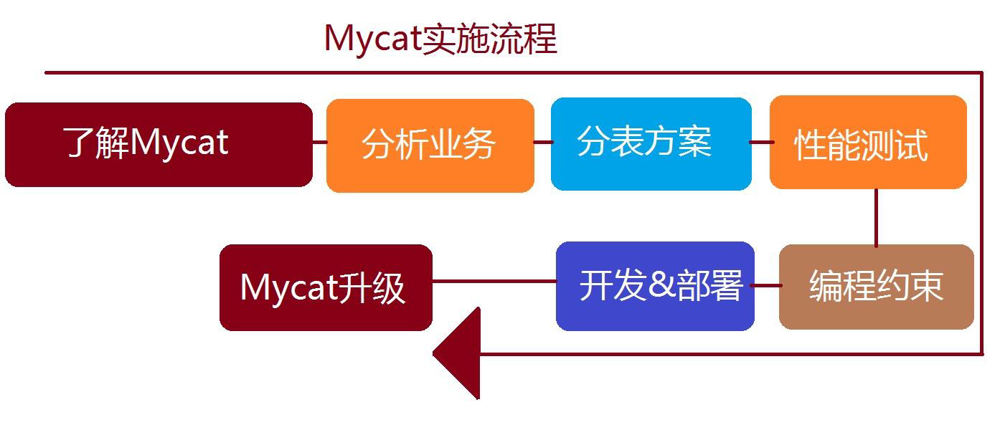

# 基于MyCat的MySQL高可用架构规划建议

> 2018-02-05 驻云DBA组

[TOC]

## 数据库架构设计

我们知道每台机器无论配置多么好它都有自身的物理上限，所以当我们应用已经能触及或远远超出单台机器的某个上限的时候，我们惟有寻找别的机器的帮助或者继续升级的我们的硬件，但常见的方案还是通过添加更多的机器来共同承担压力。我们还得考虑当我们的业务逻辑不断增长，我们的机器能不能通过线性增长就能满足需求？因此，使用数据库的分库分表，能够立竿见影的提升系统的性能。

对于大部分数据库的设计和业务的操作基本都与ID相关，因此使用ID是最常用的分库的路由策略。**发票ID**可以作为贯穿整个系统用的重要字段。因此，使用**发票ID**我们不仅可以方便我们的查询，还可以将数据平均的分配到不同的数据库中。（当然，还可以根据其他属性进行分表操作，分表的路由策略还有很多方式）

### 架构思路

1. 数据切分可以是物理上的，对数据通过一系列的切分规则将数据分布到不同的DB服务器上，通过路由规则路由访问特定的数据库，这样一来每次访问面对的就不是单台服务器了，而是N台服务器，这样就可以降低单台机器的负载压力。
2. 同时水平横向规则切分后数据散落在多台服务器上也就是变相将大表拆分成小表提升查询速度
3. 第一点在一些场景下还是无法降低单台机器的负载的比如说我有一个张日志表按照日期每一个月分到后端的一台服务器上，而最近查询总是在某一月那么将会一直发往那一台上面这个时候并不能降低负载压力此时

因此通过`MyCAT+Percona XtraDB Cluster + HAproxy + Keepalived `来实现**分库分表、负载均衡和读写分离**的功能。

### 水平切分的优缺点

优点：

* 表关联基本能够在数据库端全部完成；
* 不会存在某些超大型数据量和高负载的表遇到瓶颈的问题；
* 应用程序端整体架构改动相对较少；
* 事务处理相对简单；
* 只要切分规则能够定义好，基本上较难遇到扩展性限制。

缺点：

* 切分规则相对更为复杂，很难抽象出一个能够满足整个数据库的切分规则；

* 后期数据的维护难度有所增加，人为手工定位数据更困难；
* 应用系统各模块耦合度较高，可能会对后面数据的迁移拆分造成一定的困难。

## MyCAT+Percona XtraDB Cluster+ HAproxy + Keepalived

**首先，全面了解Mycat的能力、目前的限制、以及可能的解决办法，然后，在此基础上，考虑是否用Mycat的分表分片功能，根据目前业务的数据模型和数据访问模式，确定几个可能的分表方案，然后对方案进行针对性的性能测试，在性能数据的基础上，最终决定采用怎样的分片策略。**

### 了解Mycat的能力

了解Mycat的能力，包括如下的方面：

* Mycat的起源和解决的目标
* Mycat在数据库中间件方面的独特功能和定位
* Mycat的实际案例情况
* Mycat的优点和不足
* Mycat所提供的监控和测试工具
* Mycat社区的动态

其中，关于分片规则的支持和扩展、多数据库支持、SQL拦截和注解、跨库Join、读写分离、缓存功能、高可用性等方面需要比较深入的学习和理解，有助于正确的使用Mycat来解决当前的业务问题。 

### 分析当前业务

接下来是分析当前业务，具体内容包括如下几个方面：
* 数据模型：重点关注数据的增长模式（实时大量增长还是缓慢增长）和规律、数据之间的关联系
* 数据访问模式：通过抓取系统中实际执行的SQL，分析其频率、响应时间、对系统性能和功能的影响响程度
* 数据可靠性的要求：系统中不同数据表的可靠性要求，以及操作模式
* 事务的要求：系统中哪些业务操作是严格事务的，哪些是普通事务或可以无事务的
* 数据备份和恢复问题：目前的备份模式，对系统的压力等

数据的模型和访问模式在很大程度上决定了未来数据分片的模式，包括哪些表用全局表、哪些用ER分片、哪些用范围分片规则、哪些用一致性Hash或自定义方式。而数据可靠性的要求，则影响到Mycat后端是采用普通的MySQL主从还是用 Gluster多写模式，事务性要求需要相关的表或者SQL尽量不会垮分片执行，对于以后制定本项目的编程约束有重要意义。

### 分表方案确定一些问题

分表方案则需要确定如下一些问题：

- 哪些表要分片、什么分片规则、依赖关联关系如何解决
- 数据迁移和扩容的手段
  建议根据业务分析的结果，确定两套比较合适分表方案，然后进行性能测试，选出最佳的分表方案，性能测试可以采用Mycat自带的超级工具，此工具在前面提到过，可以模拟接近真实业务数据的数据，并随机制造大量的数据供测试，是目前开源的最佳数据库性能测试工具。
  在最终进入开发之前，架构师还需要给出一个编程约束，需要明确列出不能执行的SQL语句，这些约束可能包括如下几种：
  * 跨越太多节点的查询语句
  * 不能Join的表和相关的Join SQL
  * 很影响性能的复杂SQL
  * 对比较大的表的SQL操作提示
    最后在开发阶段，还应该做到如下几点
  * 一开始就按照最初的分片设计和数据规模，制造大量的随机数据，进行开发和测试，尽早发现性能问题
  * 对所有的SQL进行统计分析，找出异常的SQL，包括跨越太多分片的SQL，以及执行缓慢的SQL，对这些SQL进行分析和优化
  * 时刻关注性能问题

  当项目上线后，通过Mycat Web对系统进行监控，特别是服务的IO和网络指标，除此之外，对Mycat运行过程中的日志也要进行排查，告警信息可能是SQL错误，可能是Mycat Bug，及时分析处理，并积极反馈给Mycat社区，寻求帮助。

###  分表分库原则

分表分库虽然能解决大表对数据库系统的压力，但它并不是万能的，也有一些不利之处，因此首要问题是，分不分库，分哪些库，什么规则分，分多少分片。

* 原则一：能不分就不分，1000万以内的表，不建议分片，通过合适的索引，读写分离等方式，可以很好的解决性能问题。
* 原则二：分片数量尽量少，分片尽量均匀分布在多个DataHost上，因为一个查询SQL跨分片越多，则总体性能越差，虽然要好于所有数据在一个分片的结果，只在必要的时候进行扩容，增加分片数量。
* 原则三：分片规则需要慎重选择，分片规则的选择，需要考虑数据的增长模式，数据的访问模式，分片关联性问题，以及分片扩容问题，最近的分片策略为范围分片，枚举分片，一致性Hash分片，这几种分片都有利于扩容
* 原则四：尽量不要在一个事务中的SQL跨越多个分片，分布式事务一直是个不好处理的问题
* 原则五：查询条件尽量优化，尽量避免Select * 的方式，大量数据结果集下，会消耗大量带宽和CPU资源，查询尽量避免返回大量结果集，并且尽量为频繁使用的查询语句建立索引。

这里特别强调一下分片规则的选择问题，如果某个表的数据有明显的时间特征，比如订单、交易记录等，则他们通常比较合适用时间范围分片，因为具有时效性的数据，我们往往关注其近期的数据，查询条件中往往带有时间字段进行过滤，比较好的方案是，当前活跃的数据，采用跨度比较短的时间段进行分片，而历史性的数据，则采用比较长的跨度存储。

总体上来说，分片的选择是取决于最频繁的查询SQL的条件，因为不带任何Where语句的查询SQL，会便利所有的分片，性能相对最差，因此这种SQL越多，对系统的影响越大，所以我们要尽量避免这种SQL的产生。

如何准确统计和分析当前系统中最频繁的SQL呢？有几个简单做法：

-  采用特殊的JDBC驱动程序，拦截所有业务SQL，并写程序进行分析
-  采用Mycat的SQL拦截器机制，写一个插件，拦截所欲SQL，并进行统计分析
-  打开MySQL日志，分析统计所有SQL

找出每个表最频繁的SQL，分析其查询条件，以及相互的关系，并结合ER图，就能比较准确的选择每个表的分片策略。

### 后端存储的选择

Mysql尽量用比较新的稳定版，当前来说5.6和5.7都是比较靠谱的一个选择，因为Mysq这两个版本做了大量优化。另外Mysql的各种变种版本都可以考虑。以下是一些通用准则：

对于非严格苛刻交易型的数据表，建议用MariaDB，这个版本目前在开源界很盛行，评价很高，percona版本也值得推荐，percona有很多辅助的运维工具。

* 对于交易型的数据表，可以考虑Mysql官方稳定版，若交易型的数据表要求可靠性非常高，比如是替代Oracle，也可以选择Galera Cluster这种高可用的方案，他以一定的写入性能损失带来了数据的高可用和高并发访问。
* 根据数据的可靠性要求，可以采用各种数据同步方案，比如1主多从，读写分离提升数据表的读的并发能力。
* 部分表可以用NoSQL方式存储，而前端访问方式不变，Mycat支持后端MongoDB和很多NoSQL系统，以提升查询能力
* 部分表可以采用MySQL内存表，来提升查询和写入速度，替代部分复杂缓存方案。

###  数据拆分原则

1. 达到一定数量级才拆分（800万）
2. 不到800万但跟大表（超800万的表）有关联查询的表也要拆分，在此称为大表关联表
3. 大表关联表如何拆：小于100万的使用全局表；大于100万小于800万跟大表使用同样的拆分策略；无法跟大表使用相同规则的，可以考虑从java代码上分步骤查询，不用关联查询，或者破例使用全局表。
4. 破例的全局表：如item_sku表250万，跟大表关联了，又无法跟大表使用相同拆分策略，也做成了全局表。破例的全局表必须满足的条件：没有太激烈的并发update，如多线程同时update同一条id=1的记录。虽有多线程update，但不是操作同一行记录的不在此列。多线程update全局表的同一行记录会死锁。批量insert没问题。
5. 拆分字段是不可修改的
6. 拆分字段只能是一个字段，如果想按照两个字段拆分，必须新建一个冗余字段，冗余字段的值使用两个字段的值拼接而成（如大区+年月拼成zone_yyyymm字段）。
7. 拆分算法的选择和合理性评判：按照选定的算法拆分后每个库中单表不得超过800万
8. 能不拆的就尽量不拆。如果某个表不跟其他表关联查询，数据量又少，直接不拆分，使用单库即可。

### DataNode的分布问题

DataNode代表MySQL数据库上的一个Database，因此一个分片表的DataNode的分布可能有以下几种：
* 都在一个DataHost上
* 在几个DataHost上，但有连续性，比如dn1到dn5在Server1上，dn6到dn10在Server2上，依次类推
* 在几个DataHost上，但均匀分布，比如dn1,dn2,d3分别在Server1,Server2,Server3 上，dn4到dn5又重复如此

一般情况下，不建议第一种，二对于范围分片来说，在大多数情况下，最后一种情况最理想，因为当一个表的数据均匀分布在几个物理机上的时候，跨分片查询或者随机查询，都是到不同的机器上去执行，并行度最高，IO竞争也最小，因此性能最好。

当我们有几十个表都分片的情况下，怎样设计DataNode的分布问题，就成了一个难题，解决此难题的最好方式是试运行一段时间，统计观察每个DataNode上的SQL执行情况，看是否有严重不均匀的现象产生，然后根据统计结果，重新映射DataNode到DataHost的关系。

  Mycat 1.4增加了distribute函数，可以用于Table的dataNode属性上，表示将这些dataNode在该Table的分片规则里的引用顺序重新安排，使得他们能均匀分布到几个DataHost上： <table name="oc_call" primaryKey="ID" dataNode="distribute(dn1$0-372,dn2$0-372)" rule="latest-month-calldate" /> 其中dn1xxx与dn2xxxx是分别定义在DataHost1上与DataHost2上的377个分片。

### Mycat目前存在的限制

部分SQL还不能很好的支持

* 除了分片规则相同、ER分片、全局表、以及SharedJoin，其他表之间的Join问题目前还没有很好的解决，需要自己编写Catlet来处理
* 不支持Insert into 中不包括字段名的SQL
* insert into x select from y的SQL，若x与y不是相同的分片规则，则不被支持，此时会涉及到跨分片转移
* 跨分片的事务，目前只是弱XA模式，还没完全实现XA模式
* 分片的Table，目前不能执行Lock Table这样的语句，因为这种语句会随机发到某个节点，也不会全部分片锁定，经常导致死锁问题，此类问题常常出现在sqldump导入导出SQL数据的过程中。
* 目前sql解析器采用Druid,再某些sql例如order，group，sum ，count条件下，如果这类操作会出现兼容问题，比如： select t.name as name1 from test order by t.name
* 这条语句select 列的别名与order by 不一致解析器会出现异常，所以在对列加别名时候要注意这类操作异常，特别是由jpa等类似的框架生成的语句会有兼容问题。

开发框架方面，虽然支持Hibernat，但不建议使用Hibernat，而是建议Mybatis以及直接JDBC操作，原因Hibernat无法控制SQL的生成，无法做到对查询SQL的优化，导致大数量下的性能问题。此外，事务方面，建议自己手动控制，查询语句尽量走自动提交事务模式，这样Mycat的读写分离会被用到，提升性能很明显。

## 分库分表建议

系统拆分步骤

1. 寻找大表，目前需求中提出的做拆分的表有4张，客户应该根据自己定的单表最大量来确定是否要拆分，如超过800万的表都要拆分。
2. 定分片策略。这个根据业务不同可能差异很大，需要对mycat支持的分片算法都了解清楚，同时对业务系统的业务要非常清楚（即这个工作是需要2个人来一起完成的，一个懂mycat的，一个懂业务的，如果这两个都懂的就更好了）。
  建议的数据拆分方式使用
  系统拆分按照mycat实施指南中的数据拆分原则进行，单表的数据量控制在800万以内。
  针对发票的业务特点，系统中可用的拆分维度有：纳税识别号，企业名称，发票代码，发票号码、时间范围等。
  ​

## 生产环境部署

官方帮助http://www.mycat.io/

## 总结

自研该架构整体会非常复杂，需要一个团队来支持，尤其需要对mycat非常熟悉的工程师。开源产品使用需谨慎 报错无人理只能靠自己。

