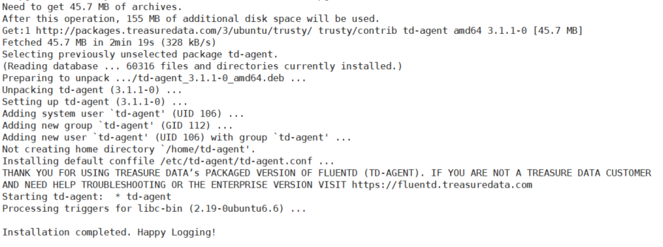
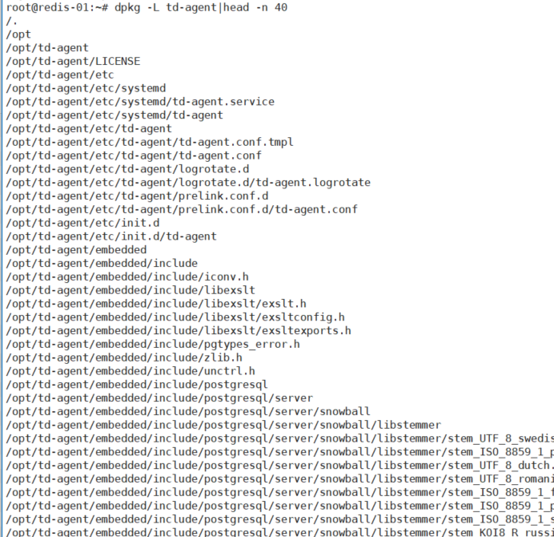
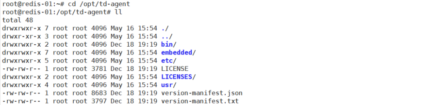
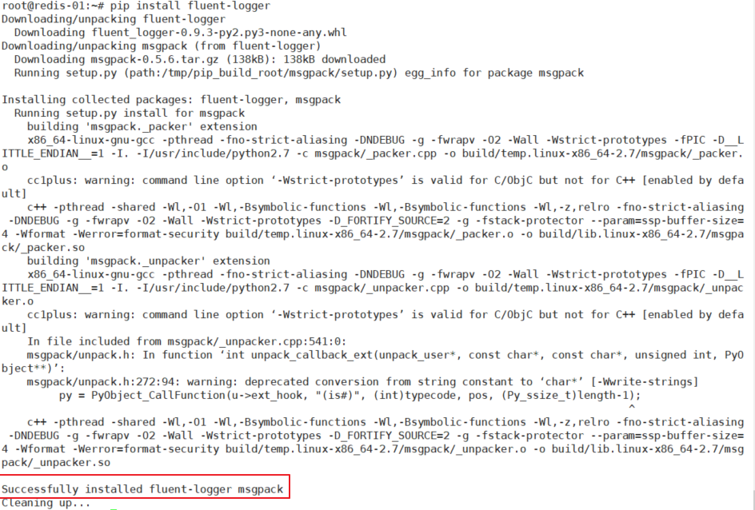
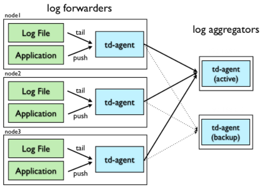

#  简介与安装

> 2018-05-16 BoobooWei

[TOC]


## 参考链接

* [Blog]http://www.cnblogs.com/felixzh/p/8075340.html
* [Official]https://www.fluentd.org/architecture
* [GitHub] <https://github.com/fluent/fluentd> 
* [Doc] <http://docs.fluentd.org/articles/config-file> 
* [Example] <https://github.com/fluent/fluentd/tree/master/example> 

 ## What？


Fluentd是一个开源的数据收集器，专为处理数据流设计，有点像 `syslogd `，但是使用JSON作为数据格式。它采用了插件式的架构，具有高可扩展性高可用性，同时还实现了高可靠的信息转发。

据分(Y)析(Y)，Fluentd是由Fluent+d得来，d生动形象地标明了它是以一个守护进程的方式运行。官网上将其描述为data collector，在使用上，我们可以把各种不同来源的信息，首先发送给Fluentd，接着Fluentd根据配置通过不同的插件把信息转发到不同的地方，比如文件、SaaS Platform、数据库，甚至可以转发到另一个Fluentd。

总结一下，数据流殊途，同归与Fluentd，Fluentd做一些诸如过滤、缓存、路由等工作，将其转发到不同的最终接收方。

用Fluentd处理数据还能保证一定的实时性，其提供种类丰富的客户端lib，很适合处理单位时间emit出log数量巨大的场景。从v10后，Fluentd **不支持** Windows。

其采用Ruby编写，比较注重性能的地方采用C编写，Ruby的创始人松本老师这样评价Fluentd：

> Fluentd proves you can achieve programmer happiness and performance at the same time. A great example of Ruby beyond the Web.

Heroku的联合创始人Adam Wiggins说的挺有道理：

> Logs are streams, not files. I love that Fluentd puts this concept front-and-center, with a developer-friendly approach for distributed systems logging.

更多信息请看 [这里 ](http://docs.fluentd.org/articles/architecture)。

 

 

##How？

[官方帮助文档]https://docs.fluentd.org/v1.0/articles/quickstart

### 准备工作

> 1. 设置NTP时间同步服务
> 2. 增加文件句柄数
> 3. 优化网络内核配置参数

####1 设置NTP时间同步服务

`ntpd `，以d结尾，是一个守护进程，全称是Network Time Protocol (NTP) daemon，它通过与一个Internet标准时钟服务器同步来维护系统时钟，同时也可以将本机做为一个时钟服务器对外提供时钟同步服务。更多信息请man一下`ntpd`。

安装ntpd是为了防止Fluentd在收集log的时候出现非法的时间戳。

在Ubuntu下，apt-get即可安装：

```
$ sudo apt-get install ntp
```

之后查看ntpd是否启动成功（pgrep返回进程号）：

```
$ pgrep ntpd
```


####2 增加文件句柄数

增加系统文件描述符的最大数量

通过ulimit查看当前的文件描述符的最大数量：

```
$ ulimit -n
```

如果是1024，那是远远不够的，将下面4行添加到 `/etc/security/limits.conf `中，重启机器。

```
root soft nofile 65536
root hard nofile 65536
* soft nofile 65536
* hard nofile 65536
```

之后用ulimit查看，应该是65536了。

####3 优化网络内核配置参数

(Optional)优化机器内核TCP/IP参数

如果Fluentd处于一个高负载的运行环境，比如一个机器中运行了多个Fluentd实例，那么最好将下面的参数添加到 `/etc/sysctl.conf `中：

```
net.ipv4.tcp_tw_recycle = 1
net.ipv4.tcp_tw_reuse = 1
net.ipv4.ip_local_port_range = 10240    65535
```

然后执行 `sysctl -w `或者重启机器使之生效。

这个跟TCP/IP的细节有关系，我没有深究，貌似是为了防止短连接数过多，机器处于 `TIME_WAIT `状态的TCP连接数过多，开启快速回收与重用。具体请参考 [这里 ](http://stackoverflow.com/questions/337115/setting-time-wait-tcp)。

### 安装Fluentd

> 测试环境使用ubuntu

有 [很多种方式 ](http://docs.fluentd.org/categories/installation)来安装Fluentd，比如通过Ruby的Gem，以及Ubuntu的deb、OS X的Homebrew。

采用Ruby的Gem安装比较简单，安装的是基本版的Fluentd，即不自带 `/etc/init.d `脚本，在运行时内存分配采用的是操作系统默认的方式；

而采用.rpm/.deb for Linux的方式安装呢，安装的是一个由 [Treasure Data, Inc ](http://www.treasuredata.com/)维护的稳定版本Fluentd，又被称为td-agent。为了保持一个良好的灵活性，Fluentd采用Ruby编写，性能要求比较高的地方采用C编写，考虑到一般的用户可能安装操作Ruby有困难，因此该公司维护并提供了一个稳定版本的Fluentd。该版本的Fluentd在内存分配上采用了着重避免内存碎片分配实现 [jemalloc ](http://www.canonware.com/jemalloc/)。两个版本的区别可以在这 [查看 ](http://docs.fluentd.org/articles/faq#treasure-agenttd-agnt)。

那么我们到底选用哪种方式呢，根据官方的文档。td-agent强调new features的稳定性，如果希望自己控制Fluentd的features，自己手动去更新，采用gem的方式安装。如果是第一次使用Fluentd或者在大规模的生产环境使用，推荐安装td-agent，每2-3个月，td-agent就会发布一个新的版本。

```shell
root@redis-01:~# lsb_release  -a
No LSB modules are available.
Distributor ID:	Ubuntu
Description:	Ubuntu 14.04.3 LTS
Release:	14.04
Codename:	trusty
```

查看到ubuntu的版本为trusty的，因此选择以下命令窒执行：

```shell
root@redis-01:~# curl -L https://toolbelt.treasuredata.com/sh/install-ubuntu-trusty-td-agent3.sh | sh
```




查询安装路径

```shell
root@redis-01:~# dpkg -L td-agent
```





### 启动Fluentd的守护进程 

因为我们安装的是td-agent，自带 `/etc/init.d/td-agent `脚本，通过该脚本启动Fluentd服务。

```
$ /etc/init.d/td-agent restart
* Restarting td-agent td-agent
$ /etc/init.d/td-agent status
* ruby is running
```

同时还支持以下命令：

```
$ /etc/init.d/td-agent start
$ /etc/init.d/td-agent stop
$ /etc/init.d/td-agent restart
$ /etc/init.d/td-agent status
```

配置文件在： `/etc/td-agent/td-agent.conf`

测试明细

```shell
root@redis-01:/opt/td-agent# ll /etc/init.d/td-agent 
-rwxr-xr-x 1 root root 6899 May 16 15:54 /etc/init.d/td-agent*
root@redis-01:/opt/td-agent# /etc/init.d/td-agent status
 * td-agent is running
root@redis-01:/opt/td-agent# ll /etc/td-agent/td-agent.conf 
-rw-r--r-- 1 root root 2381 May 16 15:54 /etc/td-agent/td-agent.conf
root@redis-01:/opt/td-agent# ps -ef|grep td-agent
td-agent   1545      1  0 15:54 ?        00:00:01 /opt/td-agent/embedded/bin/ruby /usr/sbin/td-agent --log /var/logtd-agent/td-agent.log --daemon /var/run/td-agent/td-agent.pid
td-agent   1552   1545  0 15:54 ?        00:00:02 /opt/td-agent/embedded/bin/ruby -Eascii-8bit:ascii-8bit /usr/sbintd-agent --log /var/log/td-agent/td-agent.log --daemon /var/run/td-agent/td-agent.pid --under-supervisor
root       1654   1324  0 16:26 pts/0    00:00:00 grep --color=auto td-agent
```

安装好后已经启动该服务了td-agentd

| 服务fluentd      | 路径                           |
| ---------------- | ------------------------------ |
| 配置文件         | /etc/td-agent/td-agent.cof     |
| 数据文件         | /var/log/td-agent/td-agent.log |
| 服务启动脚本ruby | /usr/sbin/td-agent             |
| 守护进程名       |                                |
| 监听端口         | 8888                           |
| 日志文件         | /var/logtd-agent/td-agent.log  |
| 进程文件         | /var/run/td-agent/td-agent.pid |

默认在配置文件中td-agent在8888端口监听，接收来自HTTP的log信息，并把其路由到stdout（ `/var/log/td-agent/td-agent.log `）,可以用curl命令测试：

```
$ curl -X POST -d 'json={"json":"message"}' http://localhost:8888/debug.test
```

之后可以打开 `/var/log/td-agent/td-agent.log查看。`

```shell
root@redis-01:/opt/td-agent# curl -X POST -d 'json={"json":"message"}' http://localhost:8888/debug.test
 
root@redis-01:/opt/td-agent# tail -f /var/log/td-agent/td-agent.log 
2018-05-16 15:54:11 +0800 [warn]: #0 [output_td] secondary type should be same with primary one primary="Fluent::Plugin::TreasureDataLogOutput" secondary="Fluent::Plugin::FileOutput"
2018-05-16 15:54:11 +0800 [info]: adding match pattern="debug.**" type="stdout"
2018-05-16 15:54:11 +0800 [info]: adding source type="forward"
2018-05-16 15:54:11 +0800 [info]: adding source type="http"
2018-05-16 15:54:11 +0800 [info]: adding source type="debug_agent"
2018-05-16 15:54:11 +0800 [info]: #0 starting fluentd worker pid=1552 ppid=1545 worker=0
2018-05-16 15:54:11 +0800 [info]: #0 [input_debug_agent] listening dRuby uri="druby://127.0.0.1:24230" object="Fluent::Engine"
2018-05-16 15:54:11 +0800 [info]: #0 [input_forward] listening port port=24224 bind="0.0.0.0"
2018-05-16 15:54:11 +0800 [info]: #0 fluentd worker is now running worker=0
2018-05-16 16:30:11.328487488 +0800 debug.test: {"json":"message"}


root@redis-01:/opt/td-agent# curl -X POST -d 'json={"name":"booboo","home":"shanghai"}' http://localhost:8888/debug.test
root@redis-01:/opt/td-agent# tail -f /var/log/td-agent/td-agent.log 
2018-05-16 15:54:11 +0800 [info]: adding match pattern="debug.**" type="stdout"
2018-05-16 15:54:11 +0800 [info]: adding source type="forward"
2018-05-16 15:54:11 +0800 [info]: adding source type="http"
2018-05-16 15:54:11 +0800 [info]: adding source type="debug_agent"
2018-05-16 15:54:11 +0800 [info]: #0 starting fluentd worker pid=1552 ppid=1545 worker=0
2018-05-16 15:54:11 +0800 [info]: #0 [input_debug_agent] listening dRuby uri="druby://127.0.0.1:24230" object="Fluent::Engine"
2018-05-16 15:54:11 +0800 [info]: #0 [input_forward] listening port port=24224 bind="0.0.0.0"
2018-05-16 15:54:11 +0800 [info]: #0 fluentd worker is now running worker=0
2018-05-16 16:30:11.328487488 +0800 debug.test: {"json":"message"}
2018-05-16 16:32:06.244858932 +0800 debug.test: {"name":"booboo","home":"shanghai"}
```

## Use Cases

> * 此处选择python应用作为使用场景，通过fluentd将日志保存到本地标准输出
>
> * [配置文件语法] https://www.ixdba.net/archives/2018/01/1116.htm

1. 修改配置文件`vim /etc/td-agent/td-agent.conf`

   ```shell
   <source>
   @type forward
   port 24224
   </source>
   <match fluentd.test.**>
   @type stdout
   </match>
   ```

2. 重启服务

   ```shell
   $ sudo /etc/init.d/td-agent restart
   ```

   

3. 安装fluent-logger-python

   ```shell
   apt-get install python-pip python-dev build-essential 
   pip install fluent-logger
   ```

   

4. python程序

   ```shell
   # test.py
   from fluent import sender
   from fluent import event
   sender.setup('fluentd.test', host='localhost', port=24224)
   event.Event('follow', {
     'from': 'userA',
     'to':   'userB'
   })
   ```

   

5. 运行python程序，查看记录输出

   ```shell
   $ python test.py
   $ tail -n 1 /var/log/td-agent/td-agent.log
   ```

   

   

明细

```shell
root@redis-01:~# vim /etc/td-agent/td-agent.conf
root@redis-01:~# /etc/init.d/td-agent restart
Restarting td-agent:  * td-agent
root@redis-01:~# /etc/init.d/td-agent status
 * td-agent is running
root@redis-01:~# apt-get install python-pip python-dev build-essential 
Reading package lists... Done
Building dependency tree       
Reading state information... Done
root@redis-01:~# pip install fluent-logger
root@redis-01:~# vim test.py
# test.py
from fluent import sender
from fluent import event
sender.setup('fluentd.test', host='localhost', port=24224)
event.Event('follow', {
  'from': 'userA',
  'to':   'userB'
})

root@redis-01:~# python test.py
root@redis-01:~# tail -f /var/log/td-agent/td-agent.log
2018-05-16 17:08:35 +0800 [info]: adding match pattern="debug.**" type="stdout"
2018-05-16 17:08:35 +0800 [info]: adding match pattern="fluentd.test.**" type="stdout"
2018-05-16 17:08:35 +0800 [info]: adding source type="forward"
2018-05-16 17:08:35 +0800 [info]: adding source type="http"
2018-05-16 17:08:35 +0800 [info]: adding source type="debug_agent"
2018-05-16 17:08:35 +0800 [info]: #0 starting fluentd worker pid=10505 ppid=10500 worker=0
2018-05-16 17:08:35 +0800 [info]: #0 [input_debug_agent] listening dRuby uri="druby://127.0.0.1:24230" object="Fluent::Engine"
2018-05-16 17:08:35 +0800 [info]: #0 listening port port=24224 bind="0.0.0.0"
2018-05-16 17:08:35 +0800 [info]: #0 fluentd worker is now running worker=0
2018-05-16 17:09:02.000000000 +0800 fluentd.test.follow: {"to":"userB","from":"userA"}


root@redis-01:~# python test.py
root@redis-01:~# tail -f /var/log/td-agent/td-agent.log
2018-05-16 17:08:35 +0800 [info]: adding match pattern="fluentd.test.**" type="stdout"
2018-05-16 17:08:35 +0800 [info]: adding source type="forward"
2018-05-16 17:08:35 +0800 [info]: adding source type="http"
2018-05-16 17:08:35 +0800 [info]: adding source type="debug_agent"
2018-05-16 17:08:35 +0800 [info]: #0 starting fluentd worker pid=10505 ppid=10500 worker=0
2018-05-16 17:08:35 +0800 [info]: #0 [input_debug_agent] listening dRuby uri="druby://127.0.0.1:24230" object="Fluent::Engine"
2018-05-16 17:08:35 +0800 [info]: #0 listening port port=24224 bind="0.0.0.0"
2018-05-16 17:08:35 +0800 [info]: #0 fluentd worker is now running worker=0
2018-05-16 17:09:02.000000000 +0800 fluentd.test.follow: {"to":"userB","from":"userA"}
2018-05-16 17:11:32 +0800 [warn]: #0 no patterns matched tag="fluentd.booboo.zyadmin"
^C
root@redis-01:~# cat test.py
# test.py
from fluent import sender
from fluent import event
sender.setup('fluentd.booboo', host='localhost', port=24224)
event.Event('zyadmin', {
  'from': 'userA',
  'to':   'userB'
})

```



## 高可用配置

> 本实验实现：
>
> 1. 通过http搜集日志后转发给日志整合服务器，标准输出至/var/log/td-agent/td-agent.log
> 2. 自动故障转移：日志整合服务器A挂了能自动建日志转发给B
> 3. 日志代理服务器是单点

### 架构规划



| 角色                            | ip地址      | 说明                     |
| ------------------------------- | ----------- | ------------------------ |
| 日志代理服务器 log forwarders   | 192.168.1.5 | 搜集各种日志，可以有多台 |
| 日志整合服务器A log aggregators | 192.168.1.6 | 汇总搜集来的日志并输出   |
| 日志整合服务器B log aggregators | 192.168.1.7 | backup                   |

###搭建明细

```shell
# 安装是一样的，重点看配置

# 日志代理服务器192.168.1.5
root@redis-01:~# vim /etc/td-agent/td-agent.conf 
<source>
  @type forward
  port 24224
</source>

<match boobooha.**>
    @type forward
    <server>
    host 192.168.1.6
    port 24224
    </server>

    <server>
    host 192.168.1.7
    port 24224
    standby
    </server>

  <secondary>
    @type file
    path /var/log/td-agent/forward-failed
  </secondary>

    <buffer>
    flush_interval 60s
    </buffer>
</match>
root@redis-01:~# service td-agent restart


# 日志整合服务器 192.168.1.6
root@redis-02:~# vim /etc/td-agent/td-agent.conf
<source>
  @type forward
  port 24224
</source>
<match boobooha.**>
  @type stdout
</match>
root@redis-01:~# service td-agent restart

# 日志整合服务器 192.168.1.7
root@redis-03:~# vim /etc/td-agent/td-agent.conf
<source>
  @type forward
  port 24224
</source>
<match boobooha.**>
  @type stdout
</match>
root@redis-01:~# service td-agent restart

# 日志代理服务器192.168.1.5
## 开始搜集日志
root@redis-01:~# curl http://localhost:8888/boobooha -d 'json={"name":"这是一个ha的测试信息"}'

## 查看日志信息可以看到两台转发服务器
root@redis-01:~# tail -f /var/log/td-agent/td-agent.log 
2018-05-21 10:13:10 +0800 [info]: adding match pattern="boobooha.**" type="forward"
2018-05-21 10:13:10 +0800 [warn]: #0 secondary type should be same with primary one primary="Fluent::Plugin::ForwardOutput" secondary="Fluent::Plugin::FileOutput"
2018-05-21 10:13:10 +0800 [info]: #0 adding forwarding server '192.168.1.6:24224' host="192.168.1.6" port=24224 weight=60 plugin_id="object:3fbeebf53c48"
2018-05-21 10:13:10 +0800 [info]: #0 adding forwarding server '192.168.1.7:24224' host="192.168.1.7" port=24224 weight=60 plugin_id="object:3fbeebf53c48"
2018-05-21 10:13:10 +0800 [info]: adding source type="forward"
2018-05-21 10:13:10 +0800 [info]: adding source type="http"
2018-05-21 10:13:10 +0800 [info]: #0 starting fluentd worker pid=2078 ppid=2073 worker=0
2018-05-21 10:13:10 +0800 [info]: #0 delayed_commit_timeout is overwritten by ack_response_timeout
2018-05-21 10:13:10 +0800 [info]: #0 listening port port=24224 bind="0.0.0.0"
2018-05-21 10:13:10 +0800 [info]: #0 fluentd worker is now running worker=0

# 日志整合服务器 192.168.1.6 查看标准输出的搜集的日志信息
root@redis-02:~# tail -f /var/log/td-agent/td-agent.log 
2018-05-21 10:10:40 +0800 [info]: gem 'fluent-plugin-s3' version '1.1.0'
2018-05-21 10:10:40 +0800 [info]: gem 'fluent-plugin-td' version '1.0.0'
2018-05-21 10:10:40 +0800 [info]: gem 'fluent-plugin-td-monitoring' version '0.2.3'
2018-05-21 10:10:40 +0800 [info]: gem 'fluent-plugin-webhdfs' version '1.2.2'
2018-05-21 10:10:40 +0800 [info]: gem 'fluentd' version '1.0.2'
2018-05-21 10:10:40 +0800 [info]: adding match pattern="boobooha.**" type="stdout"
2018-05-21 10:10:40 +0800 [info]: adding source type="forward"
2018-05-21 10:10:40 +0800 [info]: #0 starting fluentd worker pid=2263 ppid=2258 worker=0
2018-05-21 10:10:40 +0800 [info]: #0 listening port port=24224 bind="0.0.0.0"
2018-05-21 10:10:40 +0800 [info]: #0 fluentd worker is now running worker=0
2018-05-21 10:16:54.646801298 +0800 boobooha: {"name":"这是一个ha的测试信息"}
```

以上实验能够看到搜集的日志成功的转发到了`192.168.1.6`这台日志整合服务器上，接下来我们测试如果这台日志整合服务器A挂了后，日志搜集服务器是否会将日志转发给`192.168.1.7`上。

```shell
# 手动停止192.168.1.6上的td-agent服务
root@redis-02:~# service td-agent stop
Stopping td-agent:  * td-agent
root@redis-02:~# service td-agent status
 * td-agent is not running

# 192.168.1.5 
## 查看td-agent日志
2018-05-21 10:59:04 +0800 [warn]: #0 detached forwarding server '' host="192.168.1.6" port=24224 phi=16.06797998486109 phi_threshold=16
2018-05-21 10:59:04 +0800 [warn]: #0 using standby node 192.168.1.7:24224 weight=60

## 搜集日志信息
root@redis-01:~# curl http://localhost:8888/boobooha -d 'json={"name":"这是一个ha的测试信息","info":"测试HA"}'
root@redis-01:~# date
Mon May 21 10:59:05 CST 2018

# 192，168.1.7上观察是否成功获取到日志信息
root@redis-03:~# tail -f /var/log/td-agent/td-agent.log 
2018-05-21 10:10:33 +0800 [info]: gem 'fluent-plugin-s3' version '1.1.0'
2018-05-21 10:10:33 +0800 [info]: gem 'fluent-plugin-td' version '1.0.0'
2018-05-21 10:10:33 +0800 [info]: gem 'fluent-plugin-td-monitoring' version '0.2.3'
2018-05-21 10:10:33 +0800 [info]: gem 'fluent-plugin-webhdfs' version '1.2.2'
2018-05-21 10:10:33 +0800 [info]: gem 'fluentd' version '1.0.2'
2018-05-21 10:10:33 +0800 [info]: adding match pattern="boobooha.**" type="stdout"
2018-05-21 10:10:33 +0800 [info]: adding source type="forward"
2018-05-21 10:10:33 +0800 [info]: #0 starting fluentd worker pid=2199 ppid=2194 worker=0
2018-05-21 10:10:33 +0800 [info]: #0 listening port port=24224 bind="0.0.0.0"
2018-05-21 10:10:33 +0800 [info]: #0 fluentd worker is now running worker=0
2018-05-21 10:59:05.424160144 +0800 boobooha: {"name":"这是一个ha的测试信息","info":"测试HA"}
```

可以看到，实现了日志整合服务器的自动故障转移。

> 测试：重新启动日志整合服务器A，新搜集的日志将被转发给哪台整合服务器？

```shell
root@redis-02:~# service td-agent start
Starting td-agent:  * td-agent

root@redis-01:~# tail -n 1 /var/log/td-agent/td-agent.log 
2018-05-21 11:02:48 +0800 [warn]: #0 recovered forwarding server '' host="192.168.1.6" port=24224
root@redis-01:~# curl http://localhost:8888/boobooha -d 'json={"name":"重新启动A"}'

root@redis-02:~# tail -n 1 /var/log/td-agent/td-agent.log 
2018-05-21 11:03:37.759968176 +0800 boobooha: {"name":"重新启动A"}

# 可以看到重启A后，新搜集的日志将会转发给A，A即配置文件中作为主的服务器。
```

## 监控

### 进程

存在两个ruby进程，具体如下所示：

```shell
root@redis-03:~# ps w -C ruby -C td-agent --no-heading
  2496 ?        Sl     0:00 /opt/td-agent/embedded/bin/ruby /usr/sbin/td-agent --log /var/log/td-agent/td-agent.log --daemon /var/run/td-agent/td-agent.pid
  2501 ?        Sl     0:00 /opt/td-agent/embedded/bin/ruby -Eascii-8bit:ascii-8bit /usr/sbin/td-agent --log /var/log/td-agent/td-agent.log --daemon /var/run/td-agent/td-agent.pid
  
  root@redis-03:~# ps -ef|grep td-agen[t]
td-agent   2496      1  0 11:45 ?        00:00:00 /opt/td-agent/embedded/bin/ruby /usr/sbin/td-agent --log /var/log/td-agent/td-agent.log --daemon /var/run/td-agent/td-agent.pid
td-agent   2501   2496  0 11:45 ?        00:00:00 /opt/td-agent/embedded/bin/ruby -Eascii-8bit:ascii-8bit /usr/sbin/td-agent --log /var/log/td-agent/td-agent.log --daemon /var/run/td-agent/td-agent.pid --under-supervisor
```

可以看到这两个进程是父子关系。

### 监听端口

Fluentd opens several ports according to the configuration file. We recommend checking the availability of these ports. The default port settings are shown below:

`td-agent`服务开启的端口由配置文件决定，默认的监听端口如下：

- TCP 0.0.0.0 9880 (HTTP by default)
- TCP 0.0.0.0 24224 (Forward by default)

## 总结

* 基本安装
* 搭建高可用架构
* http和forward输入
* stdout/file/forward输出
* 进程和端口监控


### 

