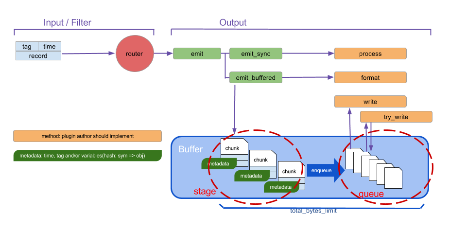

# Fluentd 配置

> 2018-05-18 BoobooWei

[TOC]

>  配置文件允许用户控制`Fluentd`的输入和输出行为，通过（1）选择输入和输出插件（2）指定插件的参数。`Fluentd`的正常运作，这个配置文件是必须的。 

# 参考链接

[GitHub]?<https://github.com/fluent/fluentd> 

[Doc]?<http://docs.fluentd.org/articles/config-file> 

[Example]?<https://github.com/fluent/fluentd/tree/master/example> 

# 文件路径

## RPM or Deb

如果你安装`Fluentd`运用的是`rpm`或是`deb` 的安装包，这个配置文件在`/etc/td-agent/td-agent.conf `这个目录。重新安装将会安装`conf` 配置文件。 

默认配置文件路径：`/etc/td-agent-td-agent.conf`

## Gem

如果你安装`Fluentd `用的是`Ruby Gem`，你可以创建一个配置文件运用下面的命令。发出一个终止信号将会重新安装配置文件。（如果你修改了配置文件―`fluent.conf `文件，`ctrl c ` 终止进程，然后在配置文件下重新启动） 

```shell
$ ctrl c 

$fluentd -c fluent.conf

$ sudo fluentd --setup /etc/fluent
$ sudo vi /etc/fluent/fluent.conf
```

# 指令列表

这个配置文件由以下指令组成： 

1. **source** 源指令决定输入资源。
2. **match**  匹配指令决定输出目的地。
3. **filter** 过滤指令决定事件处理管道。
4. **system** 系统指令设置全局系统配置。
5. **label** 标签指令决定内部路由的输出和过滤器分组。
6. **@include**  @指令包含其他一些文件。

## 输入指令 Source Directive

`Fluentd` 的输入源是通过选择和配置所需要的输入插件使用`source`指令。`Fluentd`的标准输入插件包含`http`和`forward`（转发）模式。 

每个source指令必须包含一个type（类型）参数。type参数指定输入插件使用。 

- `http`：使 fluentd 转变为一个 httpd 端点，以接受进入的 http 报文。
- `forward`：使 fluentd 转变为一个 TCP 端点，以接受 TCP 报文。

### 输入插件forward

#### 配置文件说明 

```shell
# 接收来自于监听tcp/24224的程序日志
# 用于日志转发和fluent-cat命令
<source>
  @type forward
  port 24224
</source>
```

#### 练习1_实现python程序日志搜集并标准输出至默认日志文件

> 目标：
>
> * 学习使用输入插件forward
> * Source：通过python程序进行日志搜集
> * Match：日志标准输出到`/var/log/td-agent/td-agent.log`

第一步 修改配置文件`vim /etc/td-agent/td-agent.conf`;重启服务

```shell
$ vim /etc/td-agent/td-agent.conf
<source>
  @type forward
  port 24224 #监听该tcp端口
</source>

<match fluentd.test.**> # match后面的内容可以先看作是一个tag标识符号，等下在python代码中会使用
@type stdout # 此处使用标准输出的插件，会将日志输出到td-agent.log
</match>

$ /etc/init.d/td-agent restart
```

第二步骤 编写python程序

```shell
## python代码要能够连接fluentd服务，需要第三方的python包fluent-logger
## 先安装pip工具
$ apt-get install python-pip python-dev build-essential 
## 通过pip安装fluent-logger
$ pip install fluent-logger
## python代码如下
## --test.py
from fluent import sender
from fluent import event
# 连接fluentd服务，指定tag为 fluentd.test,fluentd服务在本地localhost，端口为24224
sender.setup('fluentd.test', host='localhost', port=24224)
# 需要转发的日志信息，事件为follow，事件的详细信息是一个字典{'from':'userA','to':'userB'}
event.Event('follow', {
  'from': 'userA',
  'to':   'userB'
})
```

第三步 执行python程序

```shell
$ python test.py
```

第四步 查看日志输出

```shell
$ tail -f /var/log/td-agent/td-agent.log

2018-05-16 17:08:35 +0800 [info]: adding match pattern="fluentd.test.**" type="stdout"
2018-05-16 17:08:35 +0800 [info]: adding source type="forward"
2018-05-16 17:08:35 +0800 [info]: adding source type="http"
2018-05-16 17:08:35 +0800 [info]: adding source type="debug_agent"
2018-05-16 17:08:35 +0800 [info]: #0 starting fluentd worker pid=10505 ppid=10500 worker=0
2018-05-16 17:08:35 +0800 [info]: #0 [input_debug_agent] listening dRuby uri="druby://127.0.0.1:24230" object="Fluent::Engine"
2018-05-16 17:08:35 +0800 [info]: #0 listening port port=24224 bind="0.0.0.0"
2018-05-16 17:08:35 +0800 [info]: #0 fluentd worker is now running worker=0
2018-05-16 17:09:02.000000000 +0800 fluentd.test.follow: {"to":"userB","from":"userA"}

# match pattern="fluentd.test.**" type="stdout" 的含义是匹配到标签为'fluentd.test'开头的模式信息则将这些日志信息放到标准输出的td-agent.log中
# 2018-05-16 17:09:02.000000000 +0800 fluentd.test.follow: {"to":"userB","from":"userA"} 这条信息的含义是输出一条日志信息，日志的tag为fluentd.test 事件为follow，详细信息为json格式的信息{"to":"userB","from":"userA"}
```

### 输入插件http

#### 配置文件说明

```shell
# http://this.host:9880/myapp.access?json={"event":"data"} 
# myapp.access就是标签.事件
<source>
  @type http
  port 9880
</source>
```

#### 练习2_http输入，stdout输出

> 目标：
>
> - 学习使用输入插件http
> - Source：通过http服务进行日志搜集
> - Match：日志标准输出到`/var/log/td-agent/td-agent.log`

第一步 修改配置文件并重启服务

```shell
# 搜集8888端口的http服务日志
<source>
    @type http
    port 8888  #fluentd服务通过8888端口来搜集http的信息
    bind 0.0.0.0
</source>
# 输出匹配到booboo标签的日志信息到td-agent.log
<match booboo.**>
    @type stdout
</match>

$ /etc/init.d/td-agent restart
```

第二步 发送http请求

* Linux中通过curl发起请求

```shell
curl http://192.168.1.5:8888/booboo_file -d 'json={"booboo_file":"指定文件"}'
curl http://localhost:8888/booboo -d 'json={"name":"booboo"}'
```

* 浏览器中输入`http://192.168.1.5:8888/booboo_file?json={"booboo_file":"指定文件"}`


第三步 查看搜集的日志信息

```shell
$ tail -n 1 /var/log/td-agent/td-agent.log 
2018-05-18 16:26:48.153516800 +0800 booboo: {"name":"booboo"}
```


#### 练习3_http输入，指定文件输出

> 目标：
>
> - 学习使用输入插件http
> - Source：通过http服务进行日志搜集
> - Match：日志标准输出到`/var/log/td-agent/td-agent.log`

第一步 修改配置文件并重启服务

```shell
# 搜集8888端口的http服务日志
<source>
    @type http
    port 8888  #fluentd服务通过8888端口来搜集http的信息
    bind 0.0.0.0
</source>
# 输出匹配到booboo_file标签的日志信息到指定的文件/var/log/td-agent/booboo_file文件
<match booboo_file.**>
    @type file
    path /var/log/td-agent/booboo_file
</match>

$ /etc/init.d/td-agent restart
```

第二步 发送http请求

- Linux中通过curl发起请求

```shell
curl http://192.168.1.5:8888/booboo_file -d 'json={"booboo_file":"指定文件"}'
```

- 浏览器中输入`http://192.168.1.5:8888/booboo_file?json={"booboo_file":"指定文件"}`


第三步 查看搜集的日志信息

```shell
$ tail -n 1 /var/log/td-agent/booboo_file/buffer.b56c781ee19310426542cc19e3db769f1.log
2018-05-18T18:07:33+08:00	booboo_file	{"booboo_file":"指定文件"}
```

### Source Directive配置小结

每个 source 指令必须包括 “type” 参数，指定使用哪种插件。

**Routing（路由）**：source 把事件提交到 fluentd 的路由引擎中。一个事件由三个实体组成：tag、time 和 record。

- `tag`：是一个通过 “.” 来分离的字符串（e.g. myapp.access），用作 Fluentd 内部路由引擎的方向。
- `time`：时间字段由输入插件指定，并且必须为 Unix 时间格式。
- `record`：一个 JSON 对象。

在`练习3_http输入，指定文件输出`中

**Plugin（插件）**

用户可以扩展输入源Fluentd，通过编写自己的插件而超出默认选项。为了进一步关于fluentd 的信息，请参考 [Input Plugin Overview](http://docs.fluentd.org/articles/input-plugin-overview) 文章。

- [in_tail](https://docs.fluentd.org/v1.0/articles/in_tail)
- [in_forward](https://docs.fluentd.org/v1.0/articles/in_forward)
- [in_udp](https://docs.fluentd.org/v1.0/articles/in_udp)
- [in_tcp](https://docs.fluentd.org/v1.0/articles/in_tcp)
- [in_http](https://docs.fluentd.org/v1.0/articles/in_http)
- [in_syslog](https://docs.fluentd.org/v1.0/articles/in_syslog)
- [in_exec](https://docs.fluentd.org/v1.0/articles/in_exec)
- [in_dummy](https://docs.fluentd.org/v1.0/articles/in_dummy)
- [in_windows_eventlog](https://docs.fluentd.org/v1.0/articles/in_windows_eventlog)

## 输出指令 Match Directive

`match` 指令查找匹配 “tags” 的事件，并处理它们。`match` 命令的最常见用法是将事件输出到其他系统（因此，与 `match` 命令对应的插件称为 “输出插件”）。?`Fluentd 的标准输出插件包括 file 和 forward。` 

### match 匹配模式

| 匹配模式  | 说明                                                         | 举例                                                |
| --------- | ------------------------------------------------------------ | --------------------------------------------------- |
| `*`       | 匹配单个` tag` 部分                                          | `a.*`，匹配 `a.b`，但不匹配 `a` 或者 `a.b.c`        |
| `**`      | 匹配 `0 `或 `多个 tag` 部分                                  | `a.**`，匹配 `a`、`a.b` 和 `a.b.c`                  |
| `{X,Y,Z}` | 匹配 `X`、`Y` 或`Z`，其中` X`、`Y` 和 `Z` 是匹配模式。可以和 `* `和 `** `模式组合使用 | `{a, b}`，匹配` a `和` b`，但不匹配` c`             |
| `<match>` | 当多个模式列在一个`<match>`标签（由一个或多个空格分隔）内时，它匹配任何列出的模式 | `<match a.** b.*>`匹配 `a`、`a.b`、`a.b.c` 和 `b.d` |

`Fluentd` 尝试按照它们在配置文件中出现的顺序，从上到下来进行 "`tags`" 匹配 。 


 

* `stdout`：标准输出至/var/log/td-agent/td-agent.log
* `file`:输出至指定文件
* `forward`：转发至指定服务器的tcp监听端口


### 输出插件stdout

#### 配置文件说明

```shell
<match fluentd.test.**> # match后面的内容可以先看作是一个tag标识符号
@type stdout # 此处使用标准输出的插件，会将日志输出到td-agent.log
</match>
```

#### 练习2_http输入，stdout输出

练习同上

### 输出插件file

#### 配置文件说明

```shell
<match booboo_file.**> #匹配到booboo_file的tag就输出到指定目录中
    @type file
    path /var/log/td-agent/booboo_file
</match>
```

#### 练习3_http输入，指定文件输出

练习同上

### 输出插件forward 

> [参数解释]https://www.jianshu.com/p/c8a5cd7f7f70

`forward`缓冲输出插件将事件转发到其他`Fluentd`节点。这个插件支持`负载平衡`和`自动故障转移`（Ack.Active Active备份）。对于复制，请使用`copy`复制插件。

`forward`插件使用“φaccrual failure detector ”算法检测服务器故障。可以自定义算法的参数。当服务器故障恢复时，插件使服务器在几秒钟后自动可用。

`forward`插件最多支持一次和至少一次语义。默认值最多为一次。

#### 配置文件说明

```shell
<match pattern>
  @type forward
  send_timeout 60s #发送事件日志的超时时间。 默认值为60秒
  recover_wait 10s #接受服务器故障恢复之前的等待时间。 默认值为10秒。
  hard_timeout 60s #用于检测服务器故障的硬超时。 默认值等于send_timeout参数。

  <server> # 转发的目标服务器，至少一个server
    name myserver1
    host 192.168.1.3 #服务器的IP地址或主机名
    port 24224 #主机的端口号
    weight 60 #负载平衡重量。 如果一个服务器的权重为20，另一个服务器的权重为30，则事件以2：3的比率发送。 默认权重为60。
  </server>
  <server>
    name myserver2
    host 192.168.1.4
    port 24224
    weight 60
  </server>
  ...

  <secondary> # 备选方案，如果上面两个server都挂了，那么就放在本地指定目录中
    @type file
    path /var/log/fluent/forward-failed
  </secondary>
</match>
```

#### 练习4_搭建Fluentd自动故障转移架构

> [HA]https://docs.fluentd.org/v1.0/articles/high-availability
>
> 目标：学习使用输出插件forward实现自动故障转移


网络拓扑

To configure Fluentd for high availability, we assume that your network consists of ‘*log forwarders*’ and ‘*log aggregators*’.

`Fluentd`的高可用性配置，由”日志代理“和”日志整合“组成。本地的搜集日志的服务器为`日志代理服务器`，后面两台锁整合的成为`日志整合服务器`

**日志代理服务器配置**

```shell
# TCP input
<source>
  @type forward
  port 24224
</source>

# HTTP input
<source>
  @type http
  port 8888
</source>

# Log Forwarding
<match mytag.**>
  @type forward

  # primary host
  <server>
    host 192.168.0.1
    port 24224
    weight 60
  </server>
  # use secondary host
  <server>
    host 192.168.0.2
    port 24224
    weight 40
    #standby #如果有standby则为故障转移 如果没有strandby则为负载均衡
  </server>
  
  <secondary>
    @type file
    path /var/log/fluent/forward-failed
  </secondary>
  
  # use longer flush_interval to reduce CPU usage.
  # note that this is a trade-off against latency.
  <buffer>
    flush_interval 60s
  </buffer>
</match>
```

**日志整合服务器配置**

```shell
# Input
<source>
  @type forward
  port 24224
</source>

# Output  这匹配非常重要（就是匹配上面收集端的<match mytag.**>）匹配到的信息做标准输出
<match mytag.**>  
  @type stdout
</match>
```

### Match Directive配置小结

#### **Plugin（插件）**

> https://docs.fluentd.org/v1.0/articles/output-plugin-overview

输出插件的缓冲区行为（如果有的话）由单独的缓冲区插件定义。 可以为每个输出插件选择不同的缓冲区插件。 一些输出插件是完全自定义的，不使用缓冲区。

##### Non-Buffered

非缓冲输出插件不缓冲数据并立即写出结果。

* out_copy
* out_stdout
* out_null

##### Buffered

时间切片输出插件事实上是一种缓冲插件，但块是按时间键入的。

* out_exec_filter
* out_forward
* out_mongo or out_mongo_replset
* out_exec
* out_file
* out_s3
* out_webhdfs