# DTS工具测试记录

> DTS工具进行**公有云**和**金融云**之间RDS**数据迁移**和**实时同步**测试记录
>
> DTS为了提高传输效率，是采用多线程传输的，因为数据迁移与网络、任务队列、数据量等因素有关，具体需要的时间无法估计。
>
> 2017-07-15 BoobooWei

[TOC]


## 测试账号信息


| RSD实例  | 云类型 | 所在可用区    | 网络类型 | 数据库类型 | 账号ID           | db_name  |
| -------- | ------ | ------------- | -------- | ---------- | ---------------- | -------- |
| 目标实例 | 金融云 | 华东2（上海） | VPC      | MySQL 5.6  | 1437423208539296 | test2017 |
| 源实例   | 公共云 | 华东1（杭州） | 经典网络 | MySQL 5.6  | 1822883072502788 | booboo   |


| DTS功能 | 角色名    | 基本信息                                     | 精确授权                |
| ----- | ------ | ---------------------------------------- | ------------------- |
| 实时同步  | booboo | `"Service": ["1437423208539296@dts.aliyuncs.com"]` | AliyunDTSRolePolicy |
| 数据迁移  | booboo | `"Service": ["1437423208539296@dts.aliyuncs.com"]` | AliyunDTSRolePolicy |


## 测试方案一DTS实时同步 

> ### 通过DTS实时同步功能实现公共云与金融云间的RDS数据迁移

### 优势

1. 对于RDS实例间的数据同步，通过**私网**同步（*私网比外网同步快*）

2. 同步时间较其他方法较短

### 缺点

1. DTS实时同步不兼容触发器
2. 如果有触发器，需要同时使用DTS 数据迁移功能
  - DTS 数据迁移服务只选择**结构迁移**
  - 目标实例删除触发器
  - DTS实时同步服务只选择**全量数据初始化**
  - 同步成功后停服务插入触发器

### 解决思路

#### 不存在触发器的情况

##### 迁移原理

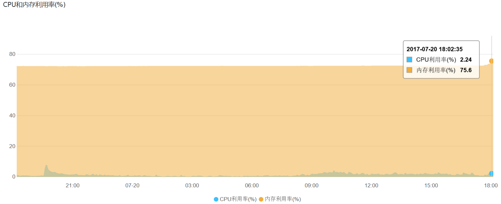

##### 迁移步骤

| 不存在触发器 | 描述                        | 服务可用性 | 时间预估                | 注意事项   |
| ------ | ------------------------- | ----- | ------------------- | ------ |
| 第一步    | 通过DTS实现公共云与金融云间RDS实时同步    | 可用    | 一般情况下，大概100G需要2-3小时 | 不兼容触发器 |
| 第二步    | 停止对源rds的写操作，保证源和目标rds数据一致 | 不可用   |                     |        |
| 第三步    | 测试目标                      | 不可用   |                     |        |
| 第四步    | 库切换客户端程序使用的数据库            | 不可用   |                     |        |
| 第五步    | 正式使用                      | 可用    |                     |        |

#### 存在触发器的情况

##### 迁移原理

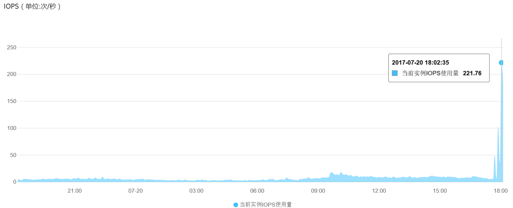

##### 迁移步骤

| 存在触发器 | 描述                         | 服务可用性 | 时间预估                | 注意事项        |
| ----- | -------------------------- | ----- | ------------------- | ----------- |
| 第一步   | 备份触发器                      | 可用    |                     |             |
| 第二步   | 通过DTS实现结构迁移后停止并释放DTS结构迁移任务 | 可用    |                     | **结构迁移**    |
| 第三步   | 删除目标rds中的触发器               | 可用    | 一般情况下，大概100G需要2-3小时 |             |
| 第四步   | 通过DTS实现公共云与金融云间RDS实时同步     | 可用    |                     | **全量数据初始化** |
| 第五步   | 停止对源rds的写操作，保证源和目标rds数据一致  | 不可用   |                     |             |
| 第六步   | 停止并释放DTS同步任务               | 不可用   |                     |             |
| 第七步   | 目标rds添加触发器                 | 不可用   |                     |             |
| 第八步   | 测试目标库                      | 不可用   |                     |             |
| 第九步   | 切换客户端程序使用的数据库              | 不可用   |                     |             |
| 第十步   | 正式使用                       | 可用    |                     |             |

---


### 存在触发器的具体操作步骤

#### 第一步 备份触发器脚本 

```shell
delimiter //
CREATE trigger data_check 
after insert on parent 
for each row 
begin
insert into child(user_vs_id, name) values(new.user_vs_id, new.name ) ;
end//
delimiter ;
```

若脚本没了，可以通过show create trigger xxx;来获取。 


#### 第二步 通过DTS实现结构迁移

1. 购买数据迁移链路
2. 迁移实例连接信息

| 迁移实例连接信息（源）  | 信息填写                 | 备注                                 |
| ------------ | -------------------- | ---------------------------------- |
| 任务名称         | 公有云华东1到金融云华东2rds同步任务 | 迁移作业名称自定义                          |
| 实例类型         | RDS实例                | 源实例为同步作业的源实例类型，目前只支持RDS For MySQL. |
| 实例地区         | 华东1                  | 源地域为同步链路源实例所在地域。                   |
| RDS实例ID      | `其他阿里云账号下的RDS实例`     | 垮公共云和经融云，选择`其他阿里云账号下的RDS实例`        |
| RDS实例所属阿里云账号 | 1822883072502788     | 源RDS实例所属阿里云账号的账号ID，账号管理的安全设置界面获取。  |
| 角色名称         | booboo               | 源RDS实例所属云账号授权的角色，具体创建看帮助           |
| 实例地区         | 华东1（可以下拉框选择）         | 源RDS实例地区                           |
| RDS实例ID      | rm-xxx（可以下拉框选择）      | 源RDS实例ID                           |
| 数据库账号        | zyadmin              | 源RDS实例数据库账号                        |
| 数据库密码        | Uploo00king          | 源RDS实例数据库密码                        |


| 迁移实例连接信息（目标） | 信息填写             | 备注                                     |
| ------------ | ---------------- | -------------------------------------- |
| 实例类型         | RDS实例            | 目前支持RDS For MySQL, MaxCompute, DataHub |
| 实例地区         | 华东2              | 目标实例所在地域                               |
| RDS实例ID      | 1437423208539296 | 目标RDS实例ID                              |
| 数据库账号        | booboo           | 目标RDS实例数据库账号                           |
| 数据库密码        | Uploo00king      | 目标RDS实例数据库密码                           |

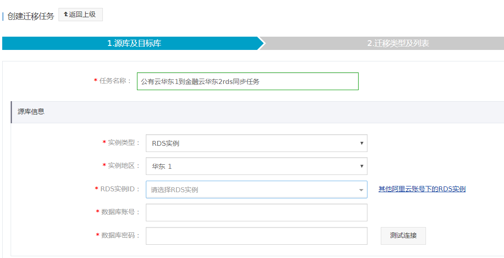

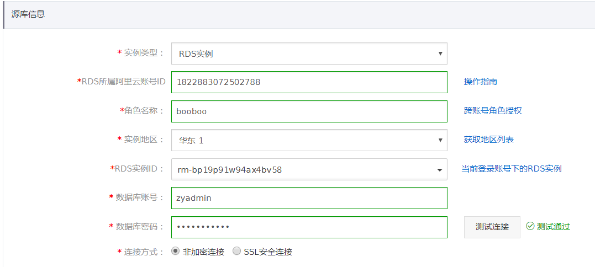
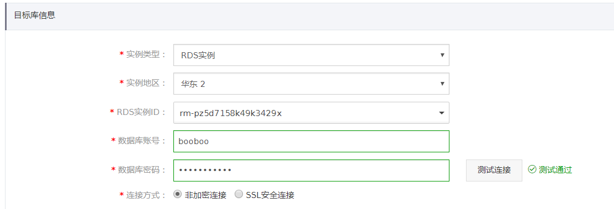

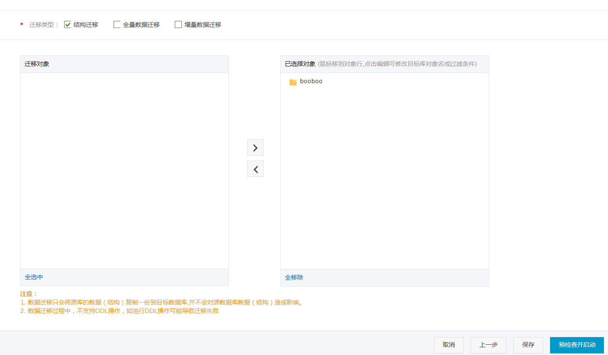

3. 授权rds实例白名单
4. 选择同步对象
5. 预检查
6. 启动迁移任务，开始结构对象的迁移。

#### 第三步 删除目标rds中的触发器

进入目标实例的DMS，执行一下SQL

```shell
drop trigger trigger_name;
# 量多的情况下，可以先生成批量删除的命令，再执行。
select concat('drop trigger ',group_concat(trigger_name),';') as statement from information_schema.triggers;
```


#### 第四步  通过DTS实现公共云与金融云间RDS实时同步

> 当目标实例中的触发器删除掉之后，可以开始创建同步链路。因为结构已经迁移过去了，所以同步初始化只选择全量数据初始化。

1. 创建同步链路

进入数据同步界面，点击右上角“创建同步作业” 购买同步链路。链路购买完成后，返回DTS控制台，点击链路右侧的 **配置同步链路**，开始链路配置。

2. 配置实例信息。

    在这个步骤中，主要配置迁移任务名称，迁移源实例及目标实例连接信息。其中：

   - 任务名称

     默认情况下，DTS为每个任务自动生成一个任务名称。任务名称没有唯一性要求，您可以修改这个名称，为任务配置一个具有业务意义的名称，便于后续的任务识别。

   - 源实例连接信息

     - 实例类型：选择 RDS实例
     - RDS实例ID：配置RDS实例的实例ID
     - 数据库账号：RDS实例访问账号
     - 数据库密码：上面RDS访问账号对应的密码

   - 目标实例连接信息

     - 实例类型：选择 RDS实例
     - RDS实例ID：配置RDS实例的实例ID
     - 数据库账号：RDS实例访问账号
     - 数据库密码：上面RDS访问账号对应的密码

3. 选择同步对象。
4. 同步初始化。
    注意，这里面同步初始化只勾选全量数据初始化，不进行结构初始化，因为上面的结构迁移已经将同步对象的结构定义迁移到目标RDS实例了。
5. 预检查。 当预检查成功后即可启动同步任务。

至此完成整个同步链路的配置。


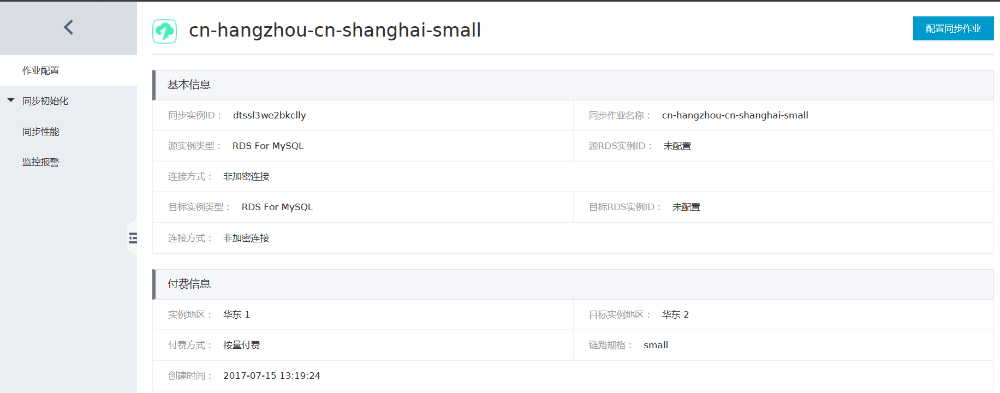
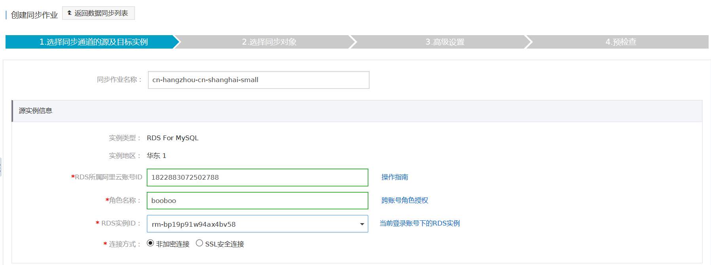

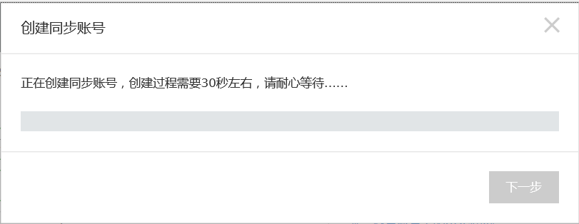
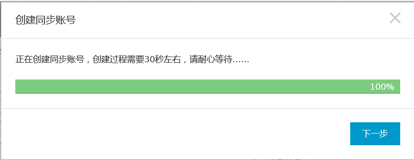
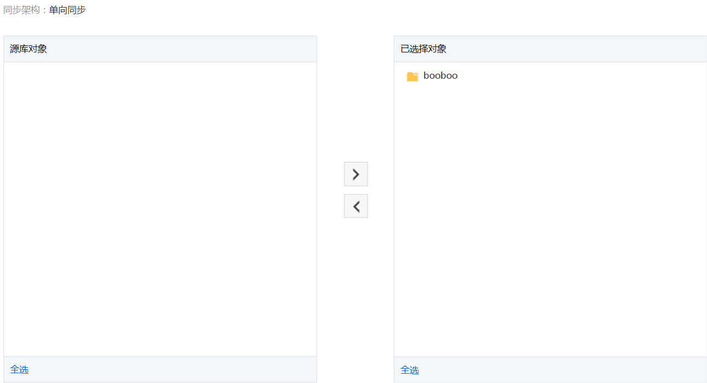

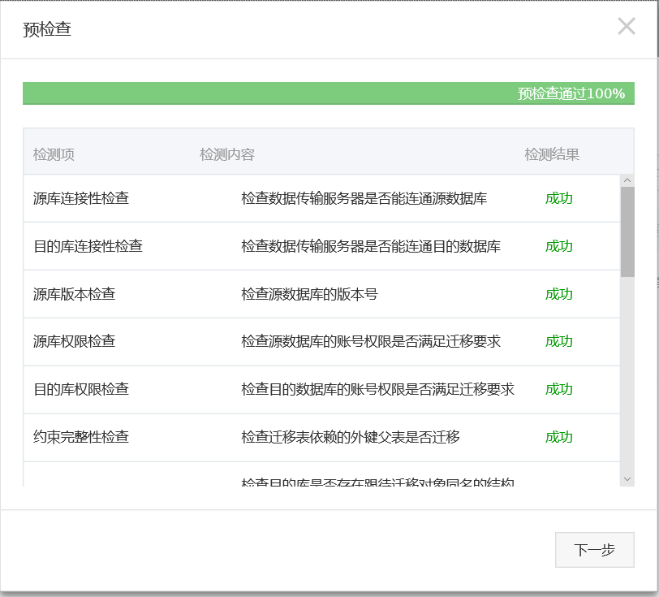
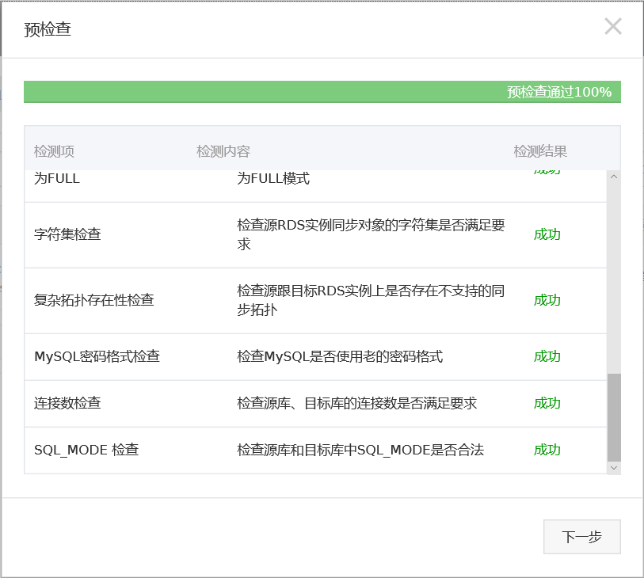


#### 第五步  停止对源rds的写操作

1. 准备好触发器脚本

   ```
   RDS是不能对系统库进行更改类的操作，所以无法使用导出的备份（select * from infomation_schema.triggers;）进行恢复。可以使用存储过程脚本再执行一遍
   ```

2. 停止对源rds的写操作

3. 进入目标RDS的控制台，执行存储过程脚本


#### 第六步  停止并释放DTS同步任务

#### 第七步  目标rds添加触发器 

#### 第八步  测试目标库

#### 第九步  切换客户端程序使用的数据库

#### 第十步  正式使用

---


### 存在触发器却直接使用DTS实时同步测试

最终会发现，源库和目标库数据不一致。

```shell
#源RDS实例数据库中的表和触发器的创建
CREATE TABLE `parent` (
  `user_vs_id` int(11) NOT NULL AUTO_INCREMENT,
  `name` varchar(30) DEFAULT NULL,
  PRIMARY KEY (`user_vs_id`)
) ENGINE=InnoDB AUTO_INCREMENT=2001 DEFAULT CHARSET=utf8;

CREATE TABLE `child` (
  `sys_child_id` int(11) NOT NULL AUTO_INCREMENT,
  `user_vs_id` int(11) DEFAULT NULL,
  `name` varchar(30) DEFAULT NULL,
  PRIMARY KEY (`sys_child_id`)
) ENGINE=InnoDB AUTO_INCREMENT=2001 DEFAULT CHARSET=utf8;

delimiter //
CREATE trigger data_check 
after insert on parent 
for each row 
begin
insert into child(user_vs_id, name) values(new.user_vs_id, new.name ) ;
end//
delimiter ;

# 查看触发器
mysql>show triggers\G;
*************************** 1. row ***************************
             Trigger: data_check
               Event: INSERT
               Table: parent
           Statement: begin
              Timing: AFTER
             Created: 
            sql_mode: 
             Definer: zyadmin@%
character_set_client: utf8mb4
collation_connection: utf8mb4_general_ci
  Database Collation: utf8_general_ci
共返回 1 行记录,花费 3 ms.

# 插入纪录
mysql>insert into `parent` set name='booboo';
# 查看源库中的数据
mysql>select * from parent;
+----------------------+----------------+
| user_vs_id           | name           |
+----------------------+----------------+
|                 2001 | booboo         |
+----------------------+----------------+
共返回 1 行记录,花费 2 ms.
mysql>select * from child;
+------------------------+----------------------+----------------+
| sys_child_id           | user_vs_id           | name           |
+------------------------+----------------------+----------------+
|                   2001 |                 2001 | booboo         |
+------------------------+----------------------+----------------+
共返回 1 行记录,花费 2 ms.


# 数据同步之后
# 源库中插入新记录
mysql>insert into parent set `name` = 'batman'

# 查看源库中的数据
mysql>SELECT * FROM parent;
+----------------------+----------------+
| user_vs_id           | name           |
+----------------------+----------------+
|                 2001 | booboo         |
|                 2002 | batman         |
+----------------------+----------------+
共返回 2 行记录,花费 2 ms.
mysql>select * from child;
+------------------------+----------------------+----------------+
| sys_child_id           | user_vs_id           | name           |
+------------------------+----------------------+----------------+
|                   2001 |                 2001 | booboo         |
|                   2002 |                 2002 | batman         |
+------------------------+----------------------+----------------+
共返回 2 行记录,花费 2 ms.

# 查看目标库中的数据
mysql>SELECT * FROM parent;
+----------------------+----------------+
| user_vs_id           | name           |
+----------------------+----------------+
|                 2001 | booboo         |
|                 2002 | batman         |
+----------------------+----------------+
共返回 2 行记录,花费 2 ms.

mysql>select * from child;
+------------------------+----------------------+----------------+
| sys_child_id           | user_vs_id           | name           |
+------------------------+----------------------+----------------+
|                   2001 |                 2001 | booboo         |
|                   2002 |                 2002 | batman         |
|                   2003 |                 2002 | batman         |
+------------------------+----------------------+----------------+
共返回 3 行记录,花费 2 ms.
```


### 测试并发同步的速率

#### 目标和源RDS实例的硬件配置情况

| RDS        | cpu  | 内存   | 磁盘   | IOPS |
| ---------- | ---- | ---- | ---- | ---- |
| 目标实例金融云    | 1核   | 1G   | 5G   | 600  |
| 源实例公有云rds1 | 1核   | 1G   | 5G   | 600  |
| 源实例公有云rds2 | 1核   | 1G   | 5G   | 600  |
| 源实例公有云rds3 | 1核   | 1G   | 5G   | 600  |

#### 源RDS实例的数据量和同步速率情况

| RDS  | db_name | db_size | 结构同步 | 全量同步     | 增量同步 |
| ---- | ------- | ------- | ---- | -------- | ---- |
| rds1 | usertb  | 341.83M |      | 16min25s |      |
| rds2 | t1      | 415.91M |      | 17min35s |      |
| rds3 | t2      | 42M     |      | 4min30s  |      |

####  同步速率情况总结

在目标实例和源实例都是最小配置的情况下（1核\1G\5G\600IOPS）

| RDS  | 数据量     | 全量同步     | 速度     |
| ---- | ------- | -------- | ------ |
| rds1 | 341.83M | 16min25s | 1.2G/h |
| rds2 | 415.91M | 17min35s | 1.3G/h |
| rds3 | 42M     | 4min30s  | 0.5G/h |

*阿里官方给到的参考速率为30~50G/h*

阿里最好配置为60核\470G\3000G\120000IOPS


#### 测试数据脚本

```shell
# 源rds1
CREATE TABLE usertb(   
id int primary key auto_increment,    
uname  varchar(20) ,   
ucreatetime  datetime  ,   
age  int(11)) DEFAULT CHARACTER SET=utf8 COLLATE=utf8_general_ci;

大宝 2017/7/16 22:07:57
delimiter $$ 
SET AUTOCOMMIT = 0$$   
 
create  procedure test1()  
begin
declare v_cnt decimal (10)  default 0 ; 
start transaction;
dd:loop            
        insert  into usertb values         
        (null,'用户1','2010-01-01 00:00:00',20),         
        (null,'用户2','2010-01-01 00:00:00',20),         
        (null,'用户3','2010-01-01 00:00:00',20),         
        (null,'用户4','2010-01-01 00:00:00',20),         
        (null,'用户5','2011-01-01 00:00:00',20),         
        (null,'用户6','2011-01-01 00:00:00',20),         
        (null,'用户7','2011-01-01 00:00:00',20),         
        (null,'用户8','2012-01-01 00:00:00',20),         
        (null,'用户9','2012-01-01 00:00:00',20),         
        (null,'用户0','2012-01-01 00:00:00',20)             
                ;                   
                             
        set v_cnt = v_cnt+10 ;                            
            if  v_cnt = 10000000 then leave dd;                           
            end if;          
        end loop dd ; 
commit;
end;$$   
 
delimiter ;

call test1();

# 源rds2
CREATE TABLE t1(   
id int primary key auto_increment,    
uname  varchar(20) ,   
ucreatetime  datetime  ,   
age  int(11)) DEFAULT CHARACTER SET=utf8 COLLATE=utf8_general_ci;


delimiter $$ 
 
create  procedure test1()  
begin

declare v_cnt decimal (10)  default 0 ;
start transaction;
dd:loop            
        insert  into t1 values         
        (null,'用户1','2010-01-01 00:00:00',20),         
        (null,'用户2','2010-01-01 00:00:00',20),         
        (null,'用户3','2010-01-01 00:00:00',20),         
        (null,'用户4','2010-01-01 00:00:00',20),         
        (null,'用户5','2011-01-01 00:00:00',20),         
        (null,'用户6','2011-01-01 00:00:00',20),         
        (null,'用户7','2011-01-01 00:00:00',20),         
        (null,'用户8','2012-01-01 00:00:00',20),         
        (null,'用户9','2012-01-01 00:00:00',20),         
        (null,'用户0','2012-01-01 00:00:00',20)             
                ;                                        
        set v_cnt = v_cnt+10 ;                            
            if  v_cnt = 10000000 then leave dd;                           
            end if;          
        end loop dd ; 
commit;
end;$$   
 
delimiter ;

call test1();

# 源rds3
CREATE TABLE t2(   
id int primary key auto_increment,    
uname  varchar(20) ,   
ucreatetime  datetime  ,   
age  int(11)) DEFAULT CHARACTER SET=utf8 COLLATE=utf8_general_ci;


delimiter $$ 
 
create  procedure test1()  
begin

declare v_cnt decimal (10)  default 0 ;
start transaction;
dd:loop            
        insert  into t2 values         
        (null,'用户1','2010-01-01 00:00:00',20),         
        (null,'用户2','2010-01-01 00:00:00',20),         
        (null,'用户3','2010-01-01 00:00:00',20),         
        (null,'用户4','2010-01-01 00:00:00',20),         
        (null,'用户5','2011-01-01 00:00:00',20),         
        (null,'用户6','2011-01-01 00:00:00',20),         
        (null,'用户7','2011-01-01 00:00:00',20),         
        (null,'用户8','2012-01-01 00:00:00',20),         
        (null,'用户9','2012-01-01 00:00:00',20),         
        (null,'用户0','2012-01-01 00:00:00',20)             
                ;                                        
        set v_cnt = v_cnt+10 ;                            
            if  v_cnt = 1000000 then leave dd;                           
            end if;          
        end loop dd ; 
commit;
end;$$   
 
delimiter ;

call test1();
```


## 测试方案二全备份+DTS增量迁移

阿里云金融云新建ecs网络类型为专有网络失败，阿里云自己的前端开发的问题。

该方案需要新建ecs自建mysql做中转，复杂且不安全，因此不再考虑。


## 官方文档参考

[数据同步](https://help.aliyun.com/document_detail/26595.html?spm=5176.doc26596.6.544.gKvM69)
[公共云与金融云间的数据迁移](https://help.aliyun.com/document_detail/26654.html?spm=5176.doc26592.6.624.QWucWE)
[跨阿里云账号RDS实时同步](https://help.aliyun.com/document_detail/26639.html)
[触发器存在情况下如何配置同步作业](https://help.aliyun.com/document_detail/26655.html?spm=5176.doc26639.6.625.n9Ke9i)
[使用DTS实现跨阿里云账号的 RDS 实例迁移](https://help.aliyun.com/document_detail/26652.html?spm=5176.doc26655.6.622.XwTYlO)


```

```