# Otter实现上海美国异地机房双向同步

> 2018-06-13 BoobooWei
>
> [TOC]

## 双向同步业务场景

上海/美国异地机房双向同步

* 业务性
* 隔离性
* 关联数据
* 双A写入
* 事务性
* 异构性（支持MySQL/Oracle）

中美异地机房同步性能指标：

   a. 100tps ， 延迟2s

   b. 5000tps ，延迟10s

---


## 双向同步业务架构图

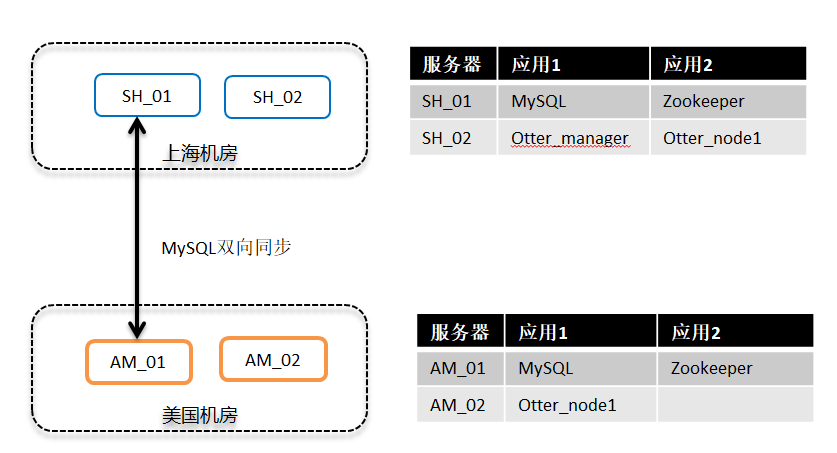

---


## Otter异地机房复制示意图

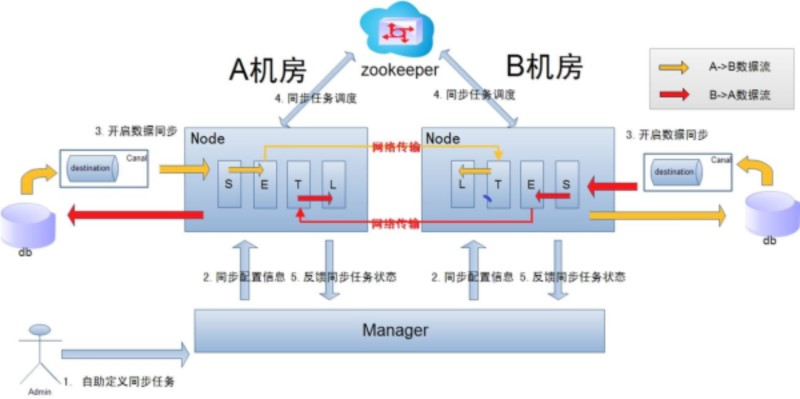

---

## 搭建明细

### 新建虚拟机

测试环境中，使用的虚拟机均为centos7.2

```shell
$ clone-vm.sh SH_01
$ clone-vm.sh SH_02
$ clone-vm.sh AM_01
$ clone-vm.sh AM_02
```

| hostname | ip          | software                 |
| -------- | ----------- | ------------------------ |
| SH_01    | 10.200.6.30 | MySQL;zookeeper          |
| SH_02    | 10.200.6.31 | otter_manager;otter_node |
| AM_01    | 10.200.6.33 | MySQL;zookeeper          |
| AM_02    | 10.200.6.32 | otter_node               |

### 软件安装

> 下面列出主要的几款软件的一般安装方法

#### 安装MySQL

> 安装MySQL5.7.17

**1. 卸载mariadb冲突包`rpm -e --nodeps mariadb-libs ; yum install -y tar gzip bzip2 wget libaio`**

**2. 新建mysql安装脚本`mysql.sh`**

```shell
#!/bin/bash

DIR=`pwd`
DATE=`date +%Y%m%d%H%M%S`

\mv /alidata/mysql /alidata/mysql.bak.$DATE &> /dev/null
mkdir -p /alidata/mysql
mkdir -p /alidata/mysql/data
mkdir -p /alidata/mysql/log
mkdir -p /alidata/install
mkdir -p /usr/local/mysql/bin

cd /alidata/install
if [ `uname -m` == "x86_64" ];then
  rm -rf mysql-5.7.17-linux-glibc2.5-x86_64
  if [ ! -f mysql-5.7.17-linux-glibc2.5-x86_64.tar.gz ];then
	 wget http://zy-res.oss-cn-hangzhou.aliyuncs.com/mysql/mysql-5.7.17-linux-glibc2.5-x86_64.tar.gz
  fi
  tar -xzvf mysql-5.7.17-linux-glibc2.5-x86_64.tar.gz
  mv mysql-5.7.17-linux-glibc2.5-x86_64/* /alidata/mysql
#else
#  rm -rf mysql-5.7.17-linux-glibc2.5-i686
#  if [ ! -f mysql-5.7.17-linux-glibc2.5-i686.tar.gz ];then
#  wget http://dev.mysql.com/get/Downloads/MySQL-5.7/mysql-5.7.17-linux-glibc2.5-i686.tar.gz
#  fi
#  tar -xzvf mysql-5.7.17-linux-glibc2.5-i686.tar.gz
#  mv mysql-5.7.17-linux-glibc2.5-i686/* /alidata/mysql

fi

#install mysql
groupadd mysql
useradd -g mysql -s /sbin/nologin mysql

\cp -f /alidata/mysql/support-files/mysql.server /etc/init.d/mysqld
sed -i 's#^basedir=$#basedir=/alidata/mysql#' /etc/init.d/mysqld
sed -i 's#^datadir=$#datadir=/alidata/mysql/data#' /etc/init.d/mysqld
cat > /etc/my.cnf <<END
[client]
port	= 3306
socket	= /tmp/mysql.sock

[mysql]
prompt="\u@MySQL-01 \R:\m:\s [\d]> "
no-auto-rehash

[mysqld]
user	= mysql
port	= 3306
basedir	= /alidata/mysql
datadir	= /alidata/mysql/data
socket	= /tmp/mysql.sock
pid-file = MySQL-01.pid
character-set-server = utf8mb4
skip_name_resolve = 1
slow_query_log = 1
slow_query_log_file = /alidata/mysql/dataslow.log
log-error = /alidata/mysql/dataerror.log
long_query_time = 0.1
log_queries_not_using_indexes =1
log_throttle_queries_not_using_indexes = 60
server-id = 1 # 建议改成ip地址的主机位
log-bin = /alidata/mysql/mybinlog
binlog_format = row
sync_binlog = 1
expire_logs_days = 30
master_info_repository = TABLE
relay_log_info_repository = TABLE
gtid_mode = on
enforce_gtid_consistency = 1
log_slave_updates


[mysqldump]
quick
max_allowed_packet = 32M
END

chown -R mysql:mysql /alidata/mysql/
chown -R mysql:mysql /alidata/mysql/data/
chown -R mysql:mysql /alidata/mysql/log
/alidata/mysql/bin/mysqld --initialize-insecure --datadir=/alidata/mysql/data/  --user=mysql
ln -s /alidata/mysql/bin/mysqld /usr/local/mysql/bin/mysqld
chmod 755 /etc/init.d/mysqld
/etc/init.d/mysqld start

#add PATH
if ! cat /etc/profile | grep "export PATH=\$PATH:/alidata/mysql/bin" &> /dev/null;then
	echo "export PATH=\$PATH:/alidata/mysql/bin" >> /etc/profile
fi
source /etc/profile
cd $DIR
bash
```

**3. 执行安装脚本`bash mysql.sh`**

#### 安装zookeeper

> 安装单实例

**1. 编写安装脚本`jdk.sh`并执行**

```shell
#!/bin/bash
SRC_URI="http://zy-res.oss-cn-hangzhou.aliyuncs.com/java/jdk-7u71-linux-x64.tar.gz"
PKG_NAME=`basename $SRC_URI`
DIR=`pwd`
DATE=`date +%Y%m%d%H%M%S`

\mv /alidata/java /alidata/java.bak.$DATE &> /dev/null
mkdir -p /alidata/java

if [ ! -s $PKG_NAME ]; then
  wget -c $SRC_URI
fi

mv jdk1.7.0_71 jdk1.7.0_71_bak.$DATE &> /dev/null

tar zxvf $PKG_NAME
mv jdk1.7.0_71/*  /alidata/java
rm -rf jdk1.7.0_71
#add PATH
if ! cat /etc/profile | grep 'export CLASSPATH=.:$JAVA_HOME/lib/dt.jar:$JAVA_HOME/lib/tools.jar:$JAVA_HOME/lib:$JRE_HOME/lib:$CLASSPATH' &> /dev/null;then
	echo "export JAVA_HOME=/alidata/java" >> /etc/profile
	echo "export JRE_HOME=/alidata/java/jre" >> /etc/profile
	echo 'export CLASSPATH=.:$JAVA_HOME/lib/dt.jar:$JAVA_HOME/lib/tools.jar:$JAVA_HOME/lib:$JRE_HOME/lib:$CLASSPATH' >> /etc/profile
	echo 'export PATH=$PATH:$JAVA_HOME/bin' >> /etc/profile
fi

cd $DIR
source /etc/profile
bash
```

**2. 编写zookeeper安装脚本`zookeeper.sh`并执行**

```shell
#!/bin/bash

SRC_URI="http://zy-res.oss-cn-hangzhou.aliyuncs.com/zookeeper/zookeeper-3.4.6.tar.gz"                       
PKG_NAME=`basename $SRC_URI`     
DIR=`pwd`                        
DATE=`date +%Y%m%d%H%M%S`
CPU_NUM=$(cat /proc/cpuinfo | grep processor | wc -l) 

\mv /alidata/zookeeper /alidata/zookeeper.bak.$DATE

mkdir -p /alidata/zookeeper
mkdir -p /alidata/zoodata
mkdir -p /alidata/install

cd /alidata/install

if [ ! -s $PKG_NAME ]; then
  wget -c $SRC_URI
fi

cd /alidata/install
tar xvf $PKG_NAME
mv zookeeper-3.4.6/* /alidata/zookeeper/
rm -rf zookeeper-3.4.6/
cp -a /alidata/zookeeper/conf/zoo_sample.cfg /alidata/zookeeper/conf/zoo.cfg
sed -i 's#dataDir=/tmp/zookeeper#dataDir=/alidata/zoodata#g' /alidata/zookeeper/conf/zoo.cfg

#start zookeeper
#. /alidata/zookeeper/bin/zkServer.sh start

#/etc/rc.local
#if ! cat /etc/rc.local | grep "/alidata/zookeeper/bin/zkServer.sh start" &> /dev/null ;then
#   echo "bash /alidata/zookeeper/bin/zkServer.sh start" >> /etc/rc.local
#fi

#cd $DIR
#bash
```


#### 安装otter_manager

> 环境准备：
>
> * jdk

**1. 下载otter-manager-schema.sql并导入数据库**

```shell
wget https://raw.github.com/alibaba/otter/master/manager/deployer/src/main/resources/sql/otter-manager-schema.sql 
mysql -uroot -puplooking < otter-manager-schema.sql
```
**2. 下载manager二进制包**

> 下载地址 https://github.com/alibaba/otter/releases/
>
> 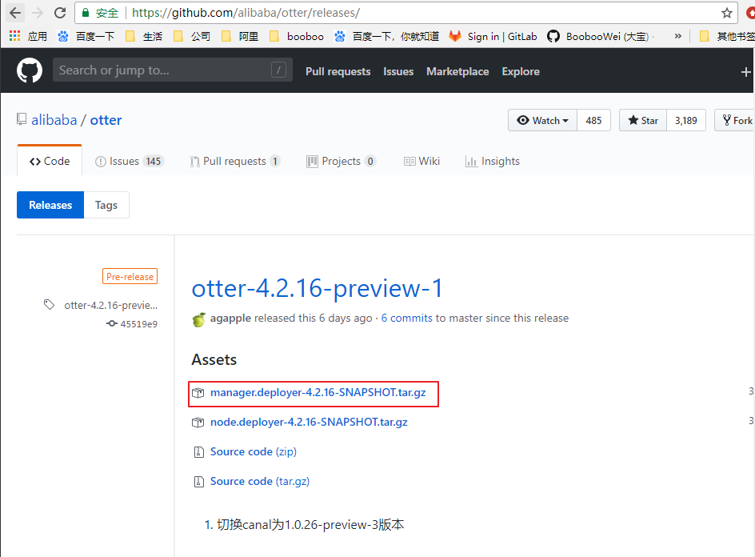

```shell
$ wget https://github.com/alibaba/otter/releases/download/otter-x.y.z/manager.deployer-x.y.z.tar.gz
```

**3. 解压缩**

```shell
mkdir /alidata/manager
tar zxvf manager.deployer-$version.tar.gz  -C /alidata/manager
```

**4. 配置修改 **

```shell
## otter manager domain name #修改为正确访问ip，生成URL使用
otter.domainName = 127.0.0.1    
## otter manager http port
otter.port = 8080
## jetty web config xml
otter.jetty = jetty.xml

#otter manager database config ，修改为正确数据库信息
otter.database.driver.class.name = com.mysql.jdbc.Driver
otter.database.driver.url = jdbc:mysql://127.0.01:3306/ottermanager
otter.database.driver.username = root
otter.database.driver.password = hello

#otter communication port
otter.communication.manager.port = 1099

#otter communication pool size
otter.communication.pool.size = 10

#default zookeeper address，修改为正确的地址，手动选择一个地域就近的zookeeper集群列表
otter.zookeeper.cluster.default = 127.0.0.1:2181

#default zookeeper session timeout = 90s
otter.zookeeper.sessionTimeout = 90000

#otter arbitrate connect manager config
otter.manager.address = ${otter.domainName}:${otter.communication.manager.port}
```


**5. 准备启动** 

```shell
sh startup.sh
```


**6. 查看日志**

```shell
vi logs/manager.log
```

```shell
2013-08-14 13:19:45.911 [] WARN  com.alibaba.otter.manager.deployer.JettyEmbedServer - ##Jetty Embed Server is startup!
2013-08-14 13:19:45.911 [] WARN  com.alibaba.otter.manager.deployer.OtterManagerLauncher - ## the manager server is running now ......
```

出现类似日志，代表启动成功

**7. 验证**

访问： http://127.0.0.1:8080/，出现otter的页面，即代表启动成功


访问：http://127.0.0.1:8080/login.htm，初始密码为：admin/admin，即可完成登录. 目前：匿名用户只有只读查看的权限，登录为管理员才可以有操作权限 

**8. 关闭**

```shell
sh stop.sh
```


#### 安装otter_node

https://github.com/alibaba/otter/wiki/QuickStart

> 环境准备：
> * jdk
> * gcc-c++

**1. manager管理界面添加node节点**

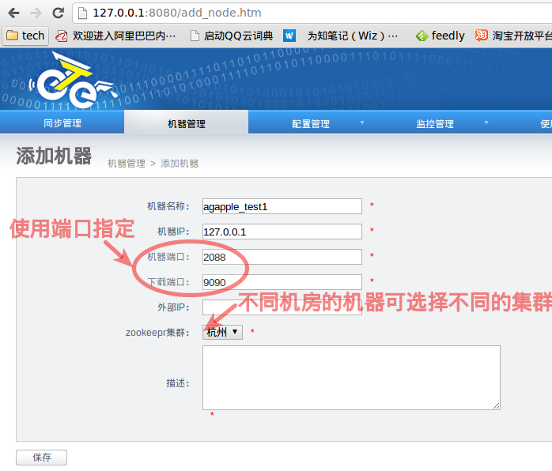 

几点说明：

- 机器名称：可以随意定义，方便自己记忆即可
- 机器ip：对应node节点将要部署的机器ip，如果有多ip时，可选择其中一个ip进行暴露. (此ip是整个集群通讯的入口，实际情况千万别使用127.0.0.1，否则多个机器的node节点会无法识别)
- 机器端口：对应node节点将要部署时启动的数据通讯端口，建议值：2088
- 下载端口：对应node节点将要部署时启动的数据下载端口，建议值：9090
- 外部ip ：对应node节点将要部署的机器ip，存在的一个外部ip，允许通讯的时候走公网处理。
- zookeeper集群：为提升通讯效率，不同机房的机器可选择就近的zookeeper集群.

node这种设计，是为解决单机部署多实例而设计的，允许单机多node指定不同的端口

  **机器添加完成后，跳转到机器列表页面，获取对应的机器序号nid**


**通过这两部操作，获取到了node节点对应的唯一标示，称之为node id，简称：nid. 记录该nid，后续启动nid时会使用**

**2. 安装aria2c**

aria2 官方首页： <http://aria2.sourceforge.net/>

下载页面： <http://sourceforge.net/projects/aria2/files/stable/>

```shell
$ wget https://sourceforge.net/projects/aria2/files/stable/aria2-1.19.0/aria2-1.19.0.tar.gz/download -O aria2-1.19.0.tar.gz
$ tar -xf aria2-1.19.0.tar.gz -C /alidata/
$ cd /alidata/aria2-1.19.0
$ ./configure
$ make
$ make install
```


**3. 安装canal **

> https://github.com/alibaba/canal/wiki/QuickStart

- a. canal的原理是基于mysql binlog技术，所以这里一定需要开启mysql的binlog写入功能，建议配置binlog模式为row.

**针对阿里云RDS账号默认已经有binlog dump权限,不需要任何权限或者binlog设置,可以直接跳过这一步**

```
[mysqld]
log-bin=mysql-bin #添加这一行就ok
binlog-format=ROW #选择row模式
server_id=1 #配置mysql replaction需要定义，不能和canal的slaveId重复
```

- b. canal的原理是模拟自己为mysql slave，所以这里一定需要做为mysql slave的相关权限.

```
CREATE USER canal IDENTIFIED BY 'canal';  
GRANT SELECT, REPLICATION SLAVE, REPLICATION CLIENT ON *.* TO 'canal'@'%';
-- GRANT ALL PRIVILEGES ON *.* TO 'canal'@'%' ;
FLUSH PRIVILEGES;
```

- c.下载canal 

  访问：<https://github.com/alibaba/canal/releases> ，会列出所有历史的发布版本包 下载方式，比如以1.0.17版本为例子： 

```shel
wget https://github.com/alibaba/canal/releases/download/canal-1.0.17/canal.deployer-1.0.17.tar.gz
```

- d. 解压缩

```
mkdir /alidata/canal
tar zxvf canal.deployer-$version.tar.gz  -C /aliata/canal
```

解压完成后，进入/tmp/canal目录，可以看到如下结构：

```
drwxr-xr-x 2 jianghang jianghang  136 2013-02-05 21:51 bin
drwxr-xr-x 4 jianghang jianghang  160 2013-02-05 21:51 conf
drwxr-xr-x 2 jianghang jianghang 1.3K 2013-02-05 21:51 lib
drwxr-xr-x 2 jianghang jianghang   48 2013-02-05 21:29 logs
```

- e. 配置修改

应用参数：

```
vi conf/example/instance.properties
```

```
#################################################
## mysql serverId
canal.instance.mysql.slaveId = 1234

position info，需要改成自己的数据库信息
canal.instance.master.address = 127.0.0.1:3306
canal.instance.master.journal.name =
canal.instance.master.position =
canal.instance.master.timestamp =
#canal.instance.standby.address =
#canal.instance.standby.journal.name =
#canal.instance.standby.position =
#canal.instance.standby.timestamp =

username/password，需要改成自己的数据库信息
canal.instance.dbUsername = canal

canal.instance.dbPassword = canal
canal.instance.defaultDatabaseName =
canal.instance.connectionCharset = UTF-8

table regex
canal.instance.filter.regex = .\..
#################################################
```

说明：

​	canal.instance.connectionCharset 代表数据库的编码方式对应到java中的编码类型，比如UTF-8，GBK , ISO-8859-1

- f. 准备启动

```
sh bin/startup.sh
```

- g. 查看日志

```
vi logs/canal/canal.log
```

```
2013-02-05 22:45:27.967 [main] INFO  com.alibaba.otter.canal.deployer.CanalLauncher - ## start the canal server.
2013-02-05 22:45:28.113 [main] INFO  com.alibaba.otter.canal.deployer.CanalController - ## start the canal server[10.1.29.120:11111]
2013-02-05 22:45:28.210 [main] INFO  com.alibaba.otter.canal.deployer.CanalLauncher - ## the canal server is running now ......
```

具体instance的日志：

```
vi logs/example/example.log
```

```
2013-02-05 22:50:45.636 [main] INFO  c.a.o.c.i.spring.support.PropertyPlaceholderConfigurer - Loading properties file from class path resource [canal.properties]
2013-02-05 22:50:45.641 [main] INFO  c.a.o.c.i.spring.support.PropertyPlaceholderConfigurer - Loading properties file from class path resource [example/instance.properties]
2013-02-05 22:50:45.803 [main] INFO  c.a.otter.canal.instance.spring.CanalInstanceWithSpring - start CannalInstance for 1-example 
2013-02-05 22:50:45.810 [main] INFO  c.a.otter.canal.instance.spring.CanalInstanceWithSpring - start successful....
```

- h. 关闭

```
sh bin/stop.sh
```


**4. 下载otter node二进制包**

直接下载 ，可访问：https://github.com/alibaba/otter/releases ，会列出所有历史的发布版本包下载方式，比如以x.y.z版本为例子：

```
wget https://github.com/alibaba/otter/releases/download/otter-x.y.z/node.deployer-x.y.z.tar.gz
```

**5. 解压缩**

```
mkdir /alidata/node
tar zxvf node.deployer-$version.tar.gz  -C /alidata/node 
```

**6. 修改配置**

a. nid配置 (将环境准备中添加机器后获取到的序号，保存到conf目录下的nid文件，比如我添加的机器对应序号为1

```
echo 1 > conf/nid
```

​    b. otter.properties配置修改

```
# otter node root dir
otter.nodeHome = ${user.dir}/../node 
## otter node dir
otter.htdocs.dir = ${otter.nodeHome}/htdocs
otter.download.dir = ${otter.nodeHome}/download
otter.extend.dir= ${otter.nodeHome}/extend

default zookeeper sesstion timeout = 90s
otter.zookeeper.sessionTimeout = 90000

otter communication pool size
otter.communication.pool.size = 10

otter arbitrate & node connect manager config ， 修改为正确的manager服务地址
otter.manager.address = 127.0.0.1:1099
```

**7. 准备启动**

```
sh startup.sh
```

**8. 查看日志**

如果manager页面的ip配置不正确，会出现类似错误：

打开日志： vi logs/node/node.log

```
Exception in thread "main" java.lang.IllegalArgumentException: node[1] ip[127.0.0.1] port[2088] , but your host ip[10.12.48.215] is not matched!
        at com.alibaba.otter.node.etl.OtterController.checkNidVaild(OtterController.java:245)
        at com.alibaba.otter.node.etl.OtterController.initNid(OtterController.java:230)
        at com.alibaba.otter.node.etl.OtterController.start(OtterController.java:73)
        at com.alibaba.otter.node.deployer.OtterLauncher.main(OtterLauncher.java:25)
```

此时修改ip为对应的host ip后，再次启动即可。

```
vi logs/node/node.log
```


```
2013-08-14 15:42:16.886 [main] INFO  com.alibaba.otter.node.deployer.OtterLauncher - INFO ## the otter server is running now ......
```

看到如下日志，代表node启动完成.

**9. 验证**

访问： http://127.0.0.1:8080/node_list.htm，查看对应的节点状态，如果变为了已启动，代表已经正常启动。(*如果是未启动，会是一个红色高亮*)


**10. 关闭**

```
sh stop.sh
```

### 部署明细

| server | mysql       | jdk         | zookeeper   | otter-manager | otter-node  | canal       | aria2c      |
| ------ | ----------- | ----------- | ----------- | ------------- | ----------- | ----------- | ----------- |
| sh_01  | **&radic;** | **&radic;** | **&radic;** |               |             |             |             |
| sh_02  |             | **&radic;** |             | **&radic;**   | **&radic;** | **&radic;** | **&radic;** |
| am_01  | **&radic;** | **&radic;** | **&radic;** |               |             |             |             |
| am_02  |             | **&radic;** |             |               | **&radic;** | **&radic;** | **&radic;** |

#### SH_01

上海机房的MySQL生产库，并部署zookeeper实例；

sh_02上部署的otter-manager需要使用数据库，因此将sh_01的数据库供sh_02使用，提前将库表新建好。

```shell
[root@sh_01 ~]# bash mysql.sh
[root@sh_01 ~]# bash jdk.sh
[root@sh_01 ~]# bash zookeeper.sh
[root@sh_01 ~]# mysql_secure_installation 
[root@sh_01 ~]# mysql -uroot -puplooking
root@MySQL-01 09:58:  [(none)]> select user,host from mysql.user;
+-----------+-----------+
| user      | host      |
+-----------+-----------+
| mysql.sys | localhost |
| root      | localhost |
+-----------+-----------+
2 rows in set (0.00 sec)

root@MySQL-01 09:58:  [(none)]> grant all on *.* to otter@'10.200.6.31' identified by 'uplooking';
Query OK, 0 rows affected, 1 warning (0.01 sec)

root@MySQL-01 09:59:  [(none)]> flush privileges;
Query OK, 0 rows affected (0.00 sec)

[root@sh_01 ~]# wget https://raw.github.com/alibaba/otter/master/manager/deployer/src/main/resources/sql/otter-manager-schema.sql 
[root@sh_01 ~]# mysql -uroot -puplooking < otter-manager-schema.sql
```

官方表示otter-manager连接的数据库要求mysql5.6，只需要修改脚本中与mysql5.7不兼容给的地方，例如`timestamp not null default 00-00-00 00:00:00 ` 改为 `timestamp not null DEFAULT CURRENT_TIMESTAMP `

#### SH_02

作为上海机房的otter-manager和otter-node1

```shell
[root@sh_02 ~]# wget https://github.com/alibaba/otter/releases/download/otter-4.2.16-preview-1/manager.deployer-4.2.16-SNAPSHOT.tar.gz
[root@sh_02 ~]# mkdir /alidata/manager
[root@sh_02 ~]# tar -xf manager.deployer-4.2.16-SNAPSHOT.tar.gz -C /alidata/manager/
[root@sh_02 ~]# cd /alidata/manager/
[root@sh_02 manager]# ll
total 8
drwxr-xr-x. 2 root root   58 Jun 14 11:44 bin
drwxr-xr-x. 2 root root   66 Jun 14 11:44 conf
drwxr-xr-x. 2 root root 4096 Jun 14 11:44 lib
drwxr-xr-x. 8 root root   89 Jun 14 11:44 webapp

[root@sh_02 manager]# vim conf/otter.properties
## otter manager domain name
otter.domainName = 10.200.6.31
## otter manager http port
otter.port = 8080
## jetty web config xml
otter.jetty = jetty.xml

## otter manager database config
otter.database.driver.class.name = com.mysql.jdbc.Driver
otter.database.driver.url = jdbc:mysql://10.200.6.30:3306/otter
otter.database.driver.username = otter
otter.database.driver.password = uplooking

## otter communication port
otter.communication.manager.port = 1099

## otter communication payload size (default = 8388608)
otter.communication.payload = 8388608

## otter communication pool size
otter.communication.pool.size = 10

## default zookeeper address
otter.zookeeper.cluster.default = 10.200.6.30:2181
## default zookeeper sesstion timeout = 60s
otter.zookeeper.sessionTimeout = 60000

## otter arbitrate connect manager config
otter.manager.address = ${otter.domainName}:${otter.communication.manager.port}

## should run in product mode , true/false
otter.manager.productionMode = true

## self-monitor enable or disable
otter.manager.monitor.self.enable = true
## self-montir interval , default 120s
otter.manager.monitor.self.interval = 120
## auto-recovery paused enable or disable
otter.manager.monitor.recovery.paused = true
# manager email user config
otter.manager.monitor.email.host = smtp.gmail.com
otter.manager.monitor.email.username =
otter.manager.monitor.email.password =
otter.manager.monitor.email.stmp.port = 465
[root@sh_02 manager]# systemctl stop firewalld;setenforce 0
[root@sh_02 manager]# bin/startup.sh
cd to /alidata/manager/bin for workaround relative path
LOG CONFIGURATION : /alidata/manager/bin/../conf/logback.xml
otter conf : /alidata/manager/bin/../conf/otter.properties
CLASSPATH :/alidata/manager/bin/..:/alidata/manager/bin/../conf:/alidata/manager/bin/../lib/zookeeper-3.4.5.jar:/alidata/manager/bin/../lib/zkclient-0.10.jar:/alidata/manager/bin/../lib/velocity-1.7.jar:/alidata/manager/bin/../lib/spring-webmvc-3.1.2.RELEASE.jar:/alidata/manager/bin/../lib/spring-web-3.1.2.RELEASE.jar:/alidata/manager/bin/../lib/spring-tx-3.1.2.RELEASE.jar:/alidata/manager/bin/../lib/spring-test-3.1.2.RELEASE.jar:/alidata/manager/bin/../lib/spring-orm-3.1.2.RELEASE.jar:/alidata/manager/bin/../lib/spring-jdbc-3.1.2.RELEASE.jar:/alidata/manager/bin/../lib/spring-expression-3.1.2.RELEASE.jar:/alidata/manager/bin/../lib/spring-core-3.1.2.RELEASE.jar:/alidata/manager/bin/../lib/spring-context-support-3.1.2.RELEASE.jar:/alidata/manager/bin/../lib/spring-context-3.1.2.RELEASE.jar:/alidata/manager/bin/../lib/spring-beans-3.1.2.RELEASE.jar:/alidata/manager/bin/../lib/spring-asm-3.1.2.RELEASE.jar:/alidata/manager/bin/../lib/spring-aop-3.1.2.RELEASE.jar:/alidata/manager/bin/../lib/slf4j-api-1.7.12.jar:/alidata/manager/bin/../lib/shared.push-4.2.16-SNAPSHOT.jar:/alidata/manager/bin/../lib/shared.communication-4.2.16-SNAPSHOT.jar:/alidata/manager/bin/../lib/shared.common-4.2.16-SNAPSHOT.jar:/alidata/manager/bin/../lib/shared.arbitrate-4.2.16-SNAPSHOT.jar:/alidata/manager/bin/../lib/protobuf-java-2.6.1.jar:/alidata/manager/bin/../lib/oro-2.0.8.jar:/alidata/manager/bin/../lib/ojdbc6.jar:/alidata/manager/bin/../lib/ojdbc6-11.1.0.7.0.jar:/alidata/manager/bin/../lib/netty-all-4.1.6.Final.jar:/alidata/manager/bin/../lib/netty-3.2.2.Final.jar:/alidata/manager/bin/../lib/mysql-connector-java-5.1.40.jar:/alidata/manager/bin/../lib/manager.web-4.2.16-SNAPSHOT.jar:/alidata/manager/bin/../lib/manager.deployer-4.2.16-SNAPSHOT.jar:/alidata/manager/bin/../lib/manager.biz-4.2.16-SNAPSHOT.jar:/alidata/manager/bin/../lib/mail-1.4.7.jar:/alidata/manager/bin/../lib/logback-core-1.1.3.jar:/alidata/manager/bin/../lib/logback-classic-1.1.3.jar:/alidata/manager/bin/../lib/jopt-simple-4.6.jar:/alidata/manager/bin/../lib/jmh-core-1.21.jar:/alidata/manager/bin/../lib/jetty-xml-8.1.7.v20120910.jar:/alidata/manager/bin/../lib/jetty-webapp-8.1.7.v20120910.jar:/alidata/manager/bin/../lib/jetty-util-8.1.7.v20120910.jar:/alidata/manager/bin/../lib/jetty-servlet-8.1.7.v20120910.jar:/alidata/manager/bin/../lib/jetty-server-8.1.7.v20120910.jar:/alidata/manager/bin/../lib/jetty-security-8.1.7.v20120910.jar:/alidata/manager/bin/../lib/jetty-io-8.1.7.v20120910.jar:/alidata/manager/bin/../lib/jetty-http-8.1.7.v20120910.jar:/alidata/manager/bin/../lib/jetty-continuation-8.1.7.v20120910.jar:/alidata/manager/bin/../lib/jcl-over-slf4j-1.7.12.jar:/alidata/manager/bin/../lib/javax.servlet-3.0.0.v201112011016.jar:/alidata/manager/bin/../lib/javassist-3.15.0-GA.jar:/alidata/manager/bin/../lib/ibatis-sqlmap-2.3.4.726.jar:/alidata/manager/bin/../lib/httpcore-4.4.3.jar:/alidata/manager/bin/../lib/httpclient-4.5.1.jar:/alidata/manager/bin/../lib/h2-1.4.196.jar:/alidata/manager/bin/../lib/guava-18.0.jar:/alidata/manager/bin/../lib/fastsql-2.0.0_preview_366.jar:/alidata/manager/bin/../lib/fastjson-1.2.28.jar:/alidata/manager/bin/../lib/ecs-1.4.2.jar:/alidata/manager/bin/../lib/dwr-2.0.10.jar:/alidata/manager/bin/../lib/dubbo-2.5.3.jar:/alidata/manager/bin/../lib/druid-1.1.9.jar:/alidata/manager/bin/../lib/dom4j-1.6.1.jar:/alidata/manager/bin/../lib/ddlutils-1.0.jar:/alidata/manager/bin/../lib/commons-pool-1.5.4.jar:/alidata/manager/bin/../lib/commons-math3-3.2.jar:/alidata/manager/bin/../lib/commons-logging-1.1.1.jar:/alidata/manager/bin/../lib/commons-lang-2.6.jar:/alidata/manager/bin/../lib/commons-jexl-2.1.1.jar:/alidata/manager/bin/../lib/commons-io-2.4.jar:/alidata/manager/bin/../lib/commons-fileupload-1.2.2.jar:/alidata/manager/bin/../lib/commons-dbcp-1.4.jar:/alidata/manager/bin/../lib/commons-compress-1.9.jar:/alidata/manager/bin/../lib/commons-collections-3.2.2.jar:/alidata/manager/bin/../lib/commons-codec-1.9.jar:/alidata/manager/bin/../lib/commons-beanutils-1.8.3.jar:/alidata/manager/bin/../lib/citrus-webx-all-3.2.0.jar:/alidata/manager/bin/../lib/cglib-nodep-2.2.jar:/alidata/manager/bin/../lib/canal.store-1.0.26-SNAPSHOT.jar:/alidata/manager/bin/../lib/canal.sink-1.0.26-SNAPSHOT.jar:/alidata/manager/bin/../lib/canal.protocol-1.0.26-SNAPSHOT.jar:/alidata/manager/bin/../lib/canal.parse.driver-1.0.26-SNAPSHOT.jar:/alidata/manager/bin/../lib/canal.parse.dbsync-1.0.26-SNAPSHOT.jar:/alidata/manager/bin/../lib/canal.parse-1.0.26-SNAPSHOT.jar:/alidata/manager/bin/../lib/canal.meta-1.0.26-SNAPSHOT.jar:/alidata/manager/bin/../lib/canal.instance.manager-1.0.26-SNAPSHOT.jar:/alidata/manager/bin/../lib/canal.instance.core-1.0.26-SNAPSHOT.jar:/alidata/manager/bin/../lib/canal.filter-1.0.26-SNAPSHOT.jar:/alidata/manager/bin/../lib/canal.common-1.0.26-SNAPSHOT.jar:/alidata/manager/bin/../lib/aviator-2.2.1.jar:/alidata/manager/bin/../lib/aopalliance-1.0.jar:/alidata/manager/bin/../lib/annotations-9.0.4.jar:/alidata/manager/bin/../lib/activation-1.1.jar:.:/alidata/java/lib/dt.jar:/alidata/java/lib/tools.jar:/alidata/java/lib:/alidata/java/jre/lib:
cd to /alidata/manager for continue

[root@sh_02 manager]# cat logs/manager.log 
2018-06-14 11:47:17.982 [] INFO  com.alibaba.otter.manager.deployer.OtterManagerLauncher - ## start the manager server.
Thu Jun 14 11:47:24 CST 2018 WARN: Establishing SSL connection without server's identity verification is not recommended. According to MySQL 5.5.45+, 5.6.26+ and 5.7.6+ requirements SSL connection must be established by default if explicit option isn't set. For compliance with existing applications not using SSL the verifyServerCertificate property is set to 'false'. You need either to explicitly disable SSL by setting useSSL=false, or set useSSL=true and provide truststore for server certificate verification.
2018-06-14 11:47:26.046 [] INFO  com.alibaba.otter.manager.deployer.JettyEmbedServer - ##Jetty Embed Server is startup!
2018-06-14 11:47:26.046 [] INFO  com.alibaba.otter.manager.deployer.OtterManagerLauncher - ## the manager server is running now ......

```

通过8080端口访问otter-manager的web界面；

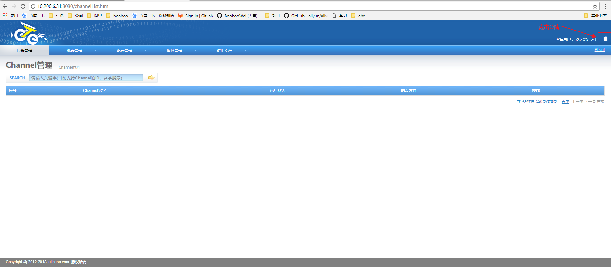

默认admin用户密码为admin；


添加zookeeper管理节点；


点击添加


到sh_01中查看zookeeper的监听端口为2181，注意格式`ip:port;`分号少了就会报错

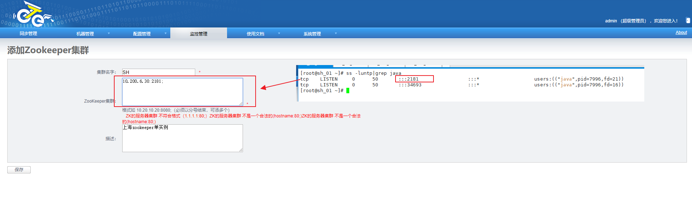

可以查看到zookeeper管理节点已经添加好了


开始添加node1

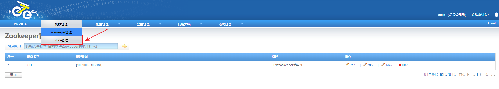

点击添加按钮


输入node1的相关参数


查看到当前node1节点还没有启动，因为我们还没有安装otter-node节点


同样的再添加一个node2，node2会部署在美国的AM_02上面。


---

开始安装otter-node1

```shell
# 安装aria2
[root@sh_02 ~]# yum install -y gcc-c++
[root@sh_02 ~]# wget https://sourceforge.net/projects/aria2/files/stable/aria2-1.19.0/aria2-1.19.0.tar.gz/download -O aria2-1.19.0.tar.gz
[root@sh_02 ~]# tar -xf aria2-1.19.0.tar.gz -C /alidata/
[root@sh_02 ~]# cd /alidata/aria2-1.19.0/
[root@sh_02 aria2-1.19.0]# make && make install
# 安装canal 
# sh_01上对数据库添加授权
> GRANT SELECT, REPLICATION SLAVE, REPLICATION CLIENT ON *.* TO 'canal'@'%' identified by '(Uploo00king)';
> flush privileges;

[root@sh_02 ~]#  wget https://github.com/alibaba/canal/releases/download/canal-1.0.26-preview-3/canal.deployer-1.0.26-SNAPSHOT.tar.gz
[root@sh_02 ~]# mkdir /alidata/canal
[root@sh_02 ~]# tar -xf canal.deployer-1.0.26-SNAPSHOT.tar.gz -C /alidata/canal/
[root@sh_02 ~]# cd /alidata/canal/
[root@sh_02 canal]# ll
total 4
drwxr-xr-x. 2 root root   58 Jun 14 14:50 bin
drwxr-xr-x. 4 root root   78 Jun 14 14:50 conf
drwxr-xr-x. 2 root root 4096 Jun 14 14:50 lib
drwxrwxrwx. 2 root root    6 Jun 12 13:52 logs
[root@sh_02 canal]# vim conf/example/instance.properties
#################################################
## mysql serverId
canal.instance.mysql.slaveId=0

# position info
# 源数据库的ip:port
canal.instance.master.address=10.200.6.30:3306
# enable gtid use true/false
canal.instance.gtidon=false
canal.instance.master.journal.name=
canal.instance.master.position=
canal.instance.master.timestamp=
canal.instance.master.gtid=

# table meta tsdb info
canal.instance.tsdb.enable=true
canal.instance.tsdb.dir=${canal.file.data.dir:../conf}/${canal.instance.destination:}
canal.instance.tsdb.url=jdbc:h2:${canal.instance.tsdb.dir}/h2;CACHE_SIZE=1000;MODE=MYSQL;
#canal.instance.tsdb.url=jdbc:mysql://10.200.6.30:3306/canal_tsdb
canal.instance.tsdb.dbUsername=
canal.instance.tsdb.dbPassword=


#canal.instance.standby.address =
#canal.instance.standby.journal.name =
#canal.instance.standby.position = 
#canal.instance.standby.timestamp =
#canal.instance.standby.gtid=
# username/password
# 数据库的用户名和密码
canal.instance.dbUsername=canal
canal.instance.dbPassword=(Uploo00king)
canal.instance.defaultDatabaseName=mysql
canal.instance.connectionCharset=UTF-8
# table regex
canal.instance.filter.regex=.*\\..*
# table black regex
canal.instance.filter.black.regex=
#################################################

[root@sh_02 canal]# bin/startup.sh 
cd to /alidata/canal/bin for workaround relative path
LOG CONFIGURATION : /alidata/canal/bin/../conf/logback.xml
canal conf : /alidata/canal/bin/../conf/canal.properties
CLASSPATH :/alidata/canal/bin/../conf:/alidata/canal/bin/../lib/zookeeper-3.4.5.jar:/alidata/canal/bin/../lib/zkclient-0.10.jar:/alidata/canal/bin/../lib/spring-tx-3.2.9.RELEASE.jar:/alidata/canal/bin/../lib/spring-orm-3.2.9.RELEASE.jar:/alidata/canal/bin/../lib/spring-jdbc-3.2.9.RELEASE.jar:/alidata/canal/bin/../lib/spring-expression-3.2.9.RELEASE.jar:/alidata/canal/bin/../lib/spring-core-3.2.9.RELEASE.jar:/alidata/canal/bin/../lib/spring-context-3.2.9.RELEASE.jar:/alidata/canal/bin/../lib/spring-beans-3.2.9.RELEASE.jar:/alidata/canal/bin/../lib/spring-aop-3.2.9.RELEASE.jar:/alidata/canal/bin/../lib/slf4j-api-1.7.12.jar:/alidata/canal/bin/../lib/protobuf-java-2.6.1.jar:/alidata/canal/bin/../lib/oro-2.0.8.jar:/alidata/canal/bin/../lib/netty-all-4.1.6.Final.jar:/alidata/canal/bin/../lib/netty-3.2.2.Final.jar:/alidata/canal/bin/../lib/mysql-connector-java-5.1.40.jar:/alidata/canal/bin/../lib/logback-core-1.1.3.jar:/alidata/canal/bin/../lib/logback-classic-1.1.3.jar:/alidata/canal/bin/../lib/jopt-simple-4.6.jar:/alidata/canal/bin/../lib/jmh-core-1.21.jar:/alidata/canal/bin/../lib/jcl-over-slf4j-1.7.12.jar:/alidata/canal/bin/../lib/ibatis-sqlmap-2.3.4.726.jar:/alidata/canal/bin/../lib/httpcore-4.4.3.jar:/alidata/canal/bin/../lib/httpclient-4.5.1.jar:/alidata/canal/bin/../lib/h2-1.4.196.jar:/alidata/canal/bin/../lib/guava-18.0.jar:/alidata/canal/bin/../lib/fastsql-2.0.0_preview_371.jar:/alidata/canal/bin/../lib/fastjson-1.2.28.jar:/alidata/canal/bin/../lib/druid-1.1.9.jar:/alidata/canal/bin/../lib/commons-math3-3.2.jar:/alidata/canal/bin/../lib/commons-logging-1.1.3.jar:/alidata/canal/bin/../lib/commons-lang-2.6.jar:/alidata/canal/bin/../lib/commons-io-2.4.jar:/alidata/canal/bin/../lib/commons-compress-1.9.jar:/alidata/canal/bin/../lib/commons-codec-1.9.jar:/alidata/canal/bin/../lib/commons-beanutils-1.8.2.jar:/alidata/canal/bin/../lib/canal.store-1.0.26-SNAPSHOT.jar:/alidata/canal/bin/../lib/canal.sink-1.0.26-SNAPSHOT.jar:/alidata/canal/bin/../lib/canal.server-1.0.26-SNAPSHOT.jar:/alidata/canal/bin/../lib/canal.protocol-1.0.26-SNAPSHOT.jar:/alidata/canal/bin/../lib/canal.parse.driver-1.0.26-SNAPSHOT.jar:/alidata/canal/bin/../lib/canal.parse.dbsync-1.0.26-SNAPSHOT.jar:/alidata/canal/bin/../lib/canal.parse-1.0.26-SNAPSHOT.jar:/alidata/canal/bin/../lib/canal.meta-1.0.26-SNAPSHOT.jar:/alidata/canal/bin/../lib/canal.instance.spring-1.0.26-SNAPSHOT.jar:/alidata/canal/bin/../lib/canal.instance.manager-1.0.26-SNAPSHOT.jar:/alidata/canal/bin/../lib/canal.instance.core-1.0.26-SNAPSHOT.jar:/alidata/canal/bin/../lib/canal.filter-1.0.26-SNAPSHOT.jar:/alidata/canal/bin/../lib/canal.deployer-1.0.26-SNAPSHOT.jar:/alidata/canal/bin/../lib/canal.common-1.0.26-SNAPSHOT.jar:/alidata/canal/bin/../lib/aviator-2.2.1.jar:/alidata/canal/bin/../lib/aopalliance-1.0.jar:.:/alidata/java/lib/dt.jar:/alidata/java/lib/tools.jar:/alidata/java/lib:/alidata/java/jre/lib:
cd to /alidata/canal for continue

[root@sh_02 canal]# cat logs/canal/canal.log 
2018-06-27 10:11:16.749 [main] INFO  com.alibaba.otter.canal.deployer.CanalLauncher - ## set default uncaught exception handler
2018-06-27 10:11:16.845 [main] INFO  com.alibaba.otter.canal.deployer.CanalLauncher - ## load canal configurations
2018-06-27 10:11:16.846 [main] INFO  com.alibaba.otter.canal.deployer.CanalLauncher - ## start the canal server.
2018-06-27 10:11:16.906 [main] INFO  com.alibaba.otter.canal.deployer.CanalController - ## start the canal server[10.200.6.31:11111]
2018-06-27 10:11:58.956 [main] INFO  com.alibaba.otter.canal.deployer.CanalLauncher - ## the canal server is running now ......


# 日志中没有报错说明启动成功


# 安装otter-node
[root@sh_02 ~]# wget https://github.com/alibaba/otter/releases/download/otter-4.2.16-preview-1/node.deployer-4.2.16-SNAPSHOT.tar.gz
[root@sh_02 ~]# mkdir /alidata/node
[root@sh_02 ~]# tar -xf node.deployer-4.2.16-SNAPSHOT.tar.gz -C /alidata/node/
[root@sh_02 ~]# cd /alidata/node/
[root@sh_02 node]# echo 1 > conf/nid
[root@sh_02 node]# vim conf/otter.properties 
[root@sh_02 node]# cat conf/otter.properties 
# otter node root dir
otter.nodeHome = ${user.dir}/../

## otter node dir
otter.htdocs.dir = ${otter.nodeHome}/htdocs
otter.download.dir = ${otter.nodeHome}/download
otter.extend.dir= ${otter.nodeHome}/extend

## default zookeeper sesstion timeout = 60s
otter.zookeeper.sessionTimeout = 60000

## otter communication payload size (default = 8388608)
otter.communication.payload = 8388608

## otter communication pool size
otter.communication.pool.size = 10

## otter arbitrate & node connect manager config
otter.manager.address = 10.200.6.31:1099

[root@sh_02 node]# bash bin/startup.sh
LOG CONFIGURATION : /alidata/node/bin/../conf/logback.xml
Otter nodeId file : /alidata/node/bin/../conf/nid
CLASSPATH :/alidata/node/bin/../conf:/alidata/node/bin/../lib/zookeeper-3.4.5.jar:/alidata/node/bin/../lib/zkclient-0.10.jar:/alidata/node/bin/../lib/xz-1.0.jar:/alidata/node/bin/../lib/truezip-6.8.4.jar:/alidata/node/bin/../lib/spring-tx-3.1.2.RELEASE.jar:/alidata/node/bin/../lib/spring-test-3.1.2.RELEASE.jar:/alidata/node/bin/../lib/spring-orm-3.2.9.RELEASE.jar:/alidata/node/bin/../lib/spring-jdbc-3.1.2.RELEASE.jar:/alidata/node/bin/../lib/spring-expression-3.1.2.RELEASE.jar:/alidata/node/bin/../lib/spring-core-3.1.2.RELEASE.jar:/alidata/node/bin/../lib/spring-context-support-3.1.2.RELEASE.jar:/alidata/node/bin/../lib/spring-context-3.1.2.RELEASE.jar:/alidata/node/bin/../lib/spring-beans-3.1.2.RELEASE.jar:/alidata/node/bin/../lib/spring-asm-3.1.2.RELEASE.jar:/alidata/node/bin/../lib/spring-aop-3.1.2.RELEASE.jar:/alidata/node/bin/../lib/slf4j-api-1.7.12.jar:/alidata/node/bin/../lib/shared.push-4.2.16-SNAPSHOT.jar:/alidata/node/bin/../lib/shared.etl-4.2.16-SNAPSHOT.jar:/alidata/node/bin/../lib/shared.communication-4.2.16-SNAPSHOT.jar:/alidata/node/bin/../lib/shared.common-4.2.16-SNAPSHOT.jar:/alidata/node/bin/../lib/shared.arbitrate-4.2.16-SNAPSHOT.jar:/alidata/node/bin/../lib/protobuf-java-2.6.1.jar:/alidata/node/bin/../lib/oro-2.0.8.jar:/alidata/node/bin/../lib/ojdbc6.jar:/alidata/node/bin/../lib/ojdbc6-11.1.0.7.0.jar:/alidata/node/bin/../lib/node.extend-4.2.16-SNAPSHOT.jar:/alidata/node/bin/../lib/node.etl-4.2.16-SNAPSHOT.jar:/alidata/node/bin/../lib/node.deployer-4.2.16-SNAPSHOT.jar:/alidata/node/bin/../lib/node.common-4.2.16-SNAPSHOT.jar:/alidata/node/bin/../lib/node.canal-4.2.16-SNAPSHOT.jar:/alidata/node/bin/../lib/netty-all-4.1.6.Final.jar:/alidata/node/bin/../lib/netty-3.2.2.Final.jar:/alidata/node/bin/../lib/mysql-connector-java-5.1.40.jar:/alidata/node/bin/../lib/logback-core-1.1.3.jar:/alidata/node/bin/../lib/logback-classic-1.1.3.jar:/alidata/node/bin/../lib/jopt-simple-4.6.jar:/alidata/node/bin/../lib/jmh-core-1.21.jar:/alidata/node/bin/../lib/jetty-xml-8.1.7.v20120910.jar:/alidata/node/bin/../lib/jetty-util-8.1.7.v20120910.jar:/alidata/node/bin/../lib/jetty-servlet-8.1.7.v20120910.jar:/alidata/node/bin/../lib/jetty-server-8.1.7.v20120910.jar:/alidata/node/bin/../lib/jetty-security-8.1.7.v20120910.jar:/alidata/node/bin/../lib/jetty-io-8.1.7.v20120910.jar:/alidata/node/bin/../lib/jetty-http-8.1.7.v20120910.jar:/alidata/node/bin/../lib/jetty-continuation-8.1.7.v20120910.jar:/alidata/node/bin/../lib/jcl-over-slf4j-1.7.12.jar:/alidata/node/bin/../lib/javax.servlet-3.0.0.v201112011016.jar:/alidata/node/bin/../lib/javassist-3.15.0-GA.jar:/alidata/node/bin/../lib/ibatis-sqlmap-2.3.4.726.jar:/alidata/node/bin/../lib/httpcore-4.4.3.jar:/alidata/node/bin/../lib/httpclient-4.5.1.jar:/alidata/node/bin/../lib/h2-1.4.196.jar:/alidata/node/bin/../lib/guava-18.0.jar:/alidata/node/bin/../lib/fastsql-2.0.0_preview_366.jar:/alidata/node/bin/../lib/fastjson-1.2.28.jar:/alidata/node/bin/../lib/dubbo-2.5.3.jar:/alidata/node/bin/../lib/druid-1.1.9.jar:/alidata/node/bin/../lib/ddlutils-1.0.jar:/alidata/node/bin/../lib/commons-pool-1.5.4.jar:/alidata/node/bin/../lib/commons-math3-3.2.jar:/alidata/node/bin/../lib/commons-logging-1.1.1.jar:/alidata/node/bin/../lib/commons-lang-2.6.jar:/alidata/node/bin/../lib/commons-io-2.4.jar:/alidata/node/bin/../lib/commons-dbcp-1.4.jar:/alidata/node/bin/../lib/commons-compress-1.4.1.jar:/alidata/node/bin/../lib/commons-collections-3.2.2.jar:/alidata/node/bin/../lib/commons-codec-1.9.jar:/alidata/node/bin/../lib/commons-beanutils-1.8.3.jar:/alidata/node/bin/../lib/cglib-nodep-2.2.jar:/alidata/node/bin/../lib/canal.store-1.0.26-SNAPSHOT.jar:/alidata/node/bin/../lib/canal.sink-1.0.26-SNAPSHOT.jar:/alidata/node/bin/../lib/canal.server-1.0.26-SNAPSHOT.jar:/alidata/node/bin/../lib/canal.protocol-1.0.26-SNAPSHOT.jar:/alidata/node/bin/../lib/canal.parse.driver-1.0.26-SNAPSHOT.jar:/alidata/node/bin/../lib/canal.parse.dbsync-1.0.26-SNAPSHOT.jar:/alidata/node/bin/../lib/canal.parse-1.0.26-SNAPSHOT.jar:/alidata/node/bin/../lib/canal.meta-1.0.26-SNAPSHOT.jar:/alidata/node/bin/../lib/canal.instance.spring-1.0.26-SNAPSHOT.jar:/alidata/node/bin/../lib/canal.instance.manager-1.0.26-SNAPSHOT.jar:/alidata/node/bin/../lib/canal.instance.core-1.0.26-SNAPSHOT.jar:/alidata/node/bin/../lib/canal.filter-1.0.26-SNAPSHOT.jar:/alidata/node/bin/../lib/canal.common-1.0.26-SNAPSHOT.jar:/alidata/node/bin/../lib/aviator-2.2.1.jar:/alidata/node/bin/../lib/aopalliance-1.0.jar:.:/alidata/java/lib/dt.jar:/alidata/java/lib/tools.jar:/alidata/java/lib:/alidata/java/jre/lib:
cd to /alidata/node/bin for workaround relative path
cd to /alidata/node for continue
[root@sh_02 node]# cat logs/node/node.log 
2018-06-14 15:22:58.305 [main] INFO  com.alibaba.otter.node.deployer.OtterLauncher - INFO ## the otter server is running now ......

```

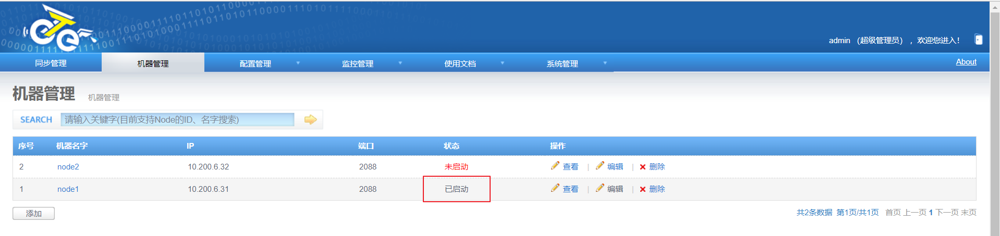

查看对应的节点状态，变为了已启动，代表已经正常启动。

#### AM _01

美国机房的MySQL生产库和zookeeper单实例

```shell
# 搭建步骤与SH_01一样
1. 安装mysql5.7
2. 安装zookeeper单实例
[root@am_01 ~]# bash mysql.sh
[root@am_01 ~]# bash jdk.sh
[root@am_01 ~]# bash zookeeper.sh
[root@am_01 ~]# mysql_secure_installation 
[root@am_01 ~]# mysql -uroot -p'(Uploo00king)'
mysql: [Warning] Using a password on the command line interface can be insecure.
Welcome to the MySQL monitor.  Commands end with ; or \g.
Your MySQL connection id is 3
Server version: 5.7.17-log MySQL Community Server (GPL)

Copyright (c) 2000, 2016, Oracle and/or its affiliates. All rights reserved.

Oracle is a registered trademark of Oracle Corporation and/or its
affiliates. Other names may be trademarks of their respective
owners.

Type 'help;' or '\h' for help. Type '\c' to clear the current input statement.

root@AM_MySQL-01 10:34:  [(none)]> show databases;
+--------------------+
| Database           |
+--------------------+
| information_schema |
| mysql              |
| performance_schema |
| sys                |
+--------------------+
4 rows in set (0.00 sec)

root@AM_MySQL-01 10:52:  [booboo]> grant all on *.* to root@'%' identified by '(Uploo00king)' ;
Query OK, 0 rows affected, 1 warning (0.01 sec)

root@AM_MySQL-01 11:09:  [booboo]> flush privileges;
Query OK, 0 rows affected (0.00 sec)

[root@am_01 ~]# ss -luntp|grep java
tcp    LISTEN     0      50       :::2181                 :::*                   users:(("java",pid=5768,fd=21))
tcp    LISTEN     0      50       :::33385                :::*                   users:(("java",pid=5768,fd=16))
```


#### AM_02

>  美国机房部署otter-node2节点

搭建otter-node2

```shell
# 安装aria2
[root@am_02 ~]# yum install -y gcc-c++
[root@am_02 ~]# wget https://sourceforge.net/projects/aria2/files/stable/aria2-1.19.0/aria2-1.19.0.tar.gz/download -O aria2-1.19.0.tar.gz
[root@am_02 ~]# tar -xf aria2-1.19.0.tar.gz -C /alidata/
[root@am_02 ~]# cd /alidata/aria2-1.19.0/
[root@am_02 aria2-1.19.0]# make && make install


# 安装canal
# am_01上对数据库添加授权
> GRANT SELECT, REPLICATION SLAVE, REPLICATION CLIENT ON *.* TO 'canal'@'%' identified by '(Uploo00king)';
> flush privileges;

[root@am_02 ~]#  wget https://github.com/alibaba/canal/releases/download/canal-1.0.26-preview-3/canal.deployer-1.0.26-SNAPSHOT.tar.gz
[root@am_02 ~]# mkdir /alidata/canal
[root@am_02 ~]# tar -xf canal.deployer-1.0.26-SNAPSHOT.tar.gz -C /alidata/canal/
[root@am_02 ~]# cd /alidata/canal/
[root@am_02 canal]# ll
total 4
drwxr-xr-x. 2 root root   58 Jun 14 14:50 bin
drwxr-xr-x. 4 root root   78 Jun 14 14:50 conf
drwxr-xr-x. 2 root root 4096 Jun 14 14:50 lib
drwxrwxrwx. 2 root root    6 Jun 12 13:52 logs
[root@sh_02 canal]# vim conf/example/instance.properties
#################################################
## mysql serverId
canal.instance.mysql.slaveId=0

# position info
canal.instance.master.address=10.200.6.33:3306
# enable gtid use true/false
canal.instance.gtidon=false
canal.instance.master.journal.name=
canal.instance.master.position=
canal.instance.master.timestamp=
canal.instance.master.gtid=

# table meta tsdb info
canal.instance.tsdb.enable=true
canal.instance.tsdb.dir=${canal.file.data.dir:../conf}/${canal.instance.destination:}
canal.instance.tsdb.url=jdbc:h2:${canal.instance.tsdb.dir}/h2;CACHE_SIZE=1000;MODE=MYSQL;
#canal.instance.tsdb.url=jdbc:mysql://10.200.6.33:3306/mysql
canal.instance.tsdb.dbUsername=
canal.instance.tsdb.dbPassword=


#canal.instance.standby.address =
#canal.instance.standby.journal.name =
#canal.instance.standby.position = 
#canal.instance.standby.timestamp =
#canal.instance.standby.gtid=
# username/password
canal.instance.dbUsername=canal
canal.instance.dbPassword=(Uploo00king)
canal.instance.defaultDatabaseName=test
canal.instance.connectionCharset=UTF-8
# table regex
canal.instance.filter.regex=.*\\..*
# table black regex
canal.instance.filter.black.regex=
#################################################
[root@am_02 canal]# bin/startup.sh
cd to /alidata/canal/bin for workaround relative path
LOG CONFIGURATION : /alidata/canal/bin/../conf/logback.xml
canal conf : /alidata/canal/bin/../conf/canal.properties
CLASSPATH :/alidata/canal/bin/../conf:/alidata/canal/bin/../lib/zookeeper-3.4.5.jar:/alidata/canal/bin/../lib/zkclient-0.10.jar:/alidata/canal/bin/../lib/spring-tx-3.2.9.RELEASE.jar:/alidata/canal/bin/../lib/spring-orm-3.2.9.RELEASE.jar:/alidata/canal/bin/../lib/spring-jdbc-3.2.9.RELEASE.jar:/alidata/canal/bin/../lib/spring-expression-3.2.9.RELEASE.jar:/alidata/canal/bin/../lib/spring-core-3.2.9.RELEASE.jar:/alidata/canal/bin/../lib/spring-context-3.2.9.RELEASE.jar:/alidata/canal/bin/../lib/spring-beans-3.2.9.RELEASE.jar:/alidata/canal/bin/../lib/spring-aop-3.2.9.RELEASE.jar:/alidata/canal/bin/../lib/slf4j-api-1.7.12.jar:/alidata/canal/bin/../lib/protobuf-java-2.6.1.jar:/alidata/canal/bin/../lib/oro-2.0.8.jar:/alidata/canal/bin/../lib/netty-all-4.1.6.Final.jar:/alidata/canal/bin/../lib/netty-3.2.2.Final.jar:/alidata/canal/bin/../lib/mysql-connector-java-5.1.40.jar:/alidata/canal/bin/../lib/logback-core-1.1.3.jar:/alidata/canal/bin/../lib/logback-classic-1.1.3.jar:/alidata/canal/bin/../lib/jopt-simple-4.6.jar:/alidata/canal/bin/../lib/jmh-core-1.21.jar:/alidata/canal/bin/../lib/jcl-over-slf4j-1.7.12.jar:/alidata/canal/bin/../lib/ibatis-sqlmap-2.3.4.726.jar:/alidata/canal/bin/../lib/httpcore-4.4.3.jar:/alidata/canal/bin/../lib/httpclient-4.5.1.jar:/alidata/canal/bin/../lib/h2-1.4.196.jar:/alidata/canal/bin/../lib/guava-18.0.jar:/alidata/canal/bin/../lib/fastsql-2.0.0_preview_371.jar:/alidata/canal/bin/../lib/fastjson-1.2.28.jar:/alidata/canal/bin/../lib/druid-1.1.9.jar:/alidata/canal/bin/../lib/commons-math3-3.2.jar:/alidata/canal/bin/../lib/commons-logging-1.1.3.jar:/alidata/canal/bin/../lib/commons-lang-2.6.jar:/alidata/canal/bin/../lib/commons-io-2.4.jar:/alidata/canal/bin/../lib/commons-compress-1.9.jar:/alidata/canal/bin/../lib/commons-codec-1.9.jar:/alidata/canal/bin/../lib/commons-beanutils-1.8.2.jar:/alidata/canal/bin/../lib/canal.store-1.0.26-SNAPSHOT.jar:/alidata/canal/bin/../lib/canal.sink-1.0.26-SNAPSHOT.jar:/alidata/canal/bin/../lib/canal.server-1.0.26-SNAPSHOT.jar:/alidata/canal/bin/../lib/canal.protocol-1.0.26-SNAPSHOT.jar:/alidata/canal/bin/../lib/canal.parse.driver-1.0.26-SNAPSHOT.jar:/alidata/canal/bin/../lib/canal.parse.dbsync-1.0.26-SNAPSHOT.jar:/alidata/canal/bin/../lib/canal.parse-1.0.26-SNAPSHOT.jar:/alidata/canal/bin/../lib/canal.meta-1.0.26-SNAPSHOT.jar:/alidata/canal/bin/../lib/canal.instance.spring-1.0.26-SNAPSHOT.jar:/alidata/canal/bin/../lib/canal.instance.manager-1.0.26-SNAPSHOT.jar:/alidata/canal/bin/../lib/canal.instance.core-1.0.26-SNAPSHOT.jar:/alidata/canal/bin/../lib/canal.filter-1.0.26-SNAPSHOT.jar:/alidata/canal/bin/../lib/canal.deployer-1.0.26-SNAPSHOT.jar:/alidata/canal/bin/../lib/canal.common-1.0.26-SNAPSHOT.jar:/alidata/canal/bin/../lib/aviator-2.2.1.jar:/alidata/canal/bin/../lib/aopalliance-1.0.jar:.:/alidata/java/lib/dt.jar:/alidata/java/lib/tools.jar:/alidata/java/lib:/alidata/java/jre/lib:
cd to /alidata/canal for continue
[root@am_02 canal]# cat logs/canal/canal.log 
[root@am_02 canal]# cat logs/canal/canal.log 
2018-06-27 10:41:38.175 [main] INFO  com.alibaba.otter.canal.deployer.CanalLauncher - ## set default uncaught exception handler
2018-06-27 10:41:38.218 [main] INFO  com.alibaba.otter.canal.deployer.CanalLauncher - ## load canal configurations
2018-06-27 10:41:38.228 [main] INFO  com.alibaba.otter.canal.deployer.CanalLauncher - ## start the canal server.
2018-06-27 10:41:38.276 [main] INFO  com.alibaba.otter.canal.deployer.CanalController - ## start the canal server[10.200.6.32:11111]
2018-06-27 10:41:38.652 [main] WARN  o.s.beans.GenericTypeAwarePropertyDescriptor - Invalid JavaBean property 'connectionCharset' being accessed! Ambiguous write methods found next to actually used [public void com.alibaba.otter.canal.parse.inbound.mysql.AbstractMysqlEventParser.setConnectionCharset(java.nio.charset.Charset)]: [public void com.alibaba.otter.canal.parse.inbound.mysql.AbstractMysqlEventParser.setConnectionCharset(java.lang.String)]
2018-06-27 10:41:38.856 [main] ERROR com.alibaba.druid.pool.DruidDataSource - testWhileIdle is true, validationQuery not set
2018-06-27 10:41:39.109 [main] INFO  com.alibaba.otter.canal.deployer.CanalLauncher - ## the canal server is running now ......
2018-06-27 10:41:39.125 [destination = example , address = /10.200.6.33:3306 , EventParser] WARN  c.a.otter.canal.parse.inbound.mysql.MysqlEventParser - prepare to find start position just show master status

# 安装otter-node
[root@am_02 ~]# wget https://github.com/alibaba/otter/releases/download/otter-4.2.16-preview-1/node.deployer-4.2.16-SNAPSHOT.tar.gz
[root@am_02 ~]# mkdir /alidata/node
[root@am_02 ~]# tar -xf node.deployer-4.2.16-SNAPSHOT.tar.gz -C /alidata/node/
[root@am_02 ~]# cd /alidata/node/
# 非常重要，nid与将来在图形化界面控制台添加的node节点编号有关
[root@am_02 node]# echo 2 > conf/nid
[root@am_02 node]# vim conf/otter.properties 
[root@am_02 node]# cat conf/otter.properties 
# otter node root dir
otter.nodeHome = ${user.dir}/../

## otter node dir
otter.htdocs.dir = ${otter.nodeHome}/htdocs
otter.download.dir = ${otter.nodeHome}/download
otter.extend.dir= ${otter.nodeHome}/extend

## default zookeeper sesstion timeout = 60s
otter.zookeeper.sessionTimeout = 60000

## otter communication payload size (default = 8388608)
otter.communication.payload = 8388608

## otter communication pool size
otter.communication.pool.size = 10

## otter arbitrate & node connect manager config
otter.manager.address = 10.200.6.31:1099

[root@am_02 node]# bash bin/startup.sh
LOG CONFIGURATION : /alidata/node/bin/../conf/logback.xml
Otter nodeId file : /alidata/node/bin/../conf/nid
CLASSPATH :/alidata/node/bin/../conf:/alidata/node/bin/../lib/zookeeper-3.4.5.jar:/alidata/node/bin/../lib/zkclient-0.10.jar:/alidata/node/bin/../lib/xz-1.0.jar:/alidata/node/bin/../lib/truezip-6.8.4.jar:/alidata/node/bin/../lib/spring-tx-3.1.2.RELEASE.jar:/alidata/node/bin/../lib/spring-test-3.1.2.RELEASE.jar:/alidata/node/bin/../lib/spring-orm-3.2.9.RELEASE.jar:/alidata/node/bin/../lib/spring-jdbc-3.1.2.RELEASE.jar:/alidata/node/bin/../lib/spring-expression-3.1.2.RELEASE.jar:/alidata/node/bin/../lib/spring-core-3.1.2.RELEASE.jar:/alidata/node/bin/../lib/spring-context-support-3.1.2.RELEASE.jar:/alidata/node/bin/../lib/spring-context-3.1.2.RELEASE.jar:/alidata/node/bin/../lib/spring-beans-3.1.2.RELEASE.jar:/alidata/node/bin/../lib/spring-asm-3.1.2.RELEASE.jar:/alidata/node/bin/../lib/spring-aop-3.1.2.RELEASE.jar:/alidata/node/bin/../lib/slf4j-api-1.7.12.jar:/alidata/node/bin/../lib/shared.push-4.2.16-SNAPSHOT.jar:/alidata/node/bin/../lib/shared.etl-4.2.16-SNAPSHOT.jar:/alidata/node/bin/../lib/shared.communication-4.2.16-SNAPSHOT.jar:/alidata/node/bin/../lib/shared.common-4.2.16-SNAPSHOT.jar:/alidata/node/bin/../lib/shared.arbitrate-4.2.16-SNAPSHOT.jar:/alidata/node/bin/../lib/protobuf-java-2.6.1.jar:/alidata/node/bin/../lib/oro-2.0.8.jar:/alidata/node/bin/../lib/ojdbc6.jar:/alidata/node/bin/../lib/ojdbc6-11.1.0.7.0.jar:/alidata/node/bin/../lib/node.extend-4.2.16-SNAPSHOT.jar:/alidata/node/bin/../lib/node.etl-4.2.16-SNAPSHOT.jar:/alidata/node/bin/../lib/node.deployer-4.2.16-SNAPSHOT.jar:/alidata/node/bin/../lib/node.common-4.2.16-SNAPSHOT.jar:/alidata/node/bin/../lib/node.canal-4.2.16-SNAPSHOT.jar:/alidata/node/bin/../lib/netty-all-4.1.6.Final.jar:/alidata/node/bin/../lib/netty-3.2.2.Final.jar:/alidata/node/bin/../lib/mysql-connector-java-5.1.40.jar:/alidata/node/bin/../lib/logback-core-1.1.3.jar:/alidata/node/bin/../lib/logback-classic-1.1.3.jar:/alidata/node/bin/../lib/jopt-simple-4.6.jar:/alidata/node/bin/../lib/jmh-core-1.21.jar:/alidata/node/bin/../lib/jetty-xml-8.1.7.v20120910.jar:/alidata/node/bin/../lib/jetty-util-8.1.7.v20120910.jar:/alidata/node/bin/../lib/jetty-servlet-8.1.7.v20120910.jar:/alidata/node/bin/../lib/jetty-server-8.1.7.v20120910.jar:/alidata/node/bin/../lib/jetty-security-8.1.7.v20120910.jar:/alidata/node/bin/../lib/jetty-io-8.1.7.v20120910.jar:/alidata/node/bin/../lib/jetty-http-8.1.7.v20120910.jar:/alidata/node/bin/../lib/jetty-continuation-8.1.7.v20120910.jar:/alidata/node/bin/../lib/jcl-over-slf4j-1.7.12.jar:/alidata/node/bin/../lib/javax.servlet-3.0.0.v201112011016.jar:/alidata/node/bin/../lib/javassist-3.15.0-GA.jar:/alidata/node/bin/../lib/ibatis-sqlmap-2.3.4.726.jar:/alidata/node/bin/../lib/httpcore-4.4.3.jar:/alidata/node/bin/../lib/httpclient-4.5.1.jar:/alidata/node/bin/../lib/h2-1.4.196.jar:/alidata/node/bin/../lib/guava-18.0.jar:/alidata/node/bin/../lib/fastsql-2.0.0_preview_366.jar:/alidata/node/bin/../lib/fastjson-1.2.28.jar:/alidata/node/bin/../lib/dubbo-2.5.3.jar:/alidata/node/bin/../lib/druid-1.1.9.jar:/alidata/node/bin/../lib/ddlutils-1.0.jar:/alidata/node/bin/../lib/commons-pool-1.5.4.jar:/alidata/node/bin/../lib/commons-math3-3.2.jar:/alidata/node/bin/../lib/commons-logging-1.1.1.jar:/alidata/node/bin/../lib/commons-lang-2.6.jar:/alidata/node/bin/../lib/commons-io-2.4.jar:/alidata/node/bin/../lib/commons-dbcp-1.4.jar:/alidata/node/bin/../lib/commons-compress-1.4.1.jar:/alidata/node/bin/../lib/commons-collections-3.2.2.jar:/alidata/node/bin/../lib/commons-codec-1.9.jar:/alidata/node/bin/../lib/commons-beanutils-1.8.3.jar:/alidata/node/bin/../lib/cglib-nodep-2.2.jar:/alidata/node/bin/../lib/canal.store-1.0.26-SNAPSHOT.jar:/alidata/node/bin/../lib/canal.sink-1.0.26-SNAPSHOT.jar:/alidata/node/bin/../lib/canal.server-1.0.26-SNAPSHOT.jar:/alidata/node/bin/../lib/canal.protocol-1.0.26-SNAPSHOT.jar:/alidata/node/bin/../lib/canal.parse.driver-1.0.26-SNAPSHOT.jar:/alidata/node/bin/../lib/canal.parse.dbsync-1.0.26-SNAPSHOT.jar:/alidata/node/bin/../lib/canal.parse-1.0.26-SNAPSHOT.jar:/alidata/node/bin/../lib/canal.meta-1.0.26-SNAPSHOT.jar:/alidata/node/bin/../lib/canal.instance.spring-1.0.26-SNAPSHOT.jar:/alidata/node/bin/../lib/canal.instance.manager-1.0.26-SNAPSHOT.jar:/alidata/node/bin/../lib/canal.instance.core-1.0.26-SNAPSHOT.jar:/alidata/node/bin/../lib/canal.filter-1.0.26-SNAPSHOT.jar:/alidata/node/bin/../lib/canal.common-1.0.26-SNAPSHOT.jar:/alidata/node/bin/../lib/aviator-2.2.1.jar:/alidata/node/bin/../lib/aopalliance-1.0.jar:.:/alidata/java/lib/dt.jar:/alidata/java/lib/tools.jar:/alidata/java/lib:/alidata/java/jre/lib:
cd to /alidata/node/bin for workaround relative path
cd to /alidata/node for continue
[root@am_02 node]# cat logs/node/node.log 
2018-06-14 15:55:25.164 [main] INFO  com.alibaba.otter.node.deployer.OtterLauncher - INFO ## the otter server is running now ......


[root@am_02 alidata]# cd node
[root@am_02 node]# ll
total 8
drwxr-xr-x. 2 root root   75 Jun 14 15:55 bin
drwxr-xr-x. 2 root root   60 Jun 14 15:55 conf
drwxr-xr-x. 2 root root    6 Jun 14 15:55 download
drwxr-xr-x. 2 root root    6 Jun 14 15:55 extend
drwxr-xr-x. 2 root root    6 Jun 14 15:55 htdocs
drwxr-xr-x. 2 root root 4096 Jun 14 15:54 lib
drwxrwxrwx. 3 root root   18 Jun 14 15:55 logs
[root@am_02 node]# cd conf
[root@am_02 conf]# ll
total 16
-rwsrwsrwt. 1 root root 8091 Sep 23  2014 logback.xml
-rw-r--r--. 1 root root    2 Jun 14 15:54 nid
-rwsrwsrwt. 1 root root  548 Jun 14 15:55 otter.properties
[root@am_02 conf]# cat nid
2

```

## 配置双向同步任务

### 机器管理

#### zookeeper管理

分别添加上海机房和美国机房的zookeeper实例


#### 机器管理

分别添加上海机房和美国机房的otter 的 node节点

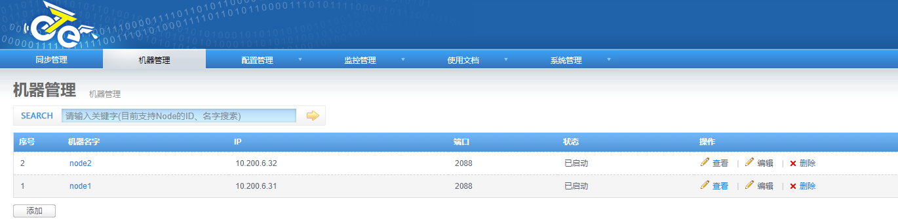

### 配置管理

#### 数据源管理

> 数据源就是将来要进行数据同步的源端和目标端数据库实例

添加上海机房的数据库

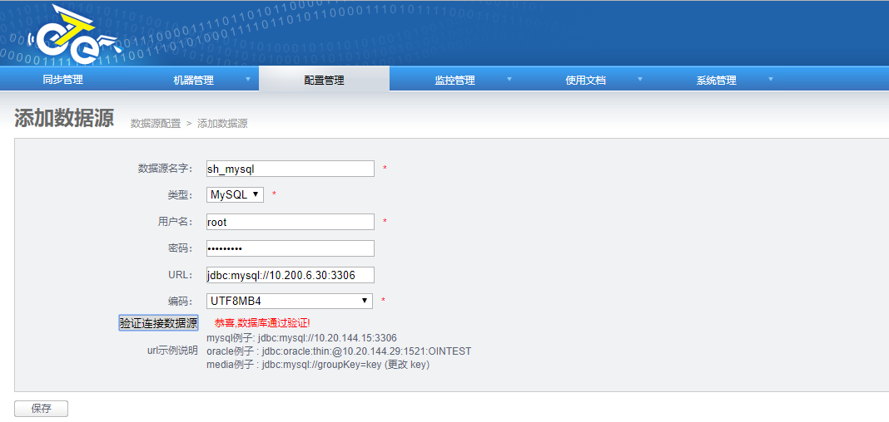

添加美国机房的数据库

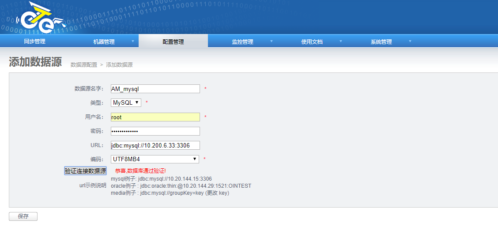

保存后可以看到刚刚添加的两个数据源


#### 数据表管理

> 我们的目标是实现上海美国异地机房双向同步，同步数据库
>
> 初始环境：sh_01 和 am_01 库中都已经建立好了数据库vingoo_mc;以及6张表，表中无数据。

```shell
root@SH_MySQL-01 11:17:  [(none)]> use vingoo_mc;
Database changed
root@SH_MySQL-01 11:17:  [vingoo_mc]> show tables;
+---------------------+
| Tables_in_vingoo_mc |
+---------------------+
| vgp_monitor         |
| vgp_order           |
| vgp_order_bom       |
| vgp_order_info      |
| vgp_payment         |
| vgp_payment_info    |
+---------------------+
6 rows in set (0.00 sec)

[root@am_01 ~]# mysql -uroot -p'(Uploo00king)' -e "use vingoo_mc;show tables;"
mysql: [Warning] Using a password on the command line interface can be insecure.
+---------------------+
| Tables_in_vingoo_mc |
+---------------------+
| vgp_monitor         |
| vgp_order           |
| vgp_order_bom       |
| vgp_order_info      |
| vgp_payment         |
| vgp_payment_info    |
+---------------------+

```


#### canal管理


### 同步管理

#### 添加上海至美国的数据同步任务

##### 添加channel


##### 添加pipeline


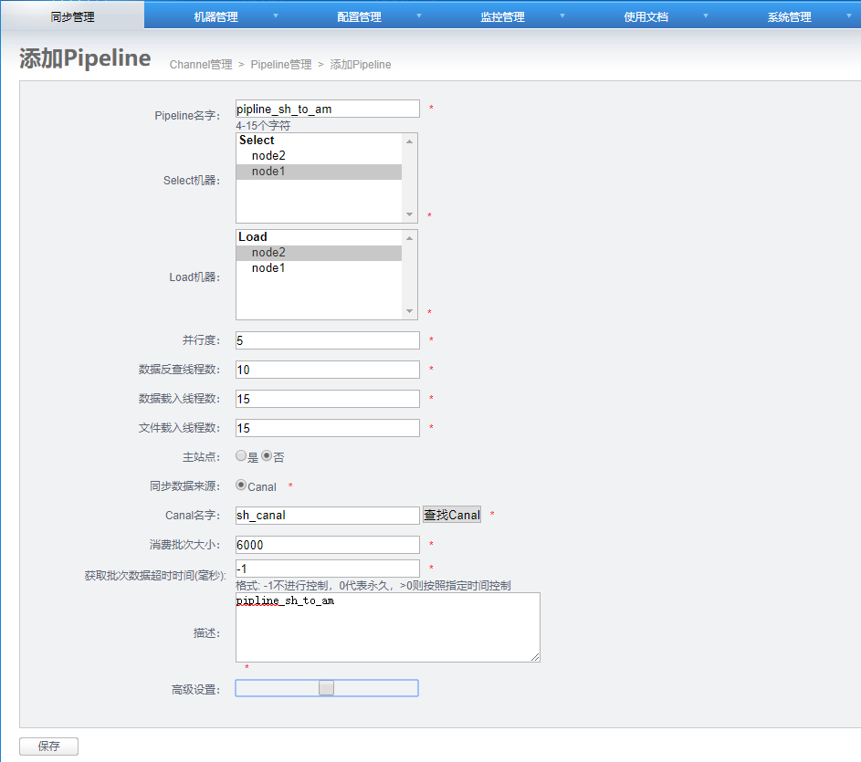


##### 添加映射关系列表

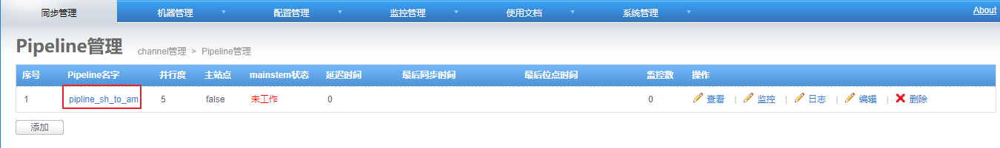


##### 开启同步任务


##### 测试DML操作

执行insert操作

```shell
# 将之前备份的数据进行导入，即insert操作在上海机房执行
[root@sh_01 ~]# mysql -uroot -puplooking vingoo_mc < vingoo_mc.sql
mysql: [Warning] Using a password on the command line interface can be insecure.
[root@sh_01 ~]# mysql -uroot -puplooking vingoo_mc
mysql: [Warning] Using a password on the command line interface can be insecure.
Welcome to the MySQL monitor.  Commands end with ; or \g.
Your MySQL connection id is 87
Server version: 5.7.17-log MySQL Community Server (GPL)

Copyright (c) 2000, 2016, Oracle and/or its affiliates. All rights reserved.

Oracle is a registered trademark of Oracle Corporation and/or its
affiliates. Other names may be trademarks of their respective
owners.

Type 'help;' or '\h' for help. Type '\c' to clear the current input statement.

root@SH_MySQL-01 14:37:  [vingoo_mc]> select * from vgp_order limit 1;
+------------+----------+------------------+--------------------+------------+-------------+---------+-------------+------------------------------------+--------------+---------+
| id         | brand_id | terminal_num     | order_address      | order_date | upload_date | vip_num | total_price | order_num                          | order_status | pre_qty |
+------------+----------+------------------+--------------------+------------+-------------+---------+-------------+------------------------------------+--------------+---------+
| 1000000002 |      394 | TS0755_0008_0001 | 观澜湖新城-B1      | 1529597873 |  1529597874 | NULL    |       15.00 | noinfo_1529597873_TS0755_0008_0001 |            2 |       1 |
+------------+----------+------------------+--------------------+------------+-------------+---------+-------------+------------------------------------+--------------+---------+
1 row in set (0.00 sec)

```


观察insert同步任务情况

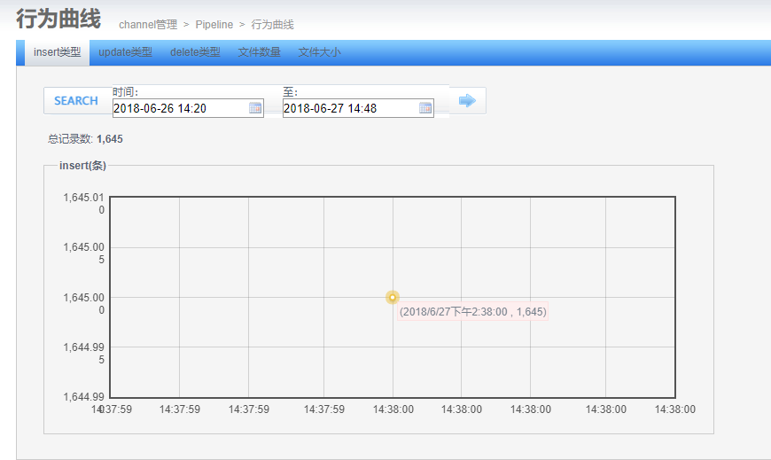

可以看到同步了1654条insert操作，点击`行为曲线`可以看到以上图表信息。

查看美国的数据库同步情况，可以看到数据同步正确。

```shell
root@AM_MySQL-01 14:36:  [vingoo_mc]> select * from vgp_order limit 1;
+------------+----------+------------------+--------------------+------------+-------------+---------+-------------+------------------------------------+--------------+---------+
| id         | brand_id | terminal_num     | order_address      | order_date | upload_date | vip_num | total_price | order_num                          | order_status | pre_qty |
+------------+----------+------------------+--------------------+------------+-------------+---------+-------------+------------------------------------+--------------+---------+
| 1000000002 |      394 | TS0755_0008_0001 | 观澜湖新城-B1      | 1529597873 |  1529597874 | NULL    |       15.00 | noinfo_1529597873_TS0755_0008_0001 |            2 |       1 |
+------------+----------+------------------+--------------------+------------+-------------+---------+-------------+------------------------------------+--------------+---------+
1 row in set (0.00 sec)


```

##### 测试DDL操作

> 1. 修改表结构测试
> 2. 新建表测试

**修改表结构测试**

执行修改表结构操作

```shell
alter table vgp_order add booboo varchar(255) default 'superman';
```

在上海机房执行修改表结构的sql

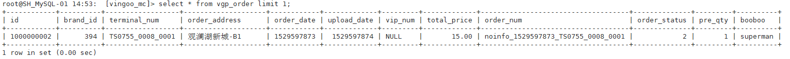

检查美国机房表结构情况，已经成功同步

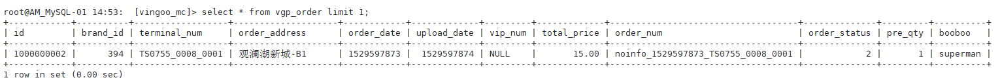

---

**新建表测试**

上海机房新建表

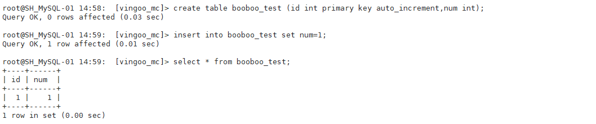

美国机房检查新表情况


测试通过

#### 添加美国到上海的数据同步任务

##### 添加channel

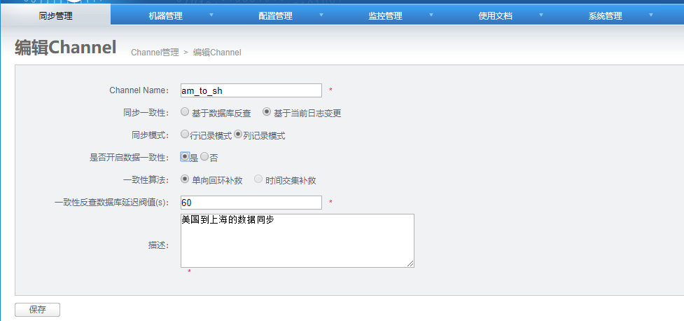


##### 添加pipeline

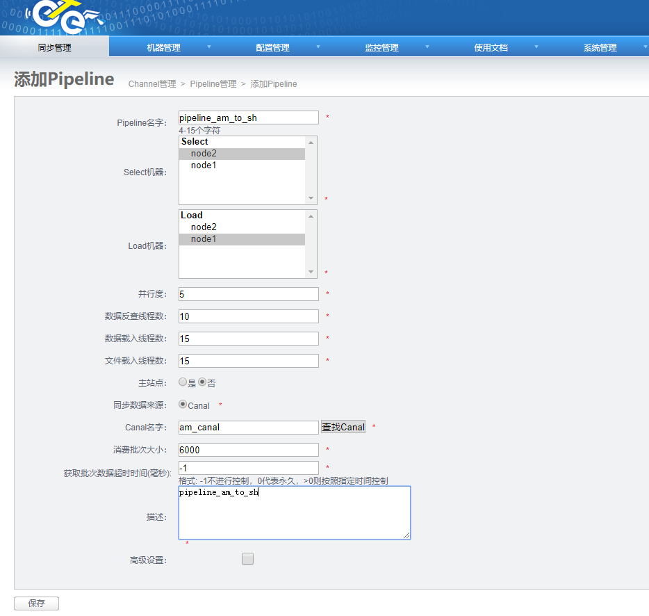

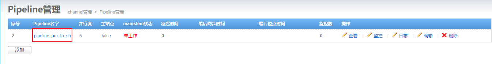

##### 添加映射关系列表


##### 开启同步任务


##### 测试DML操作

美国机房的数据库插入一条记录

```shell
insert into booboo_test set num=2;
```

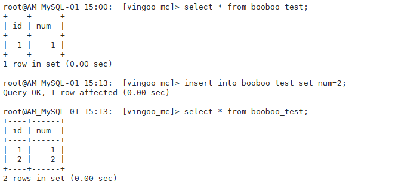

上海机房查看数据

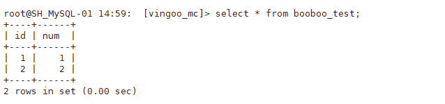

##### 测试DDL操作

美国机房执行删库操作

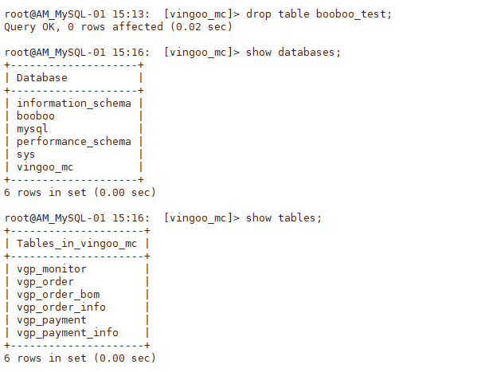

上海机房检查数据同步情况

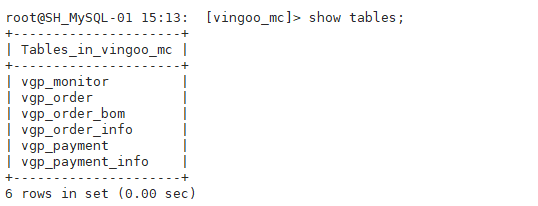

同步成功，booboo_test表已成功删除。

##### 测试DCL操作

美国机房新建用户test，并授予权限

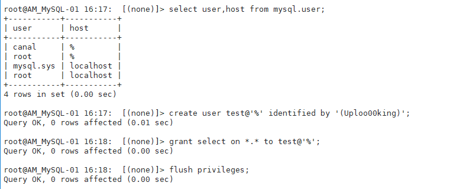

上海机房进行验证

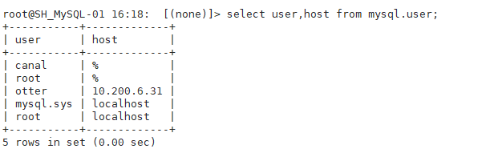

没有同步，起始也很好理解，因为认证权限信息是保存在mysql库中，而同步并没有配置mysql库的数据同步。

## 测试双写冲突解决情况

双写测试后，两个任务都进入挂起状态，两边变更都没有执行。

## 测试MySQL同步至Oracle

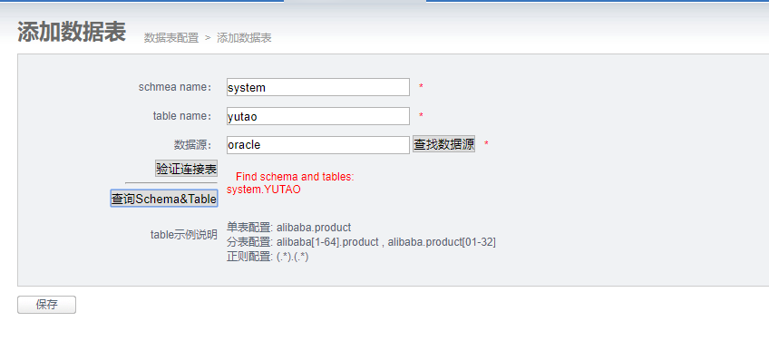


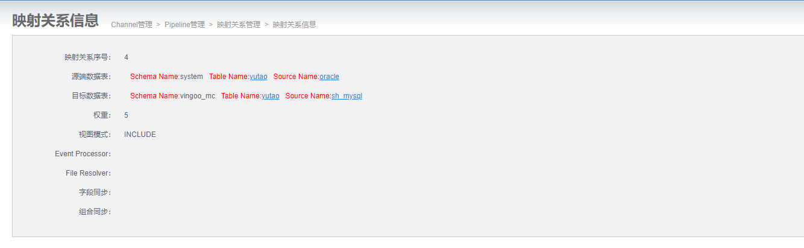

MySQL写入数据

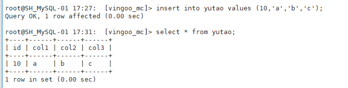

Oracle成功同步数据

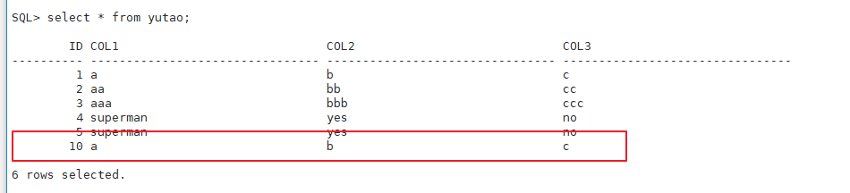

测试了一下修改表结构，失败了


```shell
pid:5 nid:2 exception:setl:com.alibaba.otter.node.etl.load.exception.LoadException: java.util.concurrent.ExecutionException: com.alibaba.otter.node.etl.load.exception.LoadException: com.alibaba.otter.node.etl.load.exception.LoadException: org.springframework.jdbc.BadSqlGrammarException: StatementCallback; bad SQL grammar []; nested exception is java.sql.SQLSyntaxErrorException: ORA-00911: invalid character

Caused by: java.util.concurrent.ExecutionException: com.alibaba.otter.node.etl.load.exception.LoadException: com.alibaba.otter.node.etl.load.exception.LoadException: org.springframework.jdbc.BadSqlGrammarException: StatementCallback; bad SQL grammar []; nested exception is java.sql.SQLSyntaxErrorException: ORA-00911: invalid character

at java.util.concurrent.FutureTask.report(FutureTask.java:122)
at java.util.concurrent.FutureTask.get(FutureTask.java:188)
at com.alibaba.otter.node.etl.load.loader.db.DataBatchLoader.load(DataBatchLoader.java:107)
at com.alibaba.otter.node.etl.load.loader.OtterLoaderFactory.load(OtterLoaderFactory.java:50)
at com.alibaba.otter.node.etl.load.LoadTask$1.run(LoadTask.java:85)
at java.util.concurrent.Executors$RunnableAdapter.call(Executors.java:471)
at java.util.concurrent.FutureTask.run(FutureTask.java:262)
at java.util.concurrent.ThreadPoolExecutor.runWorker(ThreadPoolExecutor.java:1145)
at java.util.concurrent.ThreadPoolExecutor$Worker.run(ThreadPoolExecutor.java:615)
at java.lang.Thread.run(Thread.java:745)
Caused by: com.alibaba.otter.node.etl.load.exception.LoadException: com.alibaba.otter.node.etl.load.exception.LoadException: org.springframework.jdbc.BadSqlGrammarException: StatementCallback; bad SQL grammar []; nested exception is java.sql.SQLSyntaxErrorException: ORA-00911: invalid character

Caused by: com.alibaba.otter.node.etl.load.exception.LoadException: org.springframework.jdbc.BadSqlGrammarException: StatementCallback; bad SQL grammar []; nested exception is java.sql.SQLSyntaxErrorException: ORA-00911: invalid character

Caused by: org.springframework.jdbc.BadSqlGrammarException: StatementCallback; bad SQL grammar []; nested exception is java.sql.SQLSyntaxErrorException: ORA-00911: invalid character

at org.springframework.jdbc.support.SQLExceptionSubclassTranslator.doTranslate(SQLExceptionSubclassTranslator.java:94)
at org.springframework.jdbc.support.AbstractFallbackSQLExceptionTranslator.translate(AbstractFallbackSQLExceptionTranslator.java:72)
at org.springframework.jdbc.support.AbstractFallbackSQLExceptionTranslator.translate(AbstractFallbackSQLExceptionTranslator.java:80)
at org.springframework.jdbc.core.JdbcTemplate.execute(JdbcTemplate.java:407)
at com.alibaba.otter.node.etl.load.loader.db.DbLoadAction.doDdl(DbLoadAction.java:357)
at com.alibaba.otter.node.etl.load.loader.db.DbLoadAction.load(DbLoadAction.java:135)
at com.alibaba.otter.node.etl.load.loader.db.DbLoadAction$$FastClassByCGLIB$$d932a4cb.invoke()
at net.sf.cglib.proxy.MethodProxy.invoke(MethodProxy.java:191)
at org.springframework.aop.framework.Cglib2AopProxy$DynamicAdvisedInterceptor.intercept(Cglib2AopProxy.java:618)
at com.alibaba.otter.node.etl.load.loader.db.DbLoadAction$$EnhancerByCGLIB$$80fd23c2.load()
at com.alibaba.otter.node.etl.load.loader.db.DataBatchLoader$2.call(DataBatchLoader.java:198)
at com.alibaba.otter.node.etl.load.loader.db.DataBatchLoader$2.call(DataBatchLoader.java:189)
at java.util.concurrent.FutureTask.run(FutureTask.java:262)
at java.util.concurrent.Executors$RunnableAdapter.call(Executors.java:471)
at java.util.concurrent.FutureTask.run(FutureTask.java:262)
at java.util.concurrent.ThreadPoolExecutor.runWorker(ThreadPoolExecutor.java:1145)
at java.util.concurrent.ThreadPoolExecutor$Worker.run(ThreadPoolExecutor.java:615)
at java.lang.Thread.run(Thread.java:745)
Caused by: java.sql.SQLSyntaxErrorException: ORA-00911: invalid character

at oracle.jdbc.driver.SQLStateMapping.newSQLException(SQLStateMapping.java:91)
at oracle.jdbc.driver.DatabaseError.newSQLException(DatabaseError.java:133)
at oracle.jdbc.driver.DatabaseError.throwSqlException(DatabaseError.java:206)
at oracle.jdbc.driver.T4CTTIoer.processError(T4CTTIoer.java:455)
at oracle.jdbc.driver.T4CTTIoer.processError(T4CTTIoer.java:413)
at oracle.jdbc.driver.T4C8Oall.receive(T4C8Oall.java:1034)
at oracle.jdbc.driver.T4CStatement.doOall8(T4CStatement.java:183)
at oracle.jdbc.driver.T4CStatement.executeForRows(T4CStatement.java:942)
at oracle.jdbc.driver.OracleStatement.doExecuteWithTimeout(OracleStatement.java:1222)
at oracle.jdbc.driver.OracleStatement.executeInternal(OracleStatement.java:1770)
at oracle.jdbc.driver.OracleStatement.execute(OracleStatement.java:1739)
at oracle.jdbc.driver.OracleStatementWrapper.execute(OracleStatementWrapper.java:299)
at org.apache.commons.dbcp.DelegatingStatement.execute(DelegatingStatement.java:264)
at org.apache.commons.dbcp.DelegatingStatement.execute(DelegatingStatement.java:264)
at com.alibaba.otter.node.etl.load.loader.db.DbLoadAction$1.doInStatement(DbLoadAction.java:369)
at com.alibaba.otter.node.etl.load.loader.db.DbLoadAction$1.doInStatement(DbLoadAction.java:357)
at org.springframework.jdbc.core.JdbcTemplate.execute(JdbcTemplate.java:396)
... 14 more
```

## 总结

otter的优势在于“网络环境差”的情况下；另外支持mysql到oracle的同步

otter的数据源支持mysql（源和目标）、oracle（目标）